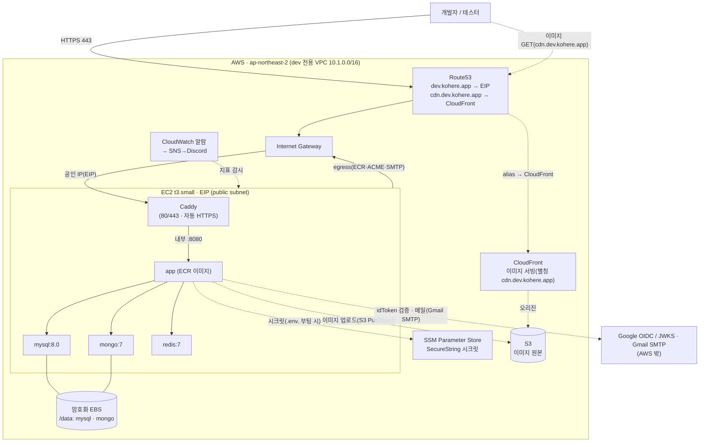

# ADR-0021. dev 환경은 단일 EC2(docker-compose) 비용 최소화 구성으로 둔다 (매니지드는 과투자)

| 항목 | 값 |
|---|---|
| 번호 | ADR-0021 |
| 작성자 | Kohere Backend 팀 |
| 작성일 | 2026-06-21 |
| 관련 문서 | [ADR-0005](./0005-polyglot-persistence.md), [ADR-0018](./0018-documentdb-for-mongodb-on-aws.md), [ADR-0019](./0019-infrastructure-as-code-terraform.md), [ADR-0020](./0020-terraform-remote-state-s3-dynamodb.md), [system-overview §1-3-2](../architecture/system-overview.md), [infra/terraform](../../infra/terraform/README.md) |

## Status

Accepted

> **환경별로 배포 아키텍처를 분리한다.** **prod**는 매니지드 스택을 유지한다([ADR-0019](./0019-infrastructure-as-code-terraform.md) 토폴로지 — ALB·ECS Fargate·RDS·DocumentDB·ElastiCache·NAT). **dev**는 그 매니지드 구성이 **과투자**라, 로컬 `docker-compose`를 그대로 올린 **단일 EC2** 구성을 쓴다. 본 ADR은 **dev 환경에만** 적용되며 prod의 매니지드 결정([ADR-0018](./0018-documentdb-for-mongodb-on-aws.md) 등)을 바꾸지 않는다.

## Context

- **dev 환경의 목적**은 기능 검증·통합 테스트·데모다 — 트래픽이 거의 없고, 가용성(HA)·내구성(PITR)·자동 확장 요구가 낮다.
- prod의 매니지드 토폴로지([system-overview §1-3-2](../architecture/system-overview.md))를 dev에 그대로 복제하면 고정비가 과도하다(Seoul, 24/7):
  - DocumentDB `db.t3.medium` ~$81/mo, RDS `db.t4g.micro` ~$21/mo, ElastiCache 2노드 ~$35/mo, NAT ~$32/mo, 인터페이스 엔드포인트 ~$95/mo, ALB ~$16/mo, Fargate ~$41/mo → **합계 ~$370/mo**.
  - dev에서 이 수준의 HA·관리형 운영은 **명백한 과투자**다.
- **로컬 개발은 이미 `docker-compose`로 app+MySQL+MongoDB+Redis+MailHog를 한 번에 띄운다**([docker-compose.yml](../../docker-compose.yml)). dev를 "클라우드에 올린 같은 compose"로 두면 로컬↔dev 구성이 일치해 친숙하고, 재현·디버깅이 쉽다.
- 단, **앱 이미지·DB 엔진은 prod과 동일**해야 호환성 검증이 의미가 있다(같은 ECR 이미지, `mysql:8.0`·`mongo:7`·`redis:7`).
- 상태(state) 백엔드는 prod·dev 공통으로 **S3 + native lockfile**(DynamoDB 불요, [ADR-0020](./0020-terraform-remote-state-s3-dynamodb.md))을 쓰며 `key`로 환경을 분리한다(`prod/…`, `dev/…`).

## Decision

**dev는 단일 EC2 1대에 dev 전용 `docker-compose`(Caddy · app · mysql · mongo · redis)를 기동하고, EIP를 Route53 A 레코드로 노출한다.** ALB·ECS·RDS·DocumentDB·ElastiCache·NAT를 **쓰지 않는다**.

- **컴퓨트**: EC2 `t3.small` 1대(2vCPU/2GB, x86 — ECR 앱 이미지가 amd64, prod ECS `X86_64`와 일치). `docker compose`로 컨테이너를 `restart: unless-stopped`로 기동.
- **이미지**: **app은 ECR**(CI가 push한 prod와 동일 빌드)에서 pull, `mysql:8.0`·`mongo:7`·`redis:7`은 Docker Hub. **MailHog는 로컬 compose 전용이라 dev에는 없다** — dev는 실 SMTP(Gmail SMTP)를 쓴다.
- **HTTPS(443)**: **Caddy** 컨테이너가 80/443을 받아 **Let's Encrypt 인증서를 자동 발급·갱신**하고 app(내부 8080)으로 프록시한다([ADR-0022](./0022-dev-https-caddy.md)). 도메인 제공 시 HTTPS(443), 없으면 `:80`(HTTP) 폴백. (prod의 ALB 443 종단을 dev에선 Caddy가 대신 — 갱신·reload를 자체 처리해 호스트 docker 명령 불필요.)
- **시크릿**: **SSM Parameter Store SecureString**(무료·**Secrets Manager 미사용**, [ADR-0023](./0023-secrets-in-ssm-parameter-store.md)). `JWT_SECRET`·`REFRESH_PEPPER`·`EMAIL_PEPPER`는 Terraform이 자동 생성, `GOOGLE_CLIENT_ID`·SMTP 자격증명 등은 변수로 받아 파라미터로 저장. EC2가 부팅 시 인스턴스 프로파일로 `GetParameter`(+`kms:Decrypt`)하여 `/opt/kohere/.env`(0600)에 주입 — compose만 읽고 `docker inspect`/명령행 미노출.
- **매물 이미지**: prod과 **동일한 S3 + CloudFront 모듈**을 dev에도 둔다. **앱(백엔드)은 S3에 업로드만** 하고(인스턴스 역할) 응답에 **CDN URL**을 담는다 → **클라이언트가 그 URL로 CloudFront에서 직접** 이미지를 받는다(앱은 이미지 서빙 경로에 없음). 커스텀 도메인(`cdn.dev.kohere.app`) 지정 시 **Route53 alias→CloudFront**로 받고(인증서는 us-east-1 ACM·무료, Route53 레코드 무시 가능), 미지정 시 `*.cloudfront.net` 직접 — **비용 영향 없음**.
- **데이터 영속**: 전용 **암호화 EBS**(gp3, `prevent_destroy`)를 `/data`에 마운트하고 **mysql/mongo** 데이터를 bind-mount한다(인스턴스 교체에도 보존). **Redis는 인메모리 — EBS 미사용**(재시작 시 캐시·refresh 토큰 소실, dev 수용).
- **노출/통제**: **EIP** + (도메인 제공 시) **Route53 A 레코드**. 보안그룹은 **80/443만** 인바운드, **SSH 미개방**(관리자 접속 **SSM Session Manager** 전용), **IMDSv2 강제**, EBS 암호화. IAM 인스턴스 프로파일은 SSM + ECR read + 지정 파라미터·이미지 버킷만(최소권한).
- **모니터링**: EC2 `StatusCheckFailed`·`CPUUtilization` **CloudWatch 알람** + SNS → Discord(웹훅, SNS→Lambda; [ADR-0027](./0027-dev-discord-alerting.md)) — 단일 박스 다운 통보.

### dev 배포 토폴로지 (각 컨테이너는 EC2 안의 박스)

prod(매니지드)은 [system-overview §1-3-2](../architecture/system-overview.md)의 토폴로지를 그대로 유지한다 — 본 ADR은 dev만 바꾼다.

## Alternatives

| 대안 | 장점 | 단점 | 채택 안 한 이유 |
|---|---|---|---|
| **단일 EC2 compose (채택)** | 월 ~$30 + EBS, 로컬과 동일 구성·시크릿 0, 가장 단순 | 단일 SPOF·HA 없음·인터넷 노출·자가운영 | — (dev엔 충분) |
| **prod 매니지드 복제** | prod와 동일 운영·HA·PITR | ~$370/mo — dev엔 과투자 | 비용 대비 dev 가치 없음 |
| **자가호스팅 DB 모듈 + ECS/ALB**(앞선 검토안) | prod 이미지 파이프라인 재사용 | dev엔 여전히 과설계(ECS·ALB·모듈 다수) | compose 한 박스가 dev 목적에 더 맞음 |
| **Fargate Spot 등 prod 축소판** | 매니지드 유지하며 비용↓ | 여전히 ALB·매니지드 DB 비용·복잡도 | dev엔 compose가 더 싸고 친숙 |

## Consequences

- **긍정**
  - **dev 고정비 급감** — EC2 `t3.small` ~$15/mo + 데이터 EBS(20GB gp3) ~$2/mo + EIP(연결 시 무료) ≈ **~$17/mo**(매니지드 복제 대비 ~$350/mo 절감).
  - **로컬↔dev 엔진 일치** — 같은 `mysql:8.0`/`mongo:7`/`redis:7`로 재현·디버깅이 쉽다. 시크릿은 **SSM Parameter Store SecureString(무료·Secrets Manager 미사용)**, 메일은 실 SMTP(Gmail SMTP), HTTPS는 nginx-proxy+Let's Encrypt.
  - **prod 영향 없음** — prod은 매니지드 토폴로지를 그대로 유지([ADR-0018](./0018-documentdb-for-mongodb-on-aws.md)/[ADR-0019](./0019-infrastructure-as-code-terraform.md)). 환경 간 분리는 Terraform `environments/{prod,dev}` 루트로 한다.
- **부정/트레이드오프**
  - **단일 호스트 SPOF** — app·DB가 한 박스라 인스턴스 장애 시 dev 전체 다운(복제·자동 failover 없음). dev라 수용.
  - **인터넷 노출** — EC2가 공인 IP(EIP)를 가져 노출된다 → SG로 인바운드 제한(**80/443만**), SSH 미개방·SSM 전용·IMDSv2·EBS 암호화로 완화. 필요 시 `ingress_cidrs`를 사무실 IP로 좁힌다.
  - **자가운영** — OS·docker·이미지 갱신을 직접 한다(매니지드 자동 패치 없음).
  - **dev≠prod 인프라** — dev는 자가호스팅 DB, prod은 매니지드라 인프라 동작이 다르다. 단 **앱 계약(엔진·포트·env)은 동일**해 앱 레벨 검증은 유효하다.
- **후속 작업**
  - CI가 dev 태그 이미지를 ECR에 push → dev EC2에서 `docker compose pull && up -d`로 갱신(또는 SSM 명령). 무중단 아님(dev 수용).
  - dev 도메인(`dev.kohere.app`)·Route53 영역 확정 시 `domain_name`/`route53_zone_id` 채움.
  - 데이터 백업이 필요해지면 EBS 스냅샷(DLM) 추가 검토(현재 dev는 휘발 허용).

## Validation

- `environments/dev` apply 후 EC2 1대 + EIP + (옵션)Route53 레코드 + S3/CloudFront가 생성되고, `docker compose ps`로 컨테이너가 떠 앱이 `https://<domain>`(도메인 시) 또는 `http://<EIP>`에 응답하는지 확인.
- **데이터 영속**: 인스턴스 재부팅/교체 후 `/data`(EBS)의 mysql/mongo 데이터가 보존되는지 확인.
- **노출 통제**: 외부에서 SSH(22)가 차단되고 SSM Session Manager로 접속되는지, 80/443만 열려 있는지, 시크릿이 SSM Parameter Store에 SecureString으로 저장됐는지 확인.
- **이미지 일치**: dev가 pull한 ECR 이미지가 prod과 동일 빌드인지(태그/다이제스트) 확인.
- **재검토 트리거**: dev에 HA·내구성·다중 사용자 요구가 생기면 매니지드(prod) 구성 일부 도입을 재검토한다.
