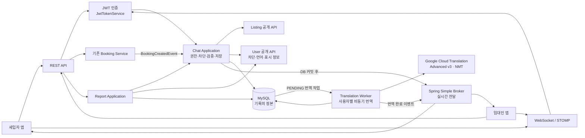

# 범위와 전체 아키텍처

## 1. 목표

Kohere의 기존 예약·인증·차단·다국어 기능을 재사용해 다음 기능을 완성한다.

- 로그인 완료 사용자 간 세입자·임대인 1:1 채팅
- 문의하기와 신청하기가 동일 채팅방을 사용하는 흐름
- 문의하기 실행 시 같은 채팅방에 필요한 경우 매물 요약 `INQUIRY_CARD` 표시
- 신청 완료 시 같은 채팅방에 임차인·임대인 화면용 `BOOKING_CARD` 표시
- MySQL 기반 메시지 영속화
- WebSocket + STOMP 실시간 송수신
- 받은 메시지의 사용자 언어별 자동 번역과 원문 보기
- 복원할 수 없는 사용자별 채팅방 삭제, 차단, 채팅방 신고

현재 `chat`과 일반 `report` 모듈은 이름과 REST 골격 위주이며 핵심 서비스·저장소가 구현되지 않았다. 기존 골격은 활용하되 영속화, 인증 주체 전달, 권한 검사, STOMP, 삭제, 신고 처리는 새로 완성해야 한다.

## 2. 쉬운 용어

### WebSocket

일반 HTTP처럼 요청마다 연결을 닫지 않고, 앱과 서버가 연결을 유지하며 서로 데이터를 보낼 수 있는 통신 방식이다.

### STOMP

WebSocket 위에서 `CONNECT`, `SUBSCRIBE`, `SEND`처럼 메시지의 목적을 정하는 규칙이다. WebSocket이 통로라면 STOMP는 그 통로에서 쓰는 메시지 규약이다.

### 구독

클라이언트가 “이 채팅방에 새 메시지가 저장되면 알려 달라”고 서버에 등록하는 것이다. 예를 들어 10번 방은 `/topic/chat-rooms/10`을 구독한다.

구독은 DB 저장 기능이 아니다. 실시간 알림을 받을 경로를 등록할 뿐이며, 과거 메시지와 연결이 끊긴 동안의 메시지는 REST로 MySQL에서 조회한다.

### Message Broker

서버가 발행한 메시지를 destination과 구독 정보에 맞춰 클라이언트에 전달하는 중간 전달자다. 이번 구조에서 broker는 권한·차단·본문 길이를 검사하거나 메시지를 영구 보관하지 않는다.

### 원문과 번역본

원문은 사용자가 실제로 전송해 MySQL에 저장된 메시지다. 번역본은 수신자의 `users.lang`에 맞춰 Google Cloud Translation이 만든 파생 데이터다.

- 원문은 수정하거나 번역본으로 덮어쓰지 않는다.
- 받은 메시지는 번역본을 먼저 표시하고 원문 보기를 제공한다.
- 내가 보낸 메시지는 원문을 먼저 표시한다.
- 번역 실패는 원문 메시지의 저장 성공을 취소하지 않는다.

### INQUIRY_CARD·BOOKING_CARD와 payload

`INQUIRY_CARD`는 사용자가 매물의 문의하기를 실행할 때 서버가 만드는 매물 문의서 카드다. 프런트는 `listingId`만 보내며, 서버가 공개 매물에서 대표 이미지·매물 제목·city·district·매물 유형·활성 방의 최소/최대 월세를 조회해 저장한다. 새 방에는 첫 문의서를 저장하고, 신청으로 먼저 만들어진 기존 방에도 문의서를 저장한다. 다만 현재 사용자가 볼 수 있는 가장 최근 문의서 뒤에 아무 메시지도 없다면 같은 문의서를 연속으로 저장하지 않는다. 최근 문의서 뒤에 `TEXT` 또는 `BOOKING_CARD`가 있거나, 채팅방 삭제 때문에 사용자가 그 문의서를 볼 수 없으면 새 문의서를 저장한다.

`BOOKING_CARD`는 사용자가 직접 보내는 채팅이 아니라 입주 신청이 저장됐을 때 서버가 만드는 신청 정보 카드다. 문의로 이미 만든 채팅방이 있으면 그 방에 추가하고, 방이 없을 때만 같은 기준으로 새 방을 만든다.

카드 payload는 카드 화면에 필요한 값을 묶은 JSON 데이터다. 일반 `TEXT`는 `content`에 원문을 저장하고, `INQUIRY_CARD`는 문의 당시 매물 요약을, `BOOKING_CARD`는 매물·신청자·입주일·기간·금액 정보를 저장한다. 외부 API 응답에서는 각각 `inquiryCard`, `bookingCard`라는 이름으로 반환한다.

## 3. 채팅방의 기준

채팅방의 비즈니스 키는 다음 세 값이다.

```text
(listingId, tenantId, landlordId)
```

따라서 다음 규칙이 성립한다.

- 같은 매물에서 문의와 신청을 해도 같은 방이다.
- 같은 매물의 여러 `roomOfferId`를 신청해도 같은 방이다.
- 같은 임대인이어도 다른 `listingId`이면 다른 방이다.
- 클라이언트는 `tenantId`나 `landlordId`를 결정하지 않는다.
- 동시 요청에서도 MySQL UNIQUE 제약으로 방은 하나만 생성한다.

## 4. 전체 구조



### 그림을 쉽게 읽는 방법

이 그림의 박스가 모두 별도 서버라는 뜻은 아니다. 초기에는 `Chat Application`, `Translation Worker`, `Report Application`, `Spring Simple Broker`가 한 대의 EC2에서 실행되는 같은 Spring 애플리케이션 안에 역할별로 나뉘어 있다.

1. 앱은 방 생성·목록·이력·삭제·차단·신고에는 REST API를 사용하고, 실시간 메시지 송수신에는 WebSocket/STOMP를 사용한다.
2. 서버는 JWT로 로그인 사용자를 확인한다.
3. 메시지를 보내면 Chat Application이 방 참여자, 차단 여부, 3,000자 제한, `clientMessageId` 중복을 검사한다.
4. 사용자가 텍스트를 보내고 검사를 통과하면 MySQL에 다음 내용을 한 트랜잭션으로 저장한다.

   - `chat_messages`: 사용자가 보낸 원문과 서버가 만든 `messageId`
   - `chat_message_translations`: 번역해야 할 작업을 `PENDING` 상태로 저장하며, 이때 번역문은 아직 비어 있음
   - `chat_rooms`: 마지막 메시지 번호와 시각
   - 필요한 경우: 실제 새 메시지를 받은 사용자의 숨겨진 방을 다시 표시할 상태

5. 그림의 `DB 커밋 후`는 위 내용이 모두 저장됐다는 뜻이다. 하나라도 저장에 실패하면 Broker로 메시지를 전달하지 않는다.
6. Simple Broker는 저장이 끝난 메시지를 현재 접속해 구독 중인 앱에 전달한다. Broker가 본문을 검사하거나 기록을 장기간 보관하지는 않는다.
7. Translation Worker는 직접 번역하지 않는다. MySQL의 번역 대기 작업을 찾아 Google API에 요청하고, Google이 만든 번역본을 저장·전달하는 백엔드 작업이다.
8. 문의 API는 Listing 공개 API에서 받은 매물 요약으로 같은 채팅방에 필요한 `INQUIRY_CARD`를 저장한다. 새 방이거나 이전 문의서 뒤에 다른 메시지가 있거나, 요청자가 이전 문의서를 볼 수 없는 경우가 저장 대상이다. Booking Service는 입주 신청을 저장하면서 카드에 필요한 신청 당시 정보를 `BookingCreatedEvent`에 함께 담는다. 이벤트를 받은 Chat Application은 문의하기와 같은 채팅방을 보장하고 그 정보를 `BOOKING_CARD` 메시지로 한 번만 저장한다. Report Application은 현재 범위에서 사용자 신고 접수를 담당한다.

입주 신청의 경우에는 기존 Booking Service가 신청을 만들 때 이미 조회한 매물·객실 정보와 신청자 정보를 재사용한다. 별도의 조회 API를 다시 호출하지 않고, 신청 시점의 매물 이미지·제목·주소·객실명, 신청자 정보, 입주일·계약 기간, 보증금·총금액을 이벤트에 담는다. Chat Application은 이 사본으로 `BOOKING_CARD`를 만들며, 이벤트가 늦게 다시 처리돼도 `bookingId`가 같은 카드를 두 번 저장하지 않는다.

`MySQL → Translation Worker` 화살표는 MySQL이 Worker를 직접 호출한다는 뜻이 아니다. Spring 애플리케이션 안의 Worker가 MySQL에 저장된 번역 대기 작업을 조회해 처리한다.

한 줄로 줄이면 다음과 같다.

```text
문의 → 같은 채팅방 보장 → 연속 중복이 아닐 때 INQUIRY_CARD 저장
신청 → 같은 채팅방 보장 → BOOKING_CARD 한 번 저장
TEXT 전송 → 인증·검증 → 원문과 번역 대기 작업 저장 → 실시간 전달 → Google 번역 결과 저장·전달
```

### 책임 분리

1. REST는 방 생성·목록·방 정보·과거/누락 메시지 조회·삭제·차단·신고를 담당한다.
2. STOMP는 연결 중 새 텍스트 메시지와 서버가 저장한 문의서·신청 카드의 실시간 수신을 담당한다. 클라이언트가 SEND할 수 있는 타입은 `TEXT`뿐이다.
3. Chat Application은 인증 사용자, 참여 권한, 차단, 본문, 중복을 검사한다.
4. MySQL은 방·메시지·상태의 정본이다.
5. Simple Broker는 MySQL 커밋이 끝난 메시지만 구독자에게 전달한다.
6. 예약 생성은 기존 Booking Service가 계속 소유한다.
7. 전역 사용자 차단은 기존 user 모듈이 계속 소유한다.
8. Translation Worker는 원문 커밋 후 수신자의 `users.lang`으로 번역하고 결과를 별도 저장한다.
9. Google 번역 지연·실패는 메시지 저장과 원문 실시간 전달에 영향을 주지 않는다.
10. 현재 신고 접수는 report 모듈이 소유하고 chat 모듈은 방·증거 조회 API를 제공한다. 운영자 처리는 [후속 고도화](future/README.md)에서 다룬다.

## 5. 기존 코드 재사용

| 기능 | 재사용 대상 | 적용 방법 |
| --- | --- | --- |
| JWT | `JwtTokenService` | REST와 STOMP CONNECT가 같은 검증 규칙 사용 |
| 사용자 신원 | `AuthPrincipal` | userId를 API 요청자와 메시지 발신자로 사용 |
| 신청 | 기존 Booking API·`BookingService` | chat 안에 예약 로직을 복제하지 않음 |
| 문의 카드 데이터 | `ChatListingQueryService`, Listing의 대표 이미지·주소 code·유형·활성 방 가격 | 프런트가 보낸 값을 신뢰하지 않고 공개 매물 정본으로 `INQUIRY_CARD` 생성 |
| 신청 카드 데이터 | 신청 생성 과정에서 이미 조회한 매물·객실·신청자 정보와 기존 금액 계산 방식 | `BookingCreatedEvent`에 신청 당시 사본을 함께 담아 카드 생성에 사용 |
| 차단 | `UserBlockService`, `user_blocks` | 서버가 방의 상대를 도출해 호출 |
| 언어 | `UserAccountService.getLanguage` | 채팅 번역 대상 언어 결정. 채팅방 신고 label은 프런트가 `ko/en`으로 관리 |
| 공통 응답 | `ApiResponse`, `PageResponse`, `CursorResponse` | 기존 REST 응답 형식 유지 |
| DB | Flyway, JPA, MySQL | 새 migration과 JPA adapter 작성 |
| 외부 API adapter | 기존 port/adapter·timeout·stub 패턴 | Google 번역 adapter를 provider 독립 port 뒤에 배치 |
| 테스트 | MySQL·Redis Testcontainers, MockMvc | 기존 통합 테스트 패턴 확장 |

### 기존 기능을 그대로 쓰는 범위와 새로 만드는 범위

| 기능 | 그대로 재사용 | 백엔드에서 추가할 것 | 프런트엔드 변경 |
| --- | --- | --- | --- |
| 차단 | `UserBlockService`, `user_blocks`, 기존 차단 목록·해제 | `roomId`로 상대를 찾는 채팅방 차단 API, 방 생성·메시지 전송 전 양방향 차단 검사 | 채팅방 차단 버튼을 새 room 기반 API에 연결 |
| 삭제 | 예약 기능의 “요청자에게만 숨김” 처리 방식만 참고 | 채팅용 사용자별 숨김 경계와 DELETE API | 삭제 성공 시 내 목록에서 제거하며 복원 UI는 제공하지 않음 |
| 신고 | `Report` 모듈 골격 | 채팅방 단위 신고 API, 참여자·상대·원문 증거 검증과 저장 | 상세 입력과 사유 조회 없이 고정 code 하나와 roomId 기준으로 신고 |

따라서 세 기능 모두 처음부터 전부 새로 만드는 것은 아니지만, 기존 API를 그대로 호출하는 것도 아니다. 기존 서비스와 설계 패턴을 재사용하고 채팅방 문맥에 필요한 API와 검증을 추가한다.

다음 기존 골격은 완성 대상이다.

- `InquiryController`, `ChatRoomController`, `ChatService`
- `ChatRoom`, `Message`, repository port와 adapter
- `ChatRoomReportController`, `ReportService`, `Report` 골격

기존 `/read` endpoint와 `unreadCount` DTO는 이번 범위에서 노출하지 않는다. 기존 `BookingEventHandler` 골격은 신청 후 같은 채팅방을 보장하고 `BOOKING_CARD`를 한 번만 저장하는 handler로 완성한다. 푸시 알림은 이번 범위에 포함하지 않는다.

## 6. 모듈 의존 방향

- `chat -> listing::api`: 매물·임대인·표시용 사본 정보 확인
- `chat -> user::api`: 차단 검사, 상대 표시 정보, 수신자의 번역 대상 언어
- `report -> chat::api`: 방 참여자, 상대, 증거 범위 확인
- `booking -> 공개 BookingCreatedEvent`: chat에 직접 의존하지 않음
- `booking -> chat` 공개 이벤트: 신청 시점 카드 사본이 포함된 이벤트로 누락된 방을 보장하고 `BOOKING_CARD`를 한 번만 저장

필요한 작은 공개 interface:

- `ChatListingQueryService`: `listingId`로 공개 상태·landlordId·제목·주소와 문의 카드용 대표 이미지·주소 code·매물 유형·활성 방 월세 범위 조회
- `ChatCounterpartQueryService`: userId로 채팅 표시 이름 조회
- `ChatReportQueryService`: 방 참여자·상대·증거 사본 조회
- `MessageTranslationPort`: 원문과 대상 언어를 받아 번역 결과 반환

매물이나 상대 계정이 나중에 사라져도 기존 방 헤더를 표시할 수 있도록 방 생성 시 매물 제목·주소 사본을 저장한다. 현재 사용자 프로필 이미지 계약은 없으므로 상대 사용자 이미지 URL은 반환하지 않고 앱이 기본 프로필 아이콘을 표시한다. 매물 대표 이미지는 일반 방 응답이 아니라 이미지가 실제로 보이는 `INQUIRY_CARD`와 `BOOKING_CARD`에 포함한다.

## 7. 외부 예제 참고 범위

[spring_vue_chatting/chatserver](https://github.com/kimseonguk197/spring_vue_chatting/tree/main/chatserver)에서는 endpoint/prefix 분리, inbound interceptor, DB 저장 후 실시간 fan-out이라는 개념만 참고한다.

다음은 가져오지 않는다.

- 클라이언트의 `senderEmail`을 발신자로 신뢰하는 방식
- SUBSCRIBE만 검사하고 SEND 권한을 검사하지 않는 방식
- 메시지마다 참여자별 `ReadStatus` 행을 생성하는 방식
- 전체 메시지 이력을 한 번에 조회하는 방식
- DB UNIQUE 없이 방을 생성하는 방식
- 예제의 JWT 파싱·secret·환경 설정

Kohere에는 JWT 검증 정본이 있으므로 예제의 JWT 코드를 복사하지 않는다. STOMP interceptor도 기존 `JwtTokenService`를 호출해 동일한 사용자 신원을 만든다.

## 8. 자동 번역 원칙

| 전송 방향 | 기본 동작 |
| --- | --- |
| 외국인 세입자 → 한국인 임대인 | 임대인에게 한국어 번역본 우선 표시 |
| 한국인 임대인 → 외국인 세입자 | 세입자의 `en` 번역본 우선 표시 |

- 번역 대상 언어는 클라이언트 요청값이 아니라 수신자의 `users.lang`으로 정한다.
- 이번 채팅 기능의 지원 언어는 `ko/en`이다. 그 밖의 값이나 미설정 값은 채팅 표시 언어 `en`으로 처리한다.
- `users.lang`은 화면 표시 언어이며 원문의 작성 언어로 간주하지 않는다.
- 원문 언어는 Google 번역 요청에서 자동 감지한다.
- Google 호출은 메시지 저장 transaction 밖에서 비동기로 수행한다.
- 한 메시지·대상 언어 조합은 한 번 번역하고 MySQL 결과를 재사용한다.
- 사용자가 언어를 바꾸면 이후 새 메시지부터 적용하고 과거 메시지는 자동 일괄 재번역하지 않는다.
- 번역본은 수신자 전용 STOMP queue로 전달하며 공용 room topic의 원문을 바꾸지 않는다.
- 신고 증거와 메시지 무결성의 기준은 항상 원문이다.
- `INQUIRY_CARD`와 `BOOKING_CARD`의 구조화 데이터는 Google 번역 대상이 아니다. city·district·매물 유형 code와 고정 화면 라벨은 앱이 `ko/en`으로 표시하고, 신청자·금액 같은 값은 저장된 그대로 사용한다.
- Google credential은 서버만 보유하고 앱에는 노출하지 않는다.
