# 시퀀스 다이어그램

이 파일은 **다이어그램 하나에 하나의 시나리오만 표현한다.** 서로 다른 사용자 행동이나 서로 다른 시간대의 백그라운드 작업을 한 그림의 `alt`로 섞지 않는다.

- 같은 요청에서 기존 데이터가 있는 경우와 없는 경우처럼 결과만 달라지는 분기는 한 그림에 표시할 수 있다.
- 세부 요청·응답은 [API 계약](02-api-contracts.md), STOMP는 [실시간 계약](03-websocket-stomp.md), 삭제·신고 내부 상태는 [데이터 모델](06-data-model-and-retention.md)이 우선한다.

## 1. 방 진입과 신청

### 매물에서 문의하기

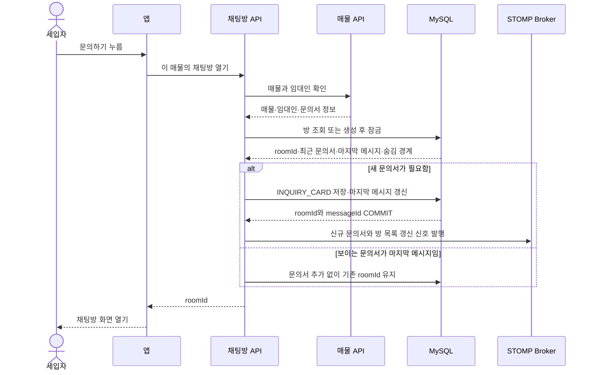

**쉽게 설명하면:** 문의하기를 누르면 서버는 `매물·세입자·임대인` 조합의 방을 찾거나 만든다. 방 생성 여부와 별도로 문의서가 필요한지도 확인한다. 문의서가 한 번도 없거나 최근 문의서 뒤에 `TEXT`·`BOOKING_CARD`가 있거나, 요청자가 최근 문의서를 볼 수 없으면 새 `INQUIRY_CARD`를 저장한다. 요청자에게 보이는 문의서가 마지막 메시지이면 같은 카드를 연속으로 저장하지 않는다. `roomId`는 이후 방 정보·메시지 조회와 실시간 구독에 사용하는 채팅방 번호다.

**결과:** 같은 매물·세입자·임대인 조합은 항상 같은 채팅방을 사용하면서, 새 문의 흐름이 시작될 때만 문의서가 한 장 추가된다.

### 매물에서 신청한 뒤 채팅방 열기

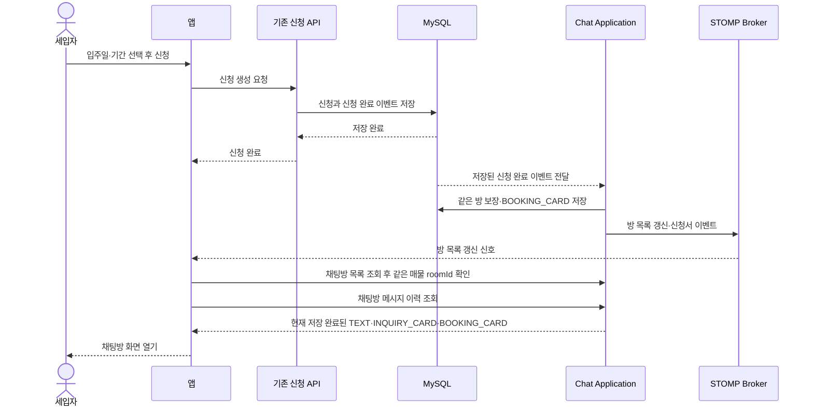

**쉽게 설명하면:** 먼저 기존 신청 API로 신청을 저장한다. 서버가 저장된 신청 이벤트를 처리해 문의하기와 같은 기준의 방을 보장하고 `BOOKING_CARD`를 저장한다. 앱은 방 목록 갱신 신호를 받거나 목록을 다시 조회해 같은 매물의 `roomId`를 확인한 뒤 메시지 이력을 연다. 신청만 한 상황에서는 문의 API를 대신 호출하지 않으므로 `INQUIRY_CARD`가 자동으로 추가되지 않는다.

신청 카드 자체는 앱이 보내지 않는다. 서버가 자동 저장하는 과정은 아래 **서버가 신청 후 채팅방과 신청 카드를 자동 보완하기** 그림에 따로 표시한다. 비동기 처리가 아직 끝나지 않아 첫 이력 조회에 카드가 없다면 짧게 기다린 뒤 이력 API를 한 번 다시 조회할 수 있다.

**결과:** 신청은 기존 Booking 기능이 처리하고, 문의하기와 같은 기준의 채팅방에 신청 카드가 표시된다. 나중에 사용자가 실제 문의하기를 누르면 그 뒤에 문의서가 추가될 수 있다.

### 채팅방 안에서 신청하기

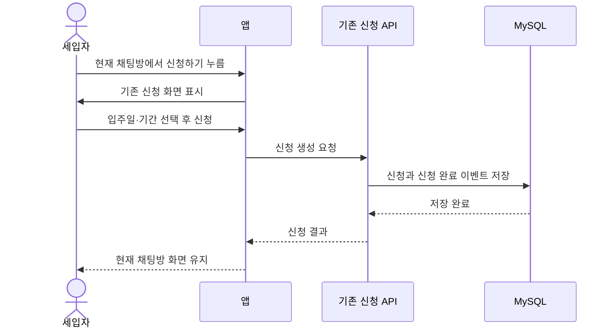

**쉽게 설명하면:** 이 그림은 채팅방 안에서 신청하는 사용자의 HTTP 흐름만 보여 준다. 이미 채팅방을 열고 있으므로 앱은 신청 API만 호출하고 현재 화면을 유지한다. 서버가 이벤트를 처리해 같은 방에 카드를 저장하는 과정은 다음 백그라운드 그림과 같다.

**결과:** 새 채팅방은 만들지 않고 현재 채팅방에 `BOOKING_CARD`만 추가한다.

### 삭제 후 같은 매물에서 새 대화 시작하기

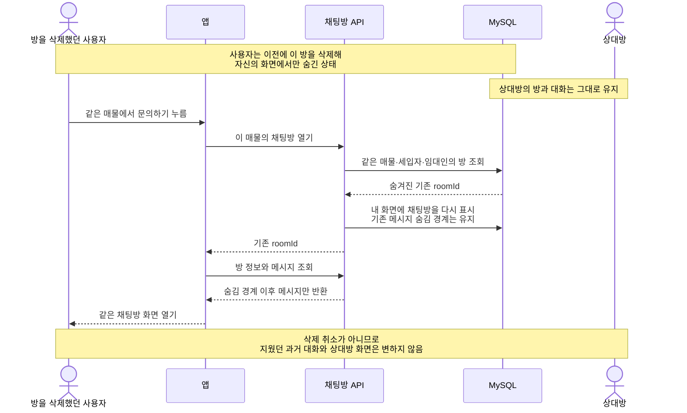

**쉽게 설명하면:** 같은 매물에서 다시 문의하면 서버는 새 채팅방을 만들지 않고 기존 `roomId`를 반환한다. 이때 채팅방 목록의 숨김 상태만 해제하고 삭제할 때 저장한 메시지 숨김 경계는 변경하지 않는다. 따라서 같은 채팅방 화면은 다시 열리지만 삭제했던 과거 메시지는 볼 수 없다.

**결과:** 새 대화를 시작하기 위해 같은 채팅방을 다시 표시하지만 삭제한 과거 이력은 복원하지 않는다.

### 서버가 신청 후 채팅방과 신청 카드를 자동 보완하기

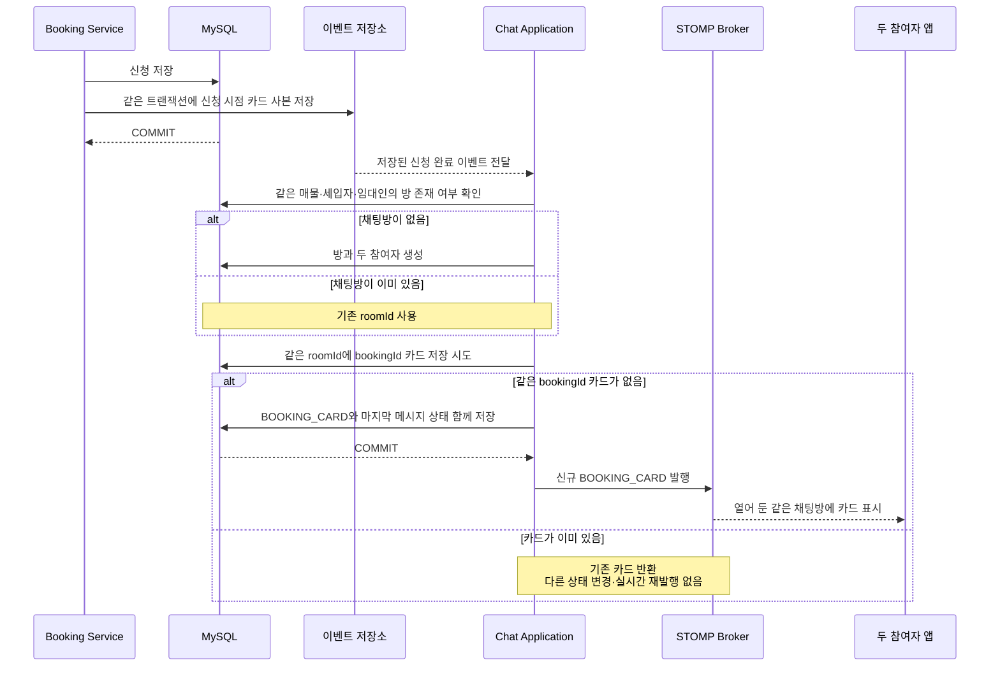

**쉽게 설명하면:** 이 그림은 사용자나 앱이 호출하지 않는 백엔드 자동 작업이다. 예약과 함께 `BookingCreatedEvent`가 MySQL에 기록되고, Chat Application이 이를 받아 같은 방을 보장한 뒤 카드 한 장을 저장한다. 카드에 필요한 대표 이미지·매물·신청자·금액은 이벤트 안에 신청 시점 사본으로 이미 들어 있으므로 처리 중 Booking API를 다시 호출하지 않는다.

listener가 실패하면 이벤트 행은 미완료로 남고 서버 재기동 때 다시 전달된다. 같은 이벤트가 다시 와도 `(chatRoomId, bookingId)` 중복 방지로 카드가 두 장 생기지 않는다. 신규 카드 저장이 커밋되면 서버가 같은 채팅방 topic으로 카드를 즉시 보내므로, 채팅방을 열어 둔 앱은 화면을 새로고침하지 않아도 카드를 표시할 수 있다. 실시간 이벤트를 놓친 앱은 메시지 이력 API로 저장된 카드를 다시 받는다.

**결과:** 신청 뒤 채팅방과 신청 카드가 누락되지 않고 신규 카드는 실시간으로 표시된다. 같은 이벤트를 다시 처리해도 방·카드·실시간 이벤트가 중복 생성되지 않는다.

## 2. WebSocket 연결과 메시지

### WebSocket에 접속하고 JWT로 인증하기

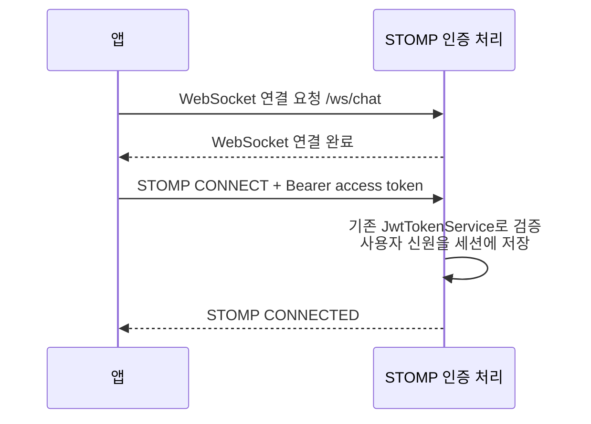

**쉽게 설명하면:** 앱은 WebSocket에 연결한 다음 STOMP `CONNECT` 헤더에 JWT를 넣는다. STOMP 메시지는 일반 REST 인증 필터를 지나지 않기 때문에 `ChannelInterceptor`가 이를 받아 기존 `JwtTokenService`로 검증한다. 검증된 `userId`는 연결 세션에 저장되고 이후 전송·구독의 사용자 신원으로 사용된다.

**결과:** 이후 STOMP 요청은 연결된 세션의 검증된 userId를 사용한다.

### 채팅방 연결 시 앱이 누락 메시지를 자동 보충하기

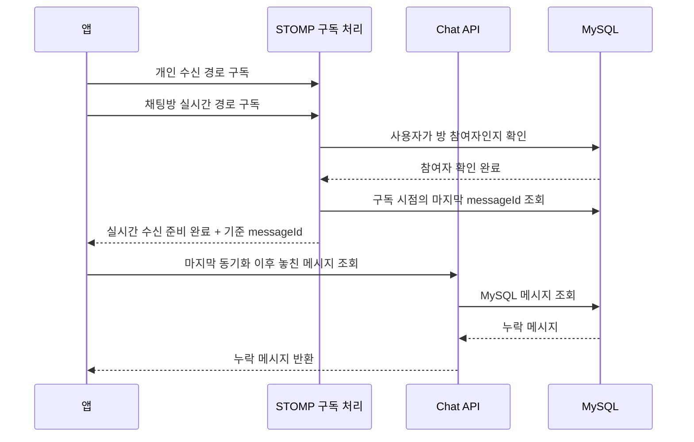

**쉽게 설명하면:** 구독은 특정 채팅방의 새 메시지를 STOMP로 실시간 수신하도록 등록하는 것이다. 앱은 구독 준비가 끝난 직후와 재연결 직후에만 REST API를 자동 호출해 마지막 `messageId` 이후의 누락분을 MySQL에서 한 번 보충한다. 사용자가 별도 버튼을 누를 필요는 없으며 계속 반복 조회하는 polling 방식도 아니다. 이것은 메시지 누락 방지 기능이며 읽음 여부를 계산하는 기능은 아니다.

**결과:** 마지막 동기화 이후부터 구독 기준 시점까지 빠진 메시지도 MySQL에서 보충한다.

### 새 메시지를 저장하고 발신자에게 ACK 보내기

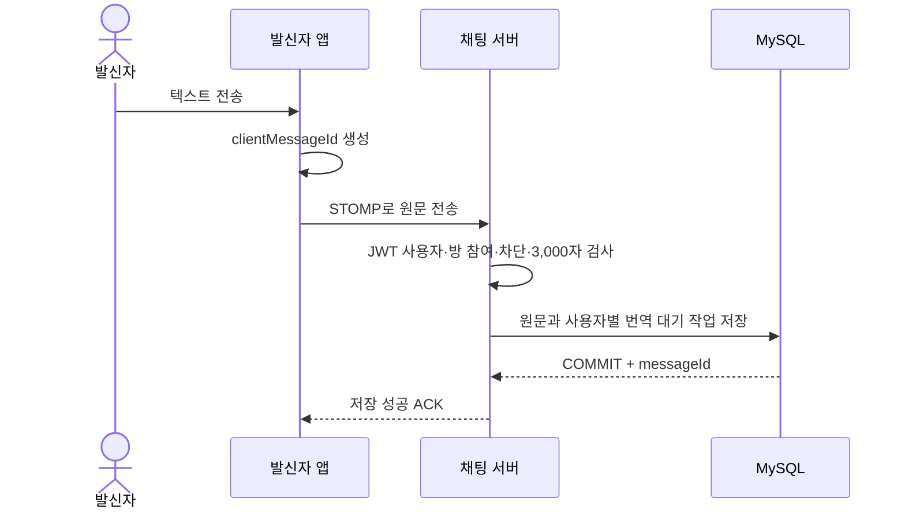

**쉽게 설명하면:** 프런트엔드가 UUID 형태의 `clientMessageId`를 먼저 만들고 서버는 이를 재전송 중복을 판별하는 값으로 사용한다. 서버는 원문, `번역 대기(PENDING)` 행, 방의 마지막 메시지 정보를 함께 저장한다. 필요하면 수신자가 숨긴 방을 다시 표시하는 상태도 같은 트랜잭션에서 바꾼다. `PENDING`은 원문 메시지가 아니라 번역만 아직 처리되지 않았다는 뜻이다. 저장이 끝나면 발신 앱은 ACK로 임시 말풍선을 전송 완료 상태로 바꾼다.

**결과:** 발신자는 Google 번역을 기다리지 않고 원문 저장 성공을 즉시 확인한다. 수신자 전달은 다음 시나리오에서 처리한다.

### 저장된 메시지를 자동 번역하기

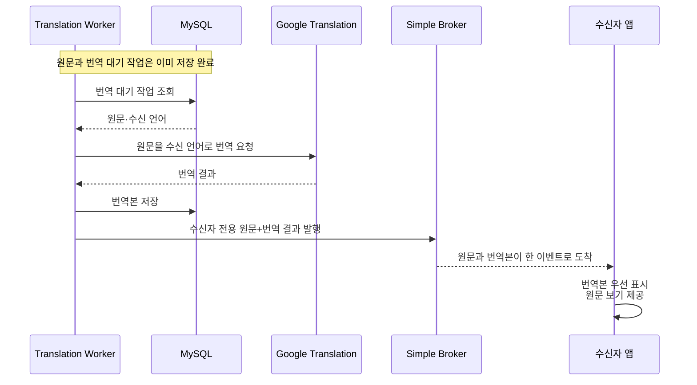

**쉽게 설명하면:** `Translation Worker`는 직접 번역하는 프로그램이 아니라 번역 작업을 관리하는 Spring 백그라운드 컴포넌트다. DB에서 `PENDING` 작업을 찾아 Google API에 원문을 보내고, Google이 만든 번역본을 DB에 저장한다. 그다음 수신자에게 원문과 번역본을 한 번에 전달한다. 원문이 먼저 나타난 뒤 번역 말풍선으로 바뀌는 방식이 아니며, 저장된 원문도 수정하지 않는다.

**결과:** 수신자는 같은 이벤트에서 번역본을 기본 표시하고 필요할 때 원문을 볼 수 있다.

### 자동 번역이 최종 실패한 경우

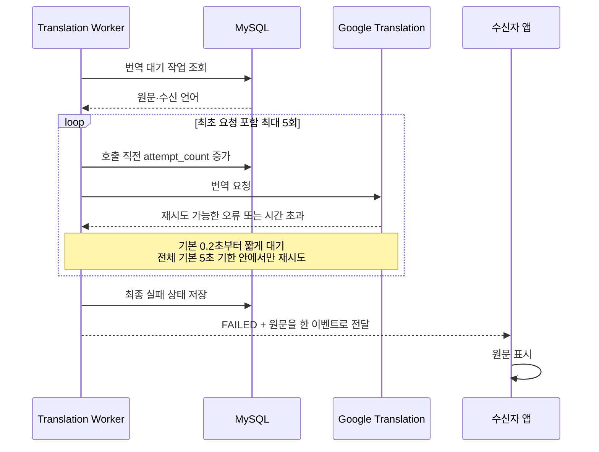

**쉽게 설명하면:** Google API의 일시 오류나 시간 초과가 발생하면 Worker가 같은 작업 안에서 아주 짧게 기다렸다가 최초 요청을 포함해 최대 5번 호출한다. 다만 수신을 오래 기다리지 않게 전체 기본 5초 기한을 넘겨 새 요청을 시작하지 않는다. 다음 시도 일정을 DB에 예약하는 방식은 아니다. 서버가 중간에 꺼지면 저장된 시도 횟수를 보고 남은 횟수만 이어서 처리한다. 계속 실패하면 `FAILED`와 원문을 함께 보내므로 수신자는 원문을 볼 수 있다.

**결과:** 번역 실패에도 원문 메시지는 그대로 저장되고 수신자 화면에는 원문이 표시된다.

### 네트워크 오류로 같은 메시지를 다시 보낸 경우

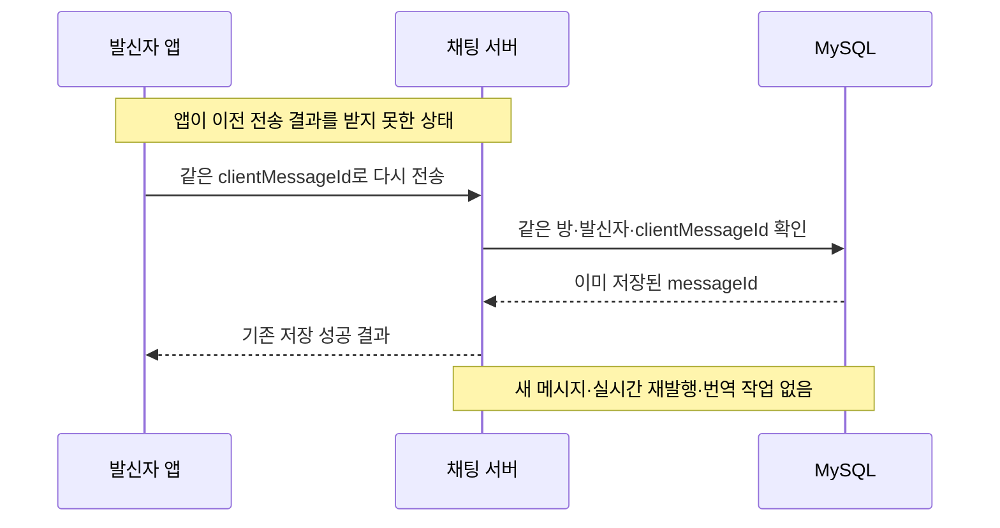

**쉽게 설명하면:** 앱이 응답을 받지 못하면 같은 논리적 메시지를 동일한 `clientMessageId`로 다시 보낸다. MySQL UNIQUE 제약으로 이미 저장된 메시지를 찾아 기존 `messageId`를 반환하므로 두 개로 저장되지 않는다. 새 메시지를 작성할 때는 새로운 `clientMessageId`를 만들어야 한다.

**결과:** 네트워크 재시도에도 메시지는 한 번만 저장된다.

## 3. 채팅방 삭제와 새 메시지

### 사용자가 채팅방을 삭제하기

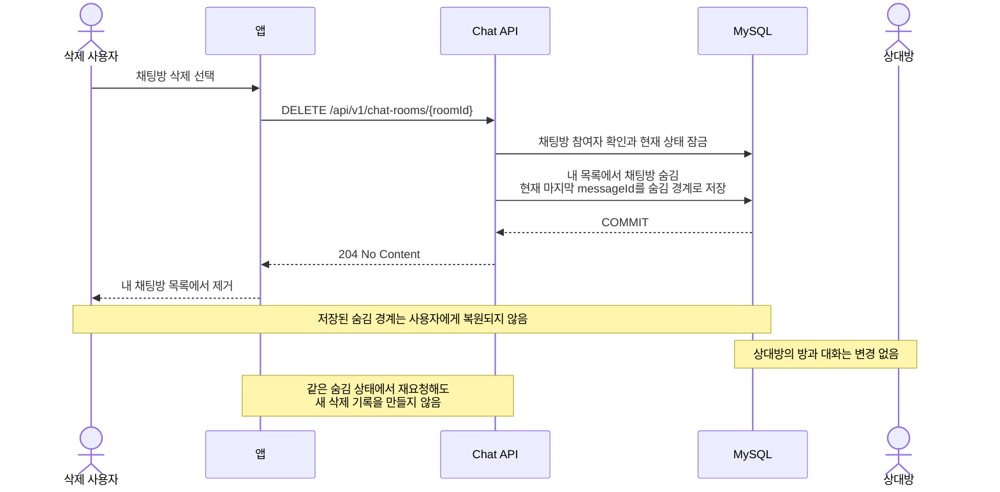

**쉽게 설명하면:** 삭제하면 요청한 사용자의 채팅방 목록에서만 채팅방을 숨기고, 삭제 시점까지의 메시지를 숨김 경계로 기록한다. 서버는 JSON 본문 없이 `204`를 반환하며 Undo나 복원 API는 제공하지 않는다. 상대방 화면은 그대로 유지되고 같은 요청을 반복해도 추가 변경 없이 성공한다.

**결과:** 사용자가 삭제한 과거 대화는 복원할 수 없지만 공유 메시지를 즉시 DB에서 물리 삭제하지는 않는다.

### 숨긴 방에 실제 새 메시지가 도착하기

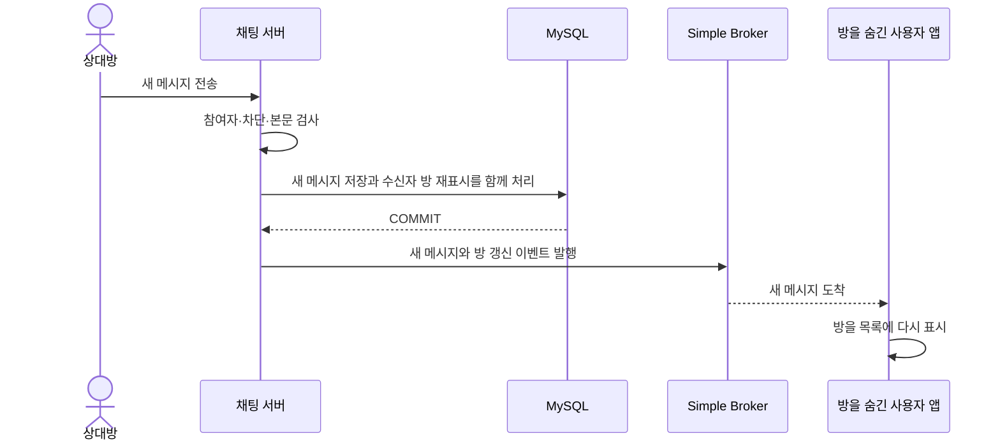

**쉽게 설명하면:** 사용자가 방을 숨겼더라도 차단하지 않았다면 상대방은 새 메시지를 보낼 수 있다. 서버는 `새 메시지 저장`과 `수신자의 방을 다시 표시`하는 변경을 한 트랜잭션으로 함께 처리한다. 그래서 메시지만 저장되고 방은 계속 안 보이거나, 방만 나타나고 메시지가 없는 상태가 생기지 않는다. 방은 다시 나타나지만 사용자가 숨긴 과거 메시지는 복원되지 않는다.

**결과:** 실제 새 메시지가 생긴 경우에만 방이 다시 나타나며, 사용자가 숨긴 과거 범위는 복원하지 않는다.

3개월 만료와 실제 DB 물리 삭제 시퀀스는 현재 구현에서 제외하고 [후속 고도화 시퀀스](future/03-sequence-diagrams.md)로 분리한다.

## 4. 차단

### 채팅방에서 상대방 차단하기

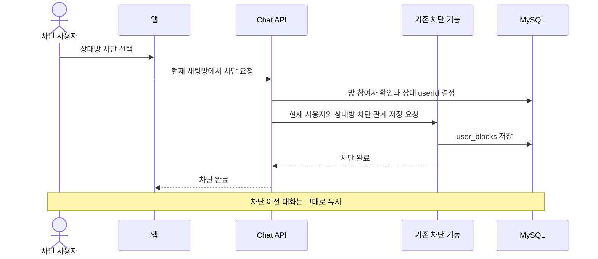

**쉽게 설명하면:** 앱은 상대 사용자 번호를 직접 보내지 않고 현재 `roomId`만 사용한다. 서버가 방의 두 참여자를 확인해 차단할 상대를 결정하므로 클라이언트가 임의의 사용자를 차단 대상으로 꾸미는 것을 막을 수 있다.

**결과:** 클라이언트가 상대 userId를 지정하지 않고 서버가 방 정보로 상대를 결정한다.

### 차단된 관계에서 메시지 보내기

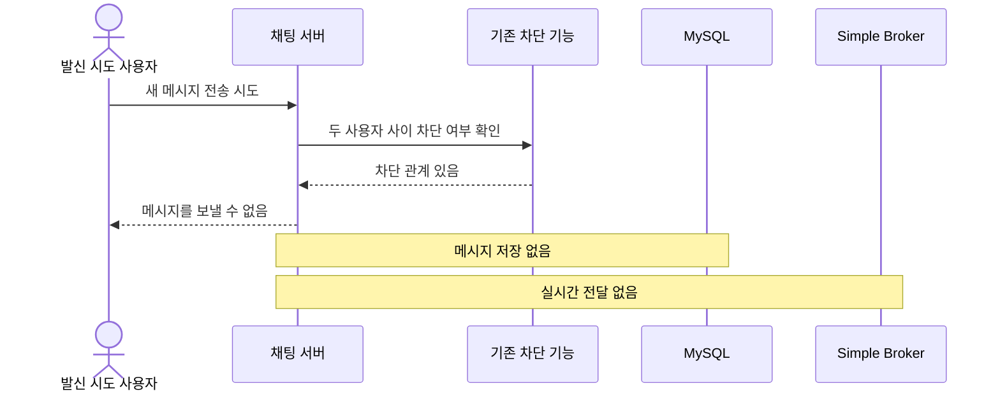

**쉽게 설명하면:** 서버는 메시지를 저장하기 전에 두 사용자 사이의 차단 여부를 확인한다. 어느 한쪽이라도 차단했다면 원문, 번역 작업, 실시간 이벤트를 모두 만들지 않는다.

**결과:** 차단 이후 메시지는 저장하거나 상대방에게 전달하지 않는다.

## 5. 신고

### 채팅방 신고 접수하기

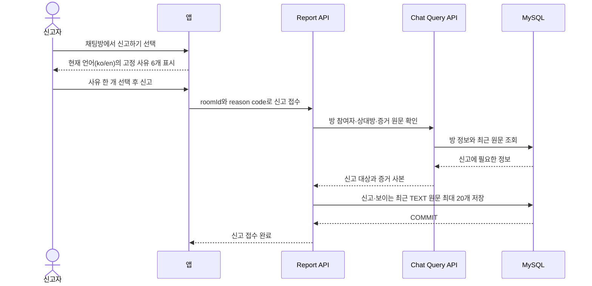

**쉽게 설명하면:** 앱은 고정 사유 문구를 `ko/en`으로 직접 보여 주고, 사용자는 code 한 개와 `roomId`만 보낸다. 서버는 신고자가 실제 방 참여자인지 확인하고 방의 다른 사용자를 신고 대상으로 결정한다. 최근 TEXT 원문과 기준 `messageId`는 서버가 직접 증거로 확보한다.

**결과:** POST 응답에 `reportId`가 오면 접수가 완료된 것이다. 별도 상태 조회 API는 없으며 신고자·상대방·방·접수 시각·증거는 서버가 결정한다.

운영자 처리와 신고 자료 만료 정리 시퀀스는 [후속 고도화 시퀀스](future/03-sequence-diagrams.md)로 분리한다.

## 6. 그림에서 생략한 상세

그림은 한 시나리오의 핵심 흐름만 보여 준다. 다음 세부 규칙은 정본 문서에서 확인한다.

- 동시 방 생성과 메시지 중복 저장을 막는 MySQL UNIQUE 처리
- STOMP destination, 개인 queue payload, heartbeat와 재연결 규칙
- 신고 중복 접수 조건
- 번역 재시도 횟수·간격과 Google API 오류 분류
- 트랜잭션 lock 순서

관리자 처리와 물리 삭제의 상세는 [후속 고도화 문서](future/README.md)를 따른다.
