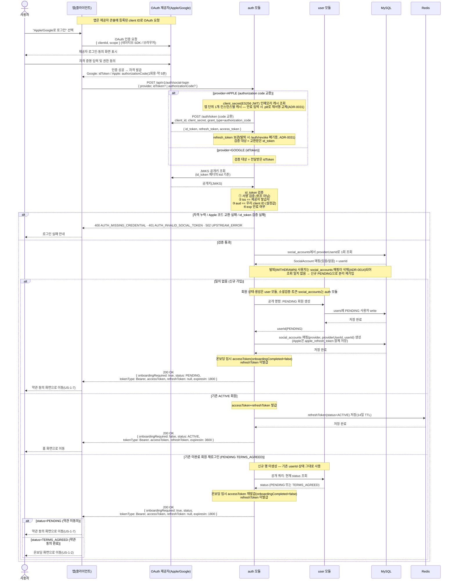

# US-1-1 — 소셜 로그인으로 진입해 서버 토큰 발급받기

> 모듈: 소셜 로그인 · 온보딩 · [유저 스토리](../../../requirements/user-stories.md) · [API 스펙](../../../api/specs/01-auth-onboarding.md)
>
> 참고: 백엔드는 관여하는 **모듈**(이 흐름은 `auth 모듈`)로 표기한다. OAuth 로그인 과정을 보이기 위해 이 다이어그램에 한해 **OAuth 제공자(Apple/Google)** 도 참가자로 둔다.

## 흐름 요약

- 사용자가 "Apple/Google로 로그인"을 선택하면 앱이 OAuth 제공자에 인증을 요청하고(네이티브 SDK/브라우저), 사용자가 제공자 화면에서 로그인·동의하면 앱이 자격을 받는다 — **Google은 `idToken`, Apple은 `authorizationCode`**(1회용·약 5분)다([ADR-0031](../../../adr/0031-apple-sign-in-authorization-code-flow.md)).
- 앱은 이 자격을 `POST /api/v1/auth/social-login`으로 전달한다(단일 엔드포인트, provider별 자격 필드 하나). **Apple은** 서버가 `authorizationCode`를 `POST /auth/token`(`client_secret`=ES256 JWT — 앱 단위 단일 값이라 인메모리 1개만 캐시하고 만료 임박 시 `.p8`로 재서명, `grant_type=authorization_code`)에서 교환해 `{ id_token, refresh_token }`을 받고, **검증 대상은 교환받은 `id_token`**이며 `refresh_token`은 탈퇴 시 폐기(US-1-4)를 위해 `social_accounts.apple_refresh_token`에 저장한다(응답에 있을 때만 upsert, 없으면 기존 값 보존). **Google은** 전달받은 `idToken`이 검증 대상이다.
- 서버는 검증 대상 토큰을 **JWKS 공개키로 서명 검증**한 뒤 클레임 **`iss`(발급자)·`aud`(= 우리 client ID)·`exp`(만료)** 를 검증한다. `aud`가 우리 client ID가 아니면(예: 타 앱에서 받은 토큰) 거부한다. 자격 필드 누락은 `400 AUTH_MISSING_CREDENTIAL`, 검증 실패는 `401 AUTH_INVALID_SOCIAL_TOKEN`, Apple 측 일시 장애·타임아웃은 `502 UPSTREAM_ERROR`.
- `aud`와 대조할 **우리 client ID는 제공자 콘솔(Google Cloud / Apple Developer)에 앱을 등록하면 발급**되는 값이다. 앱은 이 client ID로 OAuth를 요청하고(→ 제공자가 토큰 `aud`에 박아 발급), 백엔드는 같은 값을 설정에 두고 대조한다.
- 검증을 통과하면 **`auth 모듈`이 MySQL `social_accounts`에서 `providerUserId`로 회원을 1회 조회**하고, 그 결과로 세 갈래로 분기한다. 모든 분기 응답에 **`status`(PENDING·TERMS_AGREED·ACTIVE)** 를 함께 내려 클라이언트의 재개 지점을 정한다. 소셜 검증·토큰 발급·`social_accounts`는 `auth 모듈`이, 회원 상태·생성은 `user 모듈`이 소유한다.
  - **일치 없음(신규 가입)**: `auth`가 **`user 모듈`의 공개 명령으로 PENDING 회원을 생성**(`user`가 MySQL `users`에 write)한 뒤, `auth`가 `social_accounts` 매핑을 생성한다. 온보딩 임시 access 토큰(`onboardingRequired=true`, `status=PENDING`, `refreshToken=null`, `expiresIn=1800`)을 반환한다.
  - **기존 ACTIVE 회원**: 발급한 **refreshToken을 Redis에 저장(14일 TTL)**하고 `200 OK`로 access+refresh 토큰과 `onboardingRequired=false`·`status=ACTIVE`(`expiresIn=3600`)를 반환한다.
  - **기존 미완료 회원(PENDING·TERMS_AGREED) 재로그인**: 신규 행을 만들지 않고 기존 userId 그대로 **온보딩 임시 access 토큰만 재발급**(`onboardingRequired=true`, `refreshToken=null`, `expiresIn=1800`)하되 현재 `status`를 함께 내린다 — **`PENDING`(약관 미동의)이면 약관 동의(US-1-7)부터, `TERMS_AGREED`이면 온보딩(US-1-2)부터** 재개한다.
- 앱은 응답의 **`status`로 다음 화면을 분기**한다 — `PENDING`→약관 동의(US-1-7), `TERMS_AGREED`→온보딩(US-1-2), `ACTIVE`→홈. 온보딩 토큰으로는 `GET /users/me`가 `403`이라 상태를 따로 조회할 수 없으므로 이 `status`로 판단한다.
- 탈퇴(WITHDRAWN) 사용자는 `social_accounts` 매핑이 삭제([ADR-0014](../../../adr/0014-withdrawal-pii-anonymization.md))되어 조회에서 일치가 없으므로, 다시 로그인하면 신규 PENDING으로 분리되어 재가입한다.
