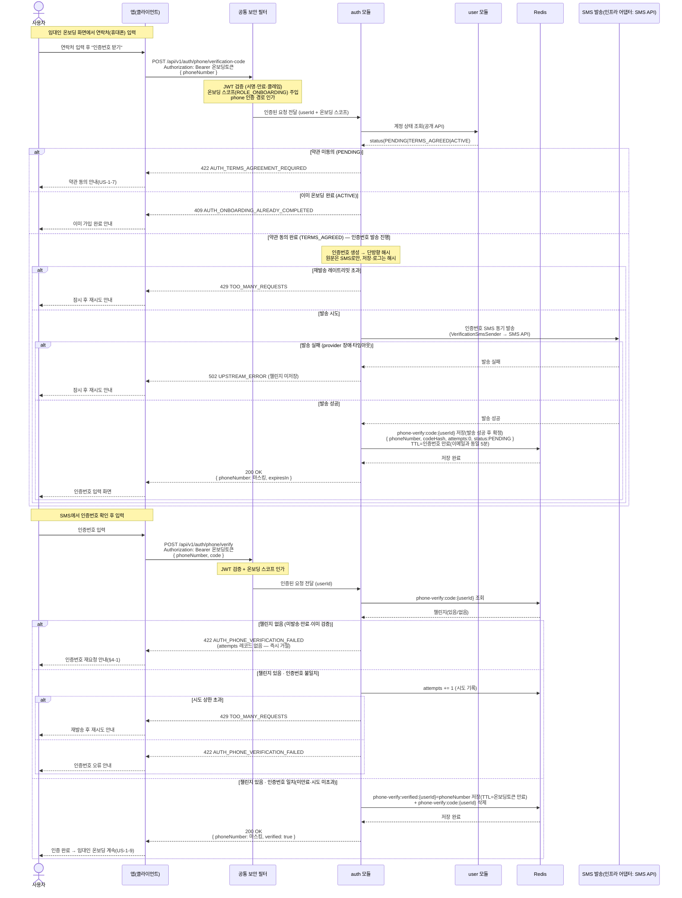

# US-1-10 — 온보딩 중 연락처(휴대폰) 인증하기 (임대인 전용)

> 모듈: 소셜 로그인 · 온보딩 · [유저 스토리](../../../requirements/user-stories.md) · [API 스펙](../../../api/specs/01-auth-onboarding.md)
>
> 임대인 온보딩(US-1-9) 제출 **전에** 수행하는 연락처(휴대폰) 소유 인증이다. 세입자 이메일 인증(US-1-6)과 대칭이며 임대인 트랙에서 이를 대체한다([ADR-0034](../../../adr/0034-landlord-phone-sms-verification.md)). 인증번호는 `auth`가 해시로만 보관(Redis, TTL)하고 SMS 발송은 인프라 어댑터(SMS API — 구체 provider는 [ADR-0034](../../../adr/0034-landlord-phone-sms-verification.md))에 위임한다. 임대인 전용 경로다.

## 흐름 요약

- 임대인 온보딩 중인 사용자가 입력한 연락처(휴대폰)로 SMS 인증번호를 받는다. 공통 보안 필터(SEC)가 **온보딩 토큰(`ROLE_ONBOARDING`)** 을 검증하고 연락처 인증 경로를 인가한 뒤 `auth 모듈`로 `userId`를 전달한다(임대인 온보딩 흐름이라 온보딩 토큰을 허용 — [API 스펙](../../../api/specs/01-auth-onboarding.md)). 세입자 이메일 인증(US-1-6)과 **대칭**인 임대인 전용 검증 단계다.
- **선행 게이트**: 연락처 인증은 **약관 동의(US-1-7, `TERMS_AGREED`)가 선행**되어야 한다. `auth`가 `user 모듈` 공개 API로 계정 상태를 조회해 **약관 미동의(`PENDING`)면 `422 AUTH_TERMS_AGREEMENT_REQUIRED`**(약관 동의 안내가 먼저), 이미 완료(`ACTIVE`)면 `409 AUTH_ONBOARDING_ALREADY_COMPLETED`로 거절한다. `TERMS_AGREED`일 때만 아래 발송·확인을 진행한다.
- **인증번호 발송**(`POST /api/v1/auth/phone/verification-code`): `auth`가 인증번호를 생성해 **아웃바운드 포트 `VerificationSmsSender`(인프라 어댑터: SMS API)로 동기 발송**하고, **발송에 성공한 뒤에만** 인증번호의 **단방향 해시**를 Redis `phone-verify:code:{userId}`에 저장(TTL=만료 5분 — 이메일과 동일)한다(원문은 SMS로만). 인증번호 생성·해시·검증은 서버가 보유하고 어댑터는 발송만 담당한다(구체 provider는 [ADR-0034](../../../adr/0034-landlord-phone-sms-verification.md)). provider 장애·타임아웃 등 **발송 실패 시 챌린지를 만들지 않고 `502 UPSTREAM_ERROR`** 로 응답해 재시도를 유도한다. 재발송 레이트리밋 초과는 `429 TOO_MANY_REQUESTS`. 응답의 `phoneNumber`는 마스킹한다. **인증번호 정책(6자리·코드 TTL 5분·검증 마커 30분·시도 5회·재발송 60초)은 이메일 인증(US-1-6)과 통일**하며, 이 발송·확인은 **프로필 연락처 변경(US-1-5)** 에서도 재사용한다(정식 토큰 컨텍스트 허용, 새 번호 VERIFIED 후에만 반영).
- **인증번호 확인**(`POST /api/v1/auth/phone/verify`): 챌린지가 **없으면**(미발송·만료·이미 검증) 올릴 `attempts` 레코드가 없으므로 즉시 `422 AUTH_PHONE_VERIFICATION_FAILED`로 거절하고 인증번호 재요청을 유도한다. 챌린지가 **있고** 입력 인증번호 해시가 `codeHash`와 **불일치**하면 `attempts`를 올려 상한 초과 시 `429 TOO_MANY_REQUESTS`, 아니면 `422`다. **일치**(미만료·시도 미초과)하면 `phone-verify:verified:{userId}`에 검증 연락처를 기록(TTL=온보딩 토큰 만료)하고 코드 키를 제거한다.
- 이후 **임대인 온보딩 제출(US-1-9)** 에서 `auth`가 제출 `phoneNumber`를 `phone-verify:verified:{userId}`와 대조해 일치할 때만 `user` 온보딩 완료 명령을 진행한다(미인증·불일치 `422 AUTH_PHONE_NOT_VERIFIED`). 인증 흔적은 TTL로 자동 소멸하며, 확정 연락처만 `users.phone_number`로 영속한다([database-design](../../../database/database-design.md) §4-1 A-3·§4-2).
- 인증번호 원문은 저장·로그하지 않고(해시만), `phoneNumber`는 응답·로그 마스킹(예 `010-****-5678`)한다([error-response-guide §6](../../../api/error-response-guide.md)).
