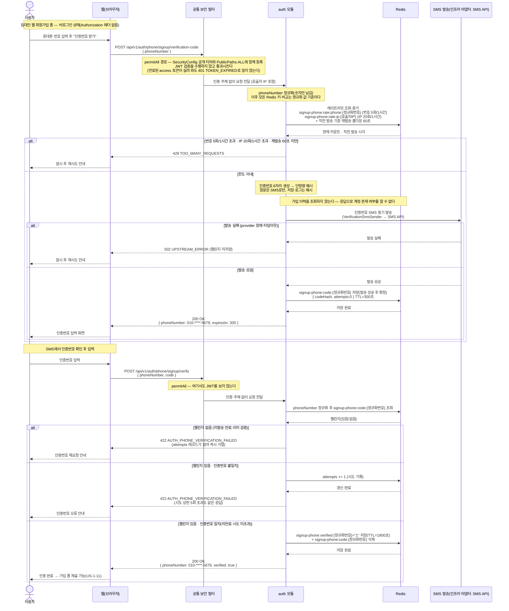

# US-1-13 — 가입용 휴대폰 인증하기 (비로그인 · 임대인 웹)

> 모듈: 소셜 로그인 · 온보딩 · [유저 스토리](../../../requirements/user-stories.md) · [API 스펙](../../../api/specs/01-auth-onboarding.md)
>
> 임대인 웹 회원가입(US-1-11) 제출 **전에** 수행하는 번호 소유 인증이다. 온보딩용 연락처 인증([US-1-10](us-1-10-phone-verification.md))과 **정책(6자리·코드 TTL 5분·검증 마커 30분·시도 5회·재발송 60초)과 발송 포트(`VerificationSmsSender`)를 그대로 공유**하지만, 아직 계정이 없어 `userId`가 존재하지 않는 단계라 **챌린지 키가 다르다** — US-1-10은 `phone-verify:*:{userId}`, 이 경로는 **정규화한 번호를 키로 쓰는** `signup-phone:*:{정규화번호}`다. 키가 다르므로 엔드포인트도 재사용하지 않고 신설하며, 비로그인이라 **permitAll**로 연다. permitAll SMS 발송은 문자 폭탄·발송비 남용 표면이므로 **번호 단위 + IP 단위 이중 레이트리밋**이 필수다([ADR-0034](../../../adr/0034-landlord-phone-sms-verification.md)의 발송 정책을 웹 가입 경로로 확장한다).

## 흐름 요약

- **비로그인 진입점이다.** 두 엔드포인트(`POST /api/v1/auth/phone/signup/verification-code` · `POST /api/v1/auth/phone/signup/verify`) 모두 토큰 없이 호출되므로 **`SecurityConfig`의 공개(permitAll) 티어와 [`PublicPaths.ALL`](../../../../src/main/java/com/kohere/common/security/PublicPaths.java) 두 곳에 함께 등록**한다. 한쪽만 등록하면 만료된 access 토큰을 든 브라우저가 가입 화면에서 `401 TOKEN_EXPIRED`를 맞는다 — 공개 경로 등록 누락은 이미 한 번 발생한 사고 유형이다. 공개 티어라 **필터가 주체(`userId`)를 세우지 않으며**, 그래서 챌린지 키를 번호로 잡는다.
- **키는 정규화한 번호다.** `auth`가 입력 `phoneNumber`에서 숫자만 남긴 값을 Redis 키로 쓰고(`signup-phone:code:{정규화번호}`), 검증에 성공하면 마커 `signup-phone:verified:{정규화번호}`에 `"1"`을 **TTL 1800초**로 기록한다. 이 마커는 **가입 제출(US-1-11)에서만 소비**하므로 용도 구분 필드가 없다.
- **레이트리밋이 이 경로의 핵심 방어다.** 인증 없이 SMS를 쏠 수 있는 경로라 **번호 5회/1시간 · IP 20회/1시간**을 동시에 걸고, 여기에 기존 정책인 **재발송 쿨다운 60초**를 그대로 얹는다. 어느 하나라도 걸리면 `429 TOO_MANY_REQUESTS`다. 번호 제한만 두면 번호를 바꿔가며 발송비를 태울 수 있고, IP 제한만 두면 한 번호를 반복 폭격할 수 있어 **둘 다 필요하다**.
- **발송 실패 시 챌린지를 저장하지 않는다.** 동기 발송이므로 provider 장애·타임아웃이면 Redis에 아무것도 쓰지 않고 `502 UPSTREAM_ERROR`를 반환한다(US-1-10과 동일). 저장부터 하면 SMS를 못 받은 사용자가 만료를 기다려야 하고 재발송 쿨다운만 소모된다.
- **확인 실패는 응답을 하나로 통일한다.** 챌린지 없음(미발송·만료·이미 검증)·인증번호 불일치·시도 상한 초과가 **모두 `422 AUTH_PHONE_VERIFICATION_FAILED`** 다. 온보딩용 US-1-10이 시도 상한 초과에 `429 TOO_MANY_REQUESTS`를 쓰는 것과 다른데, 비로그인 경로는 응답 차이 자체가 **번호별 시도 잔량과 챌린지 존재 여부를 알려주는 신호**가 되므로 구분하지 않는다.
- **계정 존재 여부를 노출하지 않는다.** 이미 가입된 번호든 처음 보는 번호든 발송·응답이 동일하다. 연동 가능 여부는 이 단계에서 알려주지 않으며(가입 폼은 연동 여부와 무관하게 항상 전체 필드를 받는다), 판정은 가입 제출(US-1-11) 시점에만 이뤄진다.
- 인증번호 원문은 저장·로그하지 않고 해시만 보관하며, `phoneNumber`는 응답·로그에서 마스킹(`010-****-5678`)한다([error-response-guide §6](../../../api/error-response-guide.md)).

## 실패 응답 정리

| 경우 | 응답 | 부수효과 |
| --- | --- | --- |
| 번호·IP 한도 초과, 재발송 60초 미만 | `429 TOO_MANY_REQUESTS` | 없음(SMS 미발송, 챌린지 미변경) |
| SMS 발송 실패(provider 장애·타임아웃) | `502 UPSTREAM_ERROR` | **없음 — 챌린지를 저장하지 않는다** |
| 챌린지 없음(미발송·만료·이미 검증) | `422 AUTH_PHONE_VERIFICATION_FAILED` | 없음(올릴 `attempts` 레코드가 없다) |
| 인증번호 불일치 | `422 AUTH_PHONE_VERIFICATION_FAILED` | `attempts += 1` |
| 시도 상한(5회) 초과 | `422 AUTH_PHONE_VERIFICATION_FAILED` | 없음 — **US-1-10과 달리 429로 구분하지 않는다** |
| 형식 위반(`phoneNumber` 누락·휴대폰 형식 아님) | `400 INVALID_INPUT` | 없음(Bean Validation 단계에서 차단) |

## 알려진 제약

- **앱스토어 심사용 고정 인증번호 우회(`FixedVerificationPolicy`)는 이 경로에 적용되지 않는다.** 그 우회는 `userId` + Google 소셜 계정을 기준으로 판정하는데, 가입 전 경로에는 둘 다 없다. 웹 가입은 항상 실제 SMS를 발송한다(로컬 개발은 `LoggingVerificationSmsSender`가 콘솔에 인증번호를 찍는다).
- **번호 정규화는 입력 경로에만 적용하고 기존 데이터를 백필하지 않는다.** 이 문서의 마커 키는 항상 정규화 값이지만, `users.phone_number`에 하이픈을 포함해 저장된 기존 임대인 행은 가입 제출(US-1-11)·병합([US-1-15](us-1-15-landlord-account-merge.md))의 매칭에서 누락될 수 있다.
