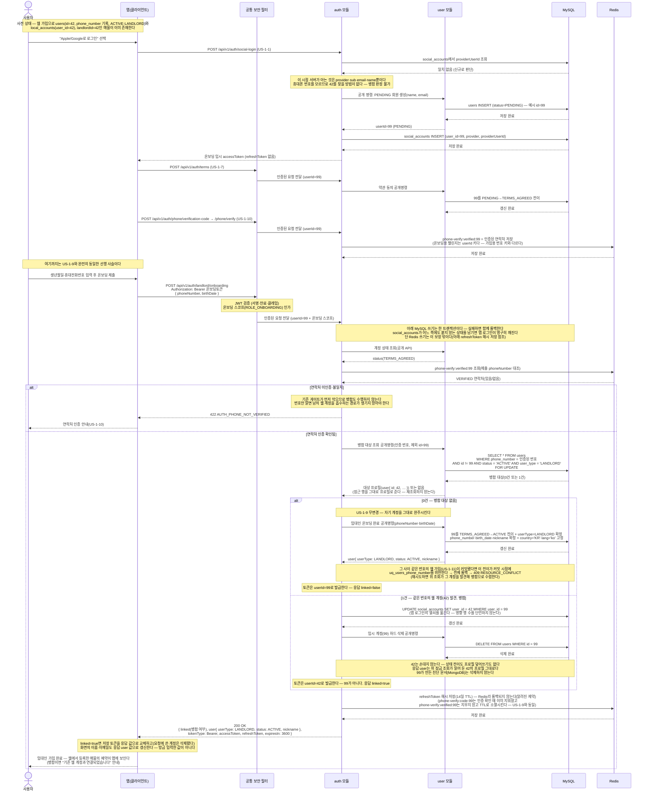

# US-1-15 — 앱 임대인 온보딩 시 기존 웹 계정과 병합하기

> 모듈: 소셜 로그인 · 온보딩 · [유저 스토리](../../../requirements/user-stories.md) · [API 스펙](../../../api/specs/01-auth-onboarding.md)
>
> 웹에서 먼저 가입해 매물을 등록해 둔 임대인([US-1-11](us-1-11-web-signup.md))이 앱에서 소셜 로그인해 임대인 온보딩([US-1-9](us-1-9-landlord-onboarding.md))을 마칠 때, 같은 번호의 웹 계정과 **하나로 합치는** 흐름이다. 엔드포인트는 신설하지 않고 기존 `POST /api/v1/auth/landlord/onboarding`에 **병합 분기를 추가**한다.
>
> **판정 지점이 로그인이 아니라 온보딩인 이유**: 소셜 로그인은 `name`·`email`만 주고 휴대폰 번호를 주지 않는다. 서버가 번호를 처음 아는 시점은 **연락처 SMS 인증([US-1-10](us-1-10-phone-verification.md))을 통과한 온보딩 제출**이며, 그때는 이미 소셜 로그인이 `createPendingUser`로 임시 `users` 행을 만들어 둔 뒤다. 그래서 웹→앱 방향(US-1-11)이 **연결**인 것과 달리 앱→웹 방향은 **병합**이 된다. 병합이 안전한 이유는 그 임시 계정이 방금 만들어져 **매물·예약·채팅이 하나도 없기 때문**이고, 실제로 옮길 것은 `social_accounts` 행 하나뿐이다.
>
> 아래 `42`(웹 계정)·`99`(임시 계정)는 설명용 예시 id다.

## 흐름 요약

- **선행 사슬은 US-1-9와 동일하다.** 소셜 로그인(US-1-1)이 `social_accounts` 조회에서 일치를 찾지 못해 임시 `users` 행(`PENDING`, 예시 id=99)과 `social_accounts` 행을 만들고 온보딩 토큰을 내린다. 이 시점에는 번호를 모르므로 **병합 판정 자체가 불가능**하다. 이어 약관 동의(US-1-7)로 `TERMS_AGREED`가 되고, 연락처 SMS 인증(US-1-10)이 **`userId` 키** 챌린지(`phone-verify:verified:{userId}`)로 검증 마커를 남긴다 — 가입용 인증([US-1-13](us-1-13-signup-phone-verification.md))이 쓰는 번호 키 챌린지와는 다른 키 공간이다.
- **인증 게이트가 병합보다 먼저다.** 온보딩 제출에서 기존 게이트(약관 → 연락처 인증)를 그대로 통과해야 하며, 마커가 없거나 제출 번호와 다르면 `422 AUTH_PHONE_NOT_VERIFIED`로 끊고 **병합도 수행하지 않는다**. 이 순서가 유지되어야 "번호만 알면 남의 웹 계정을 흡수한다"는 경로가 생기지 않는다.
- **병합 대상 조회는 `SELECT ... FOR UPDATE`로 잠그고, 잠근 행을 그대로 프로필로 돌려받는다.** 조건은 **인증된 번호 + 자기 자신 제외(`id != currentUserId`) + `status='ACTIVE'` + `user_type='LANDLORD'`** 다. 자기 제외가 없으면 자기 자신을 대상으로 잡아 **소셜 매핑을 자기에게 옮기고 자기 행을 지우는** 자기파괴가 성립한다(지금은 번호가 비어 있어 걸리지 않지만 기대면 안 되는 불변식이다). 웹 가입([US-1-11](us-1-11-web-signup.md))의 같은 조회가 **식별자만** 돌려받는 것과 달리 여기서는 **프로필까지** 받는다 — 병합 응답의 `user`가 대상 계정 기준이라 어차피 그 값이 필요하고, 잠근 행에서 바로 만들면 조회가 한 번으로 끝나며 응답이 **잠긴 그 행의 값**임이 보장된다(병합은 대상 행을 한 칼럼도 쓰지 않으므로 덮어쓰기 위험도 없다). 뒤 두 조건은 지금은 중복이다 — 번호는 임대인 온보딩(= `ACTIVE` 전이) 시점에만 기록되고, 웹 가입은 한 트랜잭션으로 `ACTIVE`까지 완주하며, 세입자·탈퇴자는 NULL이라 **`phone_number`가 채워진 계정은 사실상 `ACTIVE` 임대인뿐**이기 때문이다. 그럼에도 명시하는 이유는 나중에 누군가 다른 경로에서 `PENDING` 계정에 번호를 채워도 병합이 오작동하지 않게 하기 위해서다 — **암묵 불변식에 기대지 않는다.** 잠금은 두 기기가 동시에 같은 계정으로 병합하는 경우를 직렬화한다.
- **0건이면 US-1-9가 그대로 동작한다.** 자기 계정을 `TERMS_AGREED`→`ACTIVE`로 전이시키고 `userType=LANDLORD`를 확정한 뒤 자기 `userId`로 토큰을 발급한다 — 기존 임대인 온보딩 동작은 **한 줄도 바뀌지 않는다**.
- **1건이면 세 가지만 한다.** ① `UPDATE social_accounts SET user_id = 42 WHERE user_id = 99`로 **앱 로그인의 열쇠를 옮기고**, ② `DELETE FROM users WHERE id = 99`로 임시 행을 **하드 삭제**하며, ③ **대상 id(42)로** 토큰을 발급한다. 대상 계정은 이미 `ACTIVE`·`LANDLORD`이므로 상태 전이가 없고, 프로필도 덮어쓰지 않는다. 응답의 `user` 프로필 역시 42 기준이다. UPDATE의 영향 행 수는 **단언하지 않는다** — 임시 계정은 실제로 `social_accounts`가 1행이지만 코드가 그것을 가정할 이유가 없고, UPDATE는 N행이어도 안전하다.
- **병합했다는 사실은 응답 `linked`로 알린다 — 추론시키지 않는다.** 이 플래그가 없으면 앱은 *자기가 보낸 토큰에 박힌 `userId`* 를 꺼내 응답 `user.id`와 대조해야 병합을 알 수 있는데, **그 비교를 빠뜨려도 그 화면까지는 아무 이상이 없다** — 낡은 토큰으로 다음 API를 부르고 나서야 깨지고, 방금 입력한 이름·생년월일 대신 다른 값이 보이는 이유도 앱이 설명할 수 없다. 병합은 서버가 확실히 아는 사실이므로 서버가 말한다. 필드명이 웹 가입([US-1-11](us-1-11-web-signup.md))의 `linked`와 같은 것은 의도다 — 구현(자격증명 INSERT / 계정 병합)은 다르지만 클라이언트가 받는 사실은 "계정이 하나로 합쳐졌다" 하나다. **값은 병합 분기를 고른 그 조회 결과에서 그대로 나온다**(같은 `Optional`) — 별도 계산이 아니므로 "플래그는 true인데 실제로는 병합하지 않았다"가 성립할 자리가 없고, 토큰은 여전히 응답 프로필의 id에서만 발급된다. 세입자 온보딩([US-1-2](us-1-2-onboarding-submit.md))은 응답 타입만 공유할 뿐 번호를 수집하지 않아 **언제나 `false`** 다.
- **임시 계정 id를 참조할 수 있는 것을 전부 훑어도 남는 것은 둘뿐이다.** `local_accounts`(웹 가입은 `ACTIVE` 임대인에만 붙어 임시 계정에는 생길 수 없다) · `bookings`·`booking_reports`·`user_blocks`·매물(`listings.landlordId`)·찜·최근 본 매물(모두 `hasRole("USER")` 게이트라 온보딩 스코프 토큰이 닿지 못한다) · refresh 토큰(정식 토큰을 받은 적이 없어 `refresh:user:{id}` 인덱스가 비어 있다) · `chat`·`community`·`report`(영속 구현 없음)는 모두 **애초에 행이 없다.** 남는 것은 ① 진단 문서(의도적 미삭제 — 아래 제약)와 ② Redis 인증 마커(`phone-verify:verified:{임시 id}`, TTL 30분으로 소멸)뿐이며, 후자는 `users.id`가 AUTO_INCREMENT라 지운 값이 재사용되지 않으므로 **다른 계정이 주워 갈 수 없다.**
- **대상 쪽에 `social_accounts`가 여러 행이 되는 것은 정상이다.** 같은 사람이 Google로 병합한 뒤 Apple로도 앱 로그인해 다시 병합하면 42에 2행이 붙는다. `(provider, provider_user_id)` UNIQUE는 값이 달라 위반되지 않으며, **한 사람이 여러 소셜 계정으로 같은 계정에 들어오는 것**이라 막을 근거가 없다.
- **병합 후 앱 로그인은 항상 대상 계정으로 귀결된다.** `social_accounts`의 `providerUserId` 조회가 `user_id=42`를 반환하므로, 앱의 임대인 예약 조회(`GET /api/v1/bookings`, `WHERE landlord_id = 42`)에 **웹에서 등록한 매물의 신청이 그대로 보인다**. 이것이 공유 `user_id` 설계를 택한 이유이며, 두 방향(연결·병합) 모두 **매물·예약 데이터는 한 건도 옮기지 않는다** — id가 하나라 옮길 필요가 없다.
- **원자성이 필수다 — 단, 그 보장은 DB 쓰기까지다.** `social_accounts` 이전과 `users` 삭제는 한 트랜잭션이라 도중에 실패하면 함께 롤백된다(`social_accounts`가 어느 쪽에도 붙지 않는 상태가 되면 그 사용자의 앱 로그인이 영구히 깨진다). **토큰 발급은 그 트랜잭션에 들어오지 않는다** — refresh 해시는 Redis에 쓰이고 Redis는 롤백 대상이 아니다. 아래 알려진 제약 참조.
- **동시성의 최종 방어선은 `users.phone_number` UNIQUE 제약이다.** 같은 번호로 웹 가입(US-1-11)과 앱 온보딩이 거의 동시에 도착하면 양쪽 다 "기존 계정 없음"으로 판정해 `ACTIVE` 계정이 둘 생길 수 있다(check-then-act). 애플리케이션 조회로는 막을 수 없고 — **없는 행은 잠글 수 없다** — **DB 제약이 늦은 쪽을 실패시키는 것이 유일한 수단**이다. 세입자·탈퇴자는 번호가 NULL이고 MySQL UNIQUE는 NULL 중복을 허용하므로 영향받지 않는다.
- **그 제약 위반은 `409 RESOURCE_CONFLICT`로 번역해 내려간다.** 종전에는 `DataIntegrityViolationException`이 전역 핸들러의 마지막 그물까지 흘러 **500 `INTERNAL_ERROR`** 가 됐는데, 그 status는 스펙 에러 카탈로그에 없고 "다시 보내면 된다"는 신호도 주지 못한다. 번역이 **전역 핸들러**에 있는 이유는 위반이 드러나는 시점 때문이다 — 임대인 온보딩의 번호 기록은 **기존 행 UPDATE**라 플러시가 커밋까지 밀려, `@Transactional` 프록시가 **정상 반환한 뒤**에 터진다(서비스 안의 `try/catch`가 볼 수 없다). 반대로 IDENTITY INSERT(웹 자격증명 등)는 메서드 안에서 즉시 터지므로, 둘을 함께 덮는 자리는 트랜잭션 바깥뿐이다. 코드가 도메인 무관한 공통 코드인 이유는 그 자리가 **모듈 밖**이기 때문이며, 미리 판정할 수 있는 충돌은 도메인이 자기 자리에서 계속 자기 코드로 낸다(`BOOKING_ALREADY_EXISTS` 등). 실패한 쪽은 재시도하면 상대가 만든 계정을 발견해 정상 연동·병합된다.
- **다만 번역은 무조건이 아니다 — 문서화된 UNIQUE 제약만 골라낸다.** 핸들러는 원인 사슬의 Hibernate `ConstraintViolationException`에서 제약 이름을 읽어 `uq_users_phone_number`·`uq_local_accounts_email`·`uq_local_accounts_user_id` 셋과 대조하고 **일치할 때만** 409를 낸다. NOT NULL 위반·길이 초과도 같은 예외 타입으로 오는데 그건 재시도해도 성공하지 않는 **서버 버그**라, 전부 409로 낮추면 클라이언트에게 거짓 재시도 신호를 주고 로그 레벨까지 WARN으로 떨어져 알림이 사라진다. 화이트리스트 밖은 종전대로 **ERROR 로그 + 500**이다([error-response-guide §4](../../../api/error-response-guide.md)).

## 병합 분기 정리

| 판정 | 조건 | 결과 |
| --- | --- | --- |
| 게이트 미통과 | 약관 미동의(`PENDING`) | `422 AUTH_TERMS_AGREEMENT_REQUIRED`(기존) — 병합 없음 |
| 게이트 미통과 | 인증 마커 없음·제출 번호 불일치 | `422 AUTH_PHONE_NOT_VERIFIED`(기존) — **병합 없음** |
| 이미 완료 | 자기 계정이 이미 `ACTIVE` | `409 AUTH_ONBOARDING_ALREADY_COMPLETED`(기존) |
| **병합 없음** | 같은 번호의 다른 `ACTIVE`·`LANDLORD` 계정 0건 | US-1-9 그대로 — 자기 계정 `ACTIVE` 전이, 자기 id로 토큰, **`linked=false`** |
| **병합** | 같은 번호의 다른 `ACTIVE`·`LANDLORD` 계정 1건 | `social_accounts.user_id` 이전 + 임시 `users` 행 DELETE + **대상 id로 토큰** + **`linked=true`** |
| **경합** | 조회 시점엔 0건이었는데 커밋 전에 웹 가입이 같은 번호를 확정 | `409 RESOURCE_CONFLICT` — `uq_users_phone_number` 위반으로 전체 롤백. **재시도하면 위 「병합」으로 수렴한다** |

## 알려진 제약

- **롤백된 요청의 refresh 토큰 해시가 Redis에 남는다.** "한 트랜잭션"은 **MySQL 쓰기에만** 걸린다. 토큰 발급(`issueFullTokens`)은 트랜잭션 메서드 안에서 호출되지만 refresh 해시를 **Redis**에 남기고, Redis는 MySQL 커밋과 함께 롤백되지 않는다. 그래서 위 「경합」 분기 — `uq_users_phone_number` 위반이 **커밋 시점**에 터지는 경우 — 는 이미 토큰이 발급된 뒤라, DB는 깨끗이 되돌아가는데 **refresh 해시 하나가 14일 TTL로 살아남는다**(웹 회원가입 [US-1-11](us-1-11-web-signup.md)도 같은 모양이다).
  - **악용 불가**: 원문 토큰은 409 응답으로 대체돼 클라이언트에 전달되지 않는다. 해시만으로는 재발급을 통과할 수 없다.
  - **실제 영향**: TTL이 만료되기 전까지 `refresh:user:{id}` 인덱스가 실제 세션보다 많아 보인다(세션 수 집계·"전 기기 로그아웃"의 대상 수가 부풀 수 있다). 항목은 스스로 사라진다.
  - **고치지 않은 이유**: 없애려면 토큰 발급을 두 트랜잭션 메서드(`landlordOnboarding`·`WebAuthService.signup`) 밖으로 들어내야 하는데, 스스로 만료되는 죽은 키 하나에 비해 변경 범위가 크다. **수용한 한계**로 남긴다.
- **임시 계정의 진단 기록은 삭제하지 않는다.** 병합은 `users` 행만 지운다. `/api/v2/diagnoses`가 permitAll이고 `/api/v1/diagnoses`도 온보딩 스코프 토큰이면 통과하므로, **사라진 계정을 가리키는 문서가 MongoDB `diagnoses`·`diagnosisFlowSessions`에 남을 수 있다.** 그럼에도 지우지 않는 이유는 대칭성이다 — 현재는 **회원 탈퇴조차 진단을 지우지 않으며**(`UserWithdrawnEvent` 구독자는 auth 하나뿐이다), 병합이 탈퇴보다 공격적으로 지우는 비대칭을 만들지 않는다. 그 문서를 조회할 주체가 없어 실질 영향도 없다.
- **번호 정규화 백필이 없다.** 병합 조회는 정규화된(숫자만 남은) 번호로 대조하므로, `users.phone_number`에 하이픈을 포함해 저장된 기존 임대인 행은 **매칭에서 누락돼 병합되지 않을 수 있다.**
- **앱·웹 양쪽에 같은 번호의 완주 계정이 각각 있으면 자동 병합하지 않는다.** 양쪽 모두 매물·예약을 보유했을 수 있어 데이터 이관 판단이 필요하고, 온보딩 경로를 다시 타지 않으므로 트리거도 없다 — 운영 수동 처리 대상이다. 코드도 화면도 만들지 않는다.
- **매물 이미지 pending 업로드 키는 id를 품는다.** 임시 업로드 경로가 `uploads/{landlordId}/...` 형태라, 병합으로 id가 바뀌면 진행 중이던 pending 업로드가 고아가 된다. 병합은 앱 소셜 로그인 직후에만 일어나 그 시점에 진행 중인 업로드가 없으므로 실무상 무해하다.
- **`chat`은 아직 영속 계층이 없어 병합 대상이 아니다.** 채팅 저장소가 붙으면 소유 축이 `user_id`인지 재확인해야 한다(현재 설계대로면 id를 공유하므로 추가 처리가 필요 없다).
