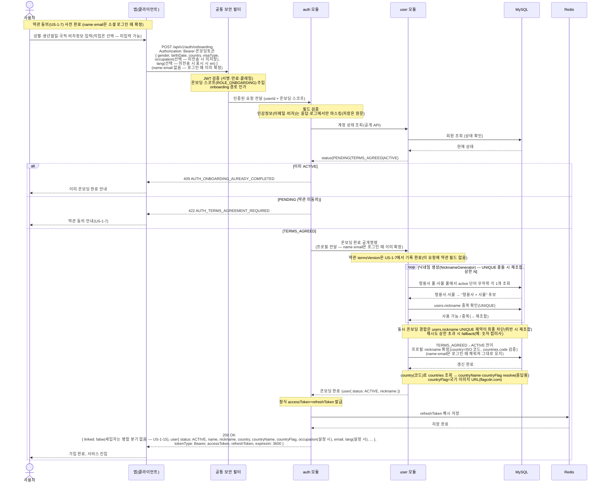

# US-1-2 — 필수 온보딩 정보 제출하기

> 모듈: 소셜 로그인 · 온보딩 · [유저 스토리](../../../requirements/user-stories.md) · [API 스펙](../../../api/specs/01-auth-onboarding.md)

## 흐름 요약

- **선행 단계**: 약관 동의(US-1-7, `PENDING`→`TERMS_AGREED`)가 끝난 상태에서 진행한다 — **이메일 인증은 더 이상 선행 단계가 아니며**(#192), `name`·`email`은 소셜 로그인(US-1-1) 때 이미 `User`에 채워져 있다. `TERMS_AGREED` 사용자가 온보딩 토큰으로 프로필을 담아(**이름·`email`은 온보딩에서 받지 않음**, 약관 필드 없음 — `occupation`·`lang`은 **선택**이라 미전송해도 `200`(#187·#141), 미전송이면 저장하지 않고(NULL) 응답에서 생략) `POST /api/v1/auth/onboarding`을 호출하며, 공통 보안 필터(SEC)가 JWT 검증·**온보딩 스코프(`ROLE_ONBOARDING`) 인가**를 마친 뒤 `userId`를 `auth 모듈`로 전달한다.
- `auth 모듈`이 요청을 수신해 필드를 검증하고, **약관 동의(`TERMS_AGREED`) 선행을 강제**한다(온보딩 선행조건은 약관 동의뿐 — 이메일 인증 게이트 없음, #192). 먼저 `user 모듈`의 공개 API로 **계정 상태를 조회**해 이미 `ACTIVE`면 `409 AUTH_ONBOARDING_ALREADY_COMPLETED`, **약관 미동의(`PENDING`)면 `422 AUTH_TERMS_AGREEMENT_REQUIRED`**(약관 동의 US-1-7 선행 필요)로 거절한다. 민감정보(이메일·비자)는 **저장은 원문**이며 **응답·로그에서만 마스킹**한다.
- 약관까지 마친(`TERMS_AGREED`) 경우 곧바로 **온보딩 완료 공개명령으로 `user 모듈`을 호출**한다(이메일 인증 확인 단계 없음 — #192). 약관 동의·`termsVersion`은 이 단계가 아니라 **약관 동의 단계(US-1-7)에서 이미 기록**된다.
- 정상(`TERMS_AGREED`)이면 `user 모듈`이 **MySQL에서 상태를 `TERMS_AGREED`→`ACTIVE`로 전이하며 프로필을 확정**한다(`name`·`email`은 소셜 로그인 때 이미 채워져 그대로 유지된다). `nickname`은 **`NicknameGenerator`가 형용사 풀·사물 풀의 active 단어에서 무작위로 각 1개를 골라 `형용사 + 사물`로 조합하고, `users.nickname` 유니크 충돌 시 재조합·재시도(상한 초과 시 fallback; 동시 경합은 UNIQUE 제약이 최종 차단)** 해 자동 배정한다. 이어 `auth 모듈`이 정식 access/refresh 토큰을 발급하여 **Redis에 refreshToken 해시를 저장**한 뒤 `200 OK`(`expiresIn: 3600`)로 완성 프로필과 토큰을 반환한다.
