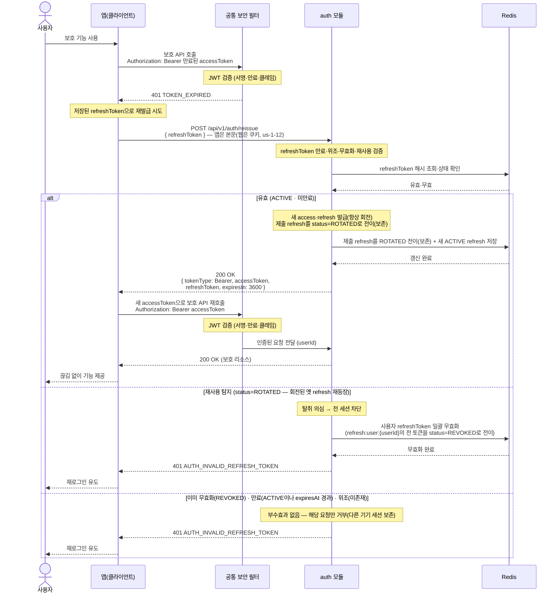

# US-1-3 — 만료된 access 토큰을 refresh로 재발급받기

> 모듈: 소셜 로그인 · 온보딩 · [유저 스토리](../../../requirements/user-stories.md) · [API 스펙](../../../api/specs/01-auth-onboarding.md)

## 흐름 요약

- 보호 API 호출 시 공통 보안 필터(SEC)가 컨트롤러 앞단에서 JWT를 검증하다 만료를 감지해 `401 TOKEN_EXPIRED`를 반환하면, 앱이 저장된 `refreshToken`으로 `auth 모듈`의 `POST /api/v1/auth/reissue`를 호출한다(재발급 엔드포인트는 인증 불필요 — SEC를 거치지 않는다).
  > **이 문서는 앱(본문) 채널을 그린다.** 서버는 refresh를 **쿠키 우선 · 본문 fallback**으로 읽고 응답도 들어온 채널로 되돌려준다 — 쿠키로 왔으면 회전된 refresh를 `Set-Cookie`로 내리고 본문 `refreshToken`은 `null`이다. 그래서 앱 동작은 이 그림 그대로이며(v1 유지), 웹 채널은 [us-1-12-web-login](us-1-12-web-login.md)이 그린다. 쿠키·본문 어느 쪽에도 값이 없으면 `400 INVALID_INPUT`(`errors[].field=refreshToken`)이다([ADR-0048](../../../adr/0048-web-refresh-token-httponly-cookie.md) · 스펙 §6).
- 서버는 Redis에서 **refreshToken 해시를 조회·상태 확인**해 유효하면 `200 OK`로 새 access·refresh(항상 회전) 토큰을 발급하면서 **제출 refresh를 ROTATED 전이(보존)하고 새 ACTIVE refresh를 저장**한다. 이후 새 accessToken으로 보호 API를 재호출하면 다시 SEC가 JWT를 검증한 뒤 모듈로 전달한다.
- 검증 실패는 코드상 두 처리로 갈린다. **재사용 탐지**(`status = ROTATED` — 회전된 옛 refresh 재등장)만 Redis에 **사용자 refresh 일괄 무효화**를 실행한 뒤 `401 AUTH_INVALID_REFRESH_TOKEN`을 반환하고, **이미 무효화된 REVOKED**(로그아웃·탈퇴)·**만료**(ACTIVE이나 `expiresAt` 경과)·**위조·미존재**(해시 매칭 레코드 없음)는 추가 쓰기 없이 `401`만 반환해 다른 기기 세션을 보존한다. 어느 쪽이든 클라이언트는 재로그인으로 유도된다. (`AuthService.reissue`는 `status == ROTATED`에서만 `revokeAllByUserId`를 호출한다.)

## refresh 검증 실패 4가지

서버는 저장된 **refresh 토큰 해시**를 조회해 [`RefreshToken`](../../../../src/main/java/com/kohere/auth/domain/RefreshToken.java)의 `expiresAt`·`status(ACTIVE/ROTATED/REVOKED)`로 다음을 판별한다.

| 경우 | 무엇 | 판별 근거(코드) | 처리 |
| --- | --- | --- | --- |
| **위조·미존재** | 서버가 발급한 진짜 토큰이 아님(해시 조회 시 저장소에 없음) | `findByTokenHash` 결과 없음 | `401`, 거부(부수효과 없음) |
| **만료** | ACTIVE이나 수명이 다 됨 | `status=ACTIVE && expiresAt ≤ now`(`isUsable`=false) | `401`, 거부(부수효과 없음) |
| **무효화(REVOKED)** | 로그아웃·탈퇴·이전 탐지로 이미 폐기됨 | `status=REVOKED` | `401`, 거부(부수효과 없음 — 다른 세션 보존) |
| **재사용 탐지(ROTATED)** | 회전으로 폐기된 옛 refresh가 다시 제출됨 → 탈취 정황 | `status=ROTATED` | `401` + **사용자 refresh 일괄 무효화** |

- **위조·미존재**, **만료**, **무효화(REVOKED)**는 제출된 그 토큰 **한 건만** 거부하고 끝난다(추가 Redis 쓰기 없음).
- **재사용 탐지(ROTATED)**만 부수효과가 다르다. 회전(항상 적용)에 따라 재발급마다 옛 refresh를 ROTATED로 폐기하고 새 것을 발급하므로 정상 클라이언트는 항상 최신 토큰만 보유한다. 그런데 이미 회전돼 죽은 ROTATED 토큰이 다시 등장하면, 정상 클라이언트와 탈취본이 동시에 토큰 체인을 들고 있다는 신호여서 서버가 둘을 구분할 수 없다. 그래서 그 토큰만 막지 않고 **해당 사용자의 모든 refresh를 일괄 무효화**해 전 세션을 끊고 재로그인을 강제한다(OAuth 2.0 refresh token rotation). 반면 **이미 명시적으로 무효화된 REVOKED 토큰**(로그아웃·탈퇴)은 권한이 0이라 재제출돼도 일괄 무효화하지 않고 해당 요청만 거부해 사용자의 **다른 기기 세션을 보존**한다(`AuthService.reissue` — `status == ROTATED`에서만 `revokeAllByUserId`). 이 일괄 무효화는 회원 탈퇴([US-1-4](us-1-4-logout-withdraw.md))와 **refresh 일괄 무효화 부분만 공통**이다(탈퇴는 PII 익명화·매핑 삭제 포함).
