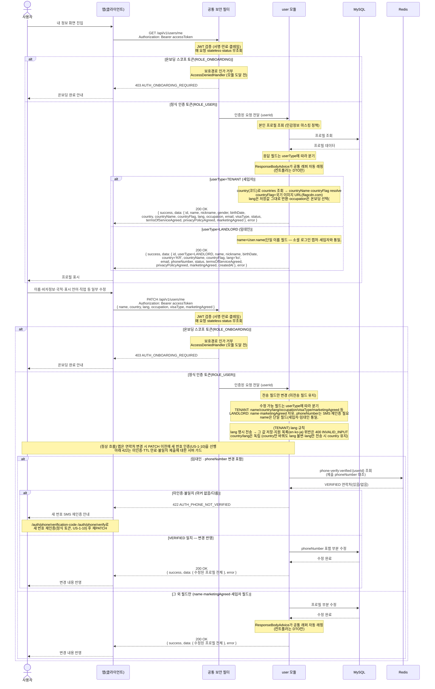

# US-1-5 — 내 프로필 조회·수정하기

> 모듈: 소셜 로그인 · 온보딩 · [유저 스토리](../../../requirements/user-stories.md) · [API 스펙](../../../api/specs/01-auth-onboarding.md) · [ADR-0029](../../../adr/0029-diagnosis-i18n-strategy.md)

## 흐름 요약

- 정식 인증 토큰(ROLE_USER) 사용자가 `user 모듈`의 `GET /api/v1/users/me`로 본인 프로필(이름·`nickname`·성별·생년월일·`country`(코드) + 서버 resolve `countryName`·`countryFlag`·표시 언어 `lang`·`occupation`(온보딩 **선택** 필드(#187) — `lang`처럼 미설정이면 응답에서 생략)·`email`·`visaType`·약관 동의 상태)을 MySQL에서 **프로필 조회**해 `200 OK`로 반환하며, 공통 보안 필터(SEC)가 컨트롤러 앞단에서 JWT를 검증(매 요청 stateless·status 무조회)한 뒤 모듈로 전달한다. 본인 프로필이라 `email`은 평문, 성공 응답은 ResponseBodyAdvice가 공통 래퍼(`{ success, data, error }`)로 자동 래핑하며 컨트롤러는 DTO만 반환한다.
- 응답 필드는 `userType`에 따라 갈린다 — **세입자(TENANT)** 는 위의 성별·국적·표시 언어·직업·비자 등 세입자 전용 필드를 포함하고, **임대인(LANDLORD)** 은 `userType=LANDLORD`·`name`(단일 이름 필드 — 소셜 로그인 캡처·세입자와 통일, #192)·`birthDate`·`country`(`KR` 고정)·`countryName`·`countryFlag`·`lang`(`ko` 고정)·`email`(소셜 로그인 provider 값 — 세입자와 통일, #192)·`phoneNumber`·`status`·약관 동의·`createdAt`을 포함한다(세입자 전용 필드 `gender`/`occupation`/`visaType`·`businessRegistrationNumber`는 미포함이나 `birthDate`는 임대인도 수집·반환, 사업자등록번호는 `users`의 해시 컬럼을 어느 경로에서도 채우지 않아 항상 NULL이고 원문은 매물 문서에 저장한다 — [ADR-0039](../../../adr/0039-listing-schema-v4-registration-form.md)). 임대인의 `country`·`lang`은 온보딩 시 서버가 `KR`·`ko`로 고정 부여한다([ADR-0034](../../../adr/0034-landlord-phone-sms-verification.md)의 "임대인 country 미수집" 결정을 개정(#141)). 임대인 `email`은 소셜 로그인이 역할 미정 상태로 provider(Google/Apple) 값을 `User.email`에 저장한 것으로(더 이상 NULL 아님·인증 대상 아닌 미검증 연락처), [ADR-0034](../../../adr/0034-landlord-phone-sms-verification.md)의 "임대인 이메일 미수집" 결정을 개정(#192)한다(수집 폼이 아니라 provider 값 보유).
- 온보딩 스코프 토큰(ROLE_ONBOARDING)으로 접근하면 SEC가 보호경로 인가 단계에서(모듈 도달 전 `AccessDeniedHandler`) `403 AUTH_ONBOARDING_REQUIRED`를 반환한다.
- `user 모듈`의 `PATCH /api/v1/users/me`에 변경 필드만 담아 보내면 미전송 필드는 유지한 채 MySQL에서 **프로필을 부분 수정**한 뒤 `200 OK`로 수정된 프로필을 반환한다. 조회와 동일하게 온보딩 스코프 토큰은 SEC가 `403 AUTH_ONBOARDING_REQUIRED`로 차단한다.
- 수정 가능 필드도 `userType`에 따라 갈린다 — **세입자**는 `name`·국적·표시 언어(`lang`)·직업·비자 등(+`marketingAgreed`)을, **임대인**은 `name`·`marketingAgreed`를 자유 수정하고(`name`은 세입자·임대인 공통 단일 필드로 통일, #192) `phoneNumber`는 **SMS 재인증(US-1-10)** 을 거쳐 변경한다. **정상 흐름은 앱이 PATCH 이전에 새 번호 인증(`/auth/phone/**`, 정식 토큰)을 먼저 수행**하는 것이다 — `PATCH`에 새 `phoneNumber`가 담기면 `user`가 Redis `phone-verify:verified:{userId}` 마커와 대조해 일치(VERIFIED)할 때만 반영하고, 마커가 없거나(미인증·TTL 만료) 다르면 `422 AUTH_PHONE_NOT_VERIFIED`로 거절한다. 즉 `422`는 happy path가 아니라 **미인증·만료·불일치 제출을 막는 서버 가드**이며, 제대로 동작하는 앱은 인증을 선행해 이를 보지 않는다. 세입자 `email`은 재인증이 필요해 이 경로로 수정하지 않으며(임대인 `email`도 소셜 로그인 provider 값을 보유하나 수정은 #192 범위 밖·후속 이슈) `userType`·`nickname`은 공통 불변이고, 임대인의 `businessRegistrationNumber`는 변경 시 외부 사업자등록정보 재검증이 필요하므로 이 경로로 수정하지 않는다(불변 — `users`의 해시 컬럼은 어느 경로에서도 채우지 않아 항상 NULL이고 원문은 매물 문서가 소유한다). 표시 언어 `lang`은 **세입자만** 변경할 수 있다 — 임대인 프로필 수정은 요청의 `lang`을 읽지 않으며 `country`='KR'·`lang`='ko'는 고정 불변이다.
- 세입자의 표시 언어 `lang`은 **`users.lang`(사용자가 고른 표시 언어)이 있으면 그 값, 없으면 `en`**으로 폴백한다([ADR-0029](../../../adr/0029-diagnosis-i18n-strategy.md) 개정(#141)) — `lang`을 명시 전송하면 그 값을 저장하고, `country`만 바꿔도 `lang`은 바뀌지 않으며(국적과 표시 언어는 독립) `lang`만 보내면 `country`는 그대로다. `lang`은 ISO 639-1 **소문자** 문자열이며 지원 목록은 **`en`·`ko`·`ja` 3개뿐**이라 그 밖의 값은 `400 INVALID_INPUT`으로 거절한다. 온보딩·`PATCH` 모두 **선택 필드**이고 응답에서는 미설정 시 생략된다(`@JsonInclude(NON_NULL)`).

