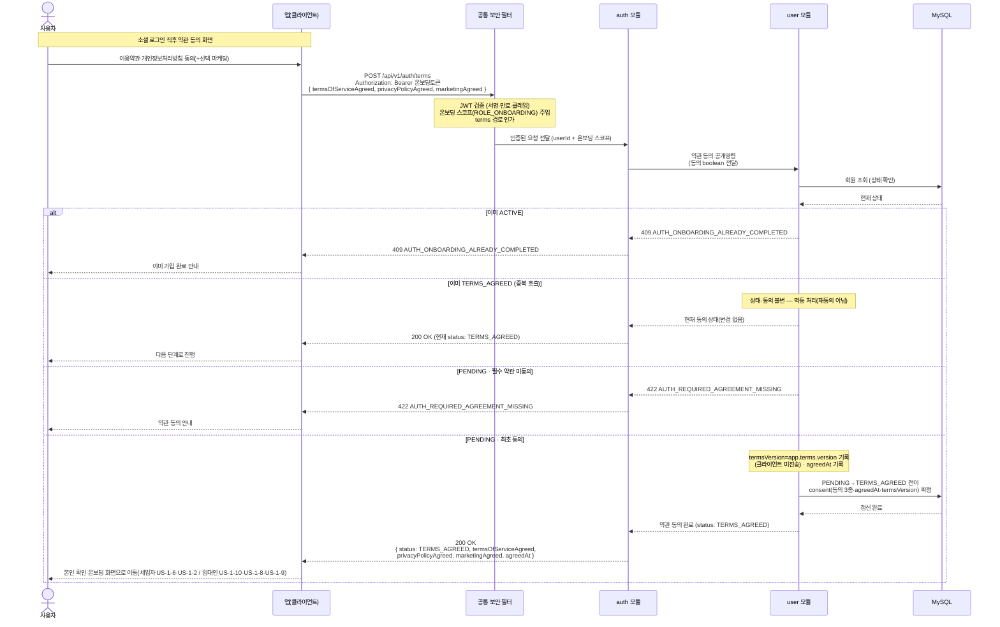

# US-1-7 — 약관 동의 화면에서 약관 동의하기

> 모듈: 소셜 로그인 · 온보딩 · [유저 스토리](../../../requirements/user-stories.md) · [API 스펙](../../../api/specs/01-auth-onboarding.md)
>
> 소셜 로그인(US-1-1) 직후 `PENDING` 사용자가 거치는 **가입 첫 단계**(두 역할 공통)다. 성공 시 `PENDING` → `TERMS_AGREED`로 전이하며, 이후 본인 확인·온보딩이 역할별로 갈린다 — 세입자는 이메일 인증(US-1-6)·온보딩 제출(US-1-2), 임대인은 연락처 인증(US-1-10)·사업자번호 검증(US-1-8)·온보딩 제출(US-1-9).

## 흐름 요약

- 소셜 로그인 직후 `PENDING` 사용자가 약관 동의 화면에서 이용약관·개인정보처리방침(+선택 마케팅)에 동의해 `POST /api/v1/auth/terms`를 호출한다. 공통 보안 필터(SEC)가 **온보딩 토큰(`ROLE_ONBOARDING`)** 을 검증·인가한 뒤 `userId`를 `auth 모듈`로 전달한다(약관 동의는 온보딩 흐름이라 온보딩 토큰도 허용 — [API 스펙](../../../api/specs/01-auth-onboarding.md)).
- `auth 모듈`이 **약관 동의 공개명령으로 `user 모듈`을 호출**한다. 필수 약관(`termsOfServiceAgreed`/`privacyPolicyAgreed`) 미동의면 `422 AUTH_REQUIRED_AGREEMENT_MISSING`, 이미 `ACTIVE`면 `409 AUTH_ONBOARDING_ALREADY_COMPLETED`로 거절한다.
- `PENDING`의 **최초 동의**면 `user 모듈`이 MySQL에서 **상태를 `PENDING` → `TERMS_AGREED`로 전이하며 `consent`(동의 3종·`agreedAt`·`termsVersion`)를 확정**한다. `termsVersion`은 **클라이언트가 보내지 않고** 서버가 `app.terms.version`을 기록한다([ADR-0012](../../../adr/0012-terms-version-management.md)).
- 이미 `TERMS_AGREED`인 사용자가 (네트워크 재시도 등으로) 다시 호출하면 **상태·동의를 바꾸지 않고 멱등하게 `200`(현재 동의 상태)** 을 반환한다 — 의도적 재동의가 아니라 중복 요청 방어다. **동의 후 마케팅 수신 동의 변경은 `PATCH /users/me`(profile)** 로 처리하며 약관 재호출로 갱신하지 않는다. (약관 버전 변경에 따른 재동의 정책은 [ADR-0012](../../../adr/0012-terms-version-management.md) — 확인 필요)
- 토큰은 갱신하지 않는다(상태만 전이) — 같은 온보딩 토큰으로 본인 확인·온보딩 제출(세입자 US-1-6·US-1-2 / 임대인 US-1-10·US-1-8·US-1-9)을 이어서 진행한다. 정식 access/refresh 토큰은 온보딩 완료(`ACTIVE`) 시 발급된다.
