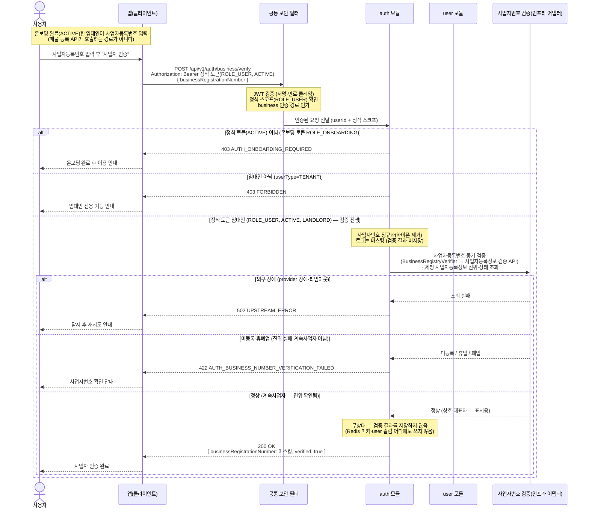

# US-1-8 — 임대인 사업자등록번호 검증하기

> 모듈: 소셜 로그인 · 온보딩 · [유저 스토리](../../../requirements/user-stories.md) · [API 스펙](../../../api/specs/01-auth-onboarding.md)
>
> 임대인 온보딩(US-1-9) **완료(`ACTIVE`) 후**, 임대인이 필요할 때 직접 호출하는 온보딩과 **분리된 무상태(stateless) 사업자등록번호 진위·상태 검증**이다. 온보딩을 마친 임대인이 정식 access 토큰(`ROLE_USER`)으로 호출하며, **검증 결과는 서버에 저장하지 않고 응답 본문에만 담는다**(Redis 마커·`user` 컬럼 어디에도 쓰지 않음). 외부 조회는 인프라 어댑터에 위임한다. 임대인 전용 경로다. **매물 등록 시점에는 이 검증을 호출하지 않는다**(아래 흐름 요약 마지막 항목).

## 흐름 요약

- 온보딩을 **완료(`ACTIVE`)한 임대인**이 입력한 사업자등록번호의 진위·상태를 검증한다. 온보딩과 **분리된 무상태 검증 API**로, 공통 보안 필터(SEC)가 **정식 access 토큰(`ROLE_USER`)** 을 검증하고 `business` 인증 경로를 인가한 뒤 `auth 모듈`로 `userId`를 전달한다([API 스펙](../../../api/specs/01-auth-onboarding.md)). 임대인 전용 검증 단계다.
- **인가 게이트**: 정식 토큰(`ROLE_USER`, `ACTIVE`)이 필수다. **온보딩 토큰(`ROLE_ONBOARDING`, `PENDING`/`TERMS_AGREED`)으로 호출하면 `403 AUTH_ONBOARDING_REQUIRED`**(온보딩을 먼저 완료해야 함), **임대인이 아닌(`userType=TENANT`) `ACTIVE` 사용자면 `403 FORBIDDEN`**으로 거절한다. 정식 토큰 임대인일 때만 아래 검증을 진행한다.
- **동기 검증**(`POST /api/v1/auth/business/verify`): `auth`가 사업자번호를 정규화해 **아웃바운드 포트 `BusinessRegistryVerifier`(인프라 어댑터: 사업자등록정보 검증 API — 국세청 사업자등록정보 진위·상태 기반, 구체 provider는 [ADR-0033](../../../adr/0033-business-registry-verification.md))로 동기 검증**한다. **정상(계속사업자, 진위 확인됨)이면 `verified: true`로 응답**한다. **미등록·휴폐업·진위 실패**면 `422 AUTH_BUSINESS_NUMBER_VERIFICATION_FAILED`로 거절하며, provider 장애·타임아웃 등 **외부 장애 시 `502 UPSTREAM_ERROR`**(기존 공통 코드 재사용)로 응답해 재시도를 유도한다.
- **무상태**: 검증 결과를 **서버에 저장하지 않는다** — Redis 마커(`business-verify:verified:{userId}`)도, `user.businessRegistrationNumberHash` 컬럼도 쓰지 않으며, 결과는 응답(HTTP body)에만 담긴다. 사업자등록번호는 응답·로그에서 마스킹한다([error-response-guide §6](../../../api/error-response-guide.md)). 검증 서비스 회신 상호·대표자는 검증 응답 표시용으로만 쓴다. 외부 연동 정책 골격은 ADR-0033(Proposed — 확인 필요).
- 이 검증은 **온보딩과 무관**하다 — 임대인 온보딩(US-1-9)은 약관 동의 + 연락처(SMS) 인증만으로 완료되며, 사업자번호를 수집·대조하지 않는다. **매물 등록 시점에는 이 검증을 호출하지 않는다** — 등록 API(`POST /api/v2/listings`)는 사업자등록번호를 **형식만 검증해 저장**하고, 진위는 **관리자가 승인 심사에서 수동으로 확인**한다. `POST /api/v1/auth/business/verify`는 임대인이 필요할 때 직접 호출하는 무상태 검증 엔드포인트로 **그대로 유지**된다([ADR-0033](../../../adr/0033-business-registry-verification.md)·[ADR-0039](../../../adr/0039-listing-schema-v4-registration-form.md)).
