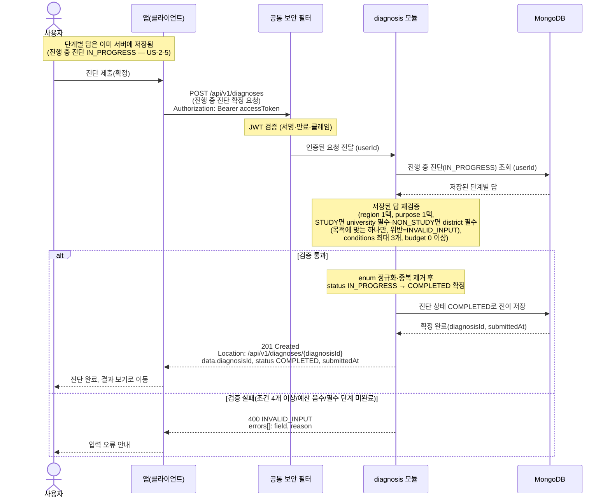

# US-2-1 — 진단 제출(진행 중 진단 확정 및 저장)

> 모듈: 맞춤 진단 & 매물 추천 · [유저 스토리](../../../requirements/user-stories.md) · [API 스펙](../../../api/specs/02-diagnosis-recommendation.md)

## 흐름 요약

- 단계별 답은 진단 진행 중 서버가 이미 저장해 둔다 — 사용자당 진행 중 진단 1건(`status=IN_PROGRESS`)에 단계마다 채워 간다(US-2-5). 제출은 별도 단계로, `POST /api/v1/diagnoses`는 6필드 누적 답을 다시 보내는 요청이 아니라 **서버에 저장된 진행 중 진단을 확정하는 요청**이다.
- 공통 보안 필터(SEC)가 컨트롤러 앞단에서 JWT를 검증한 뒤 diagnosis 모듈로 전달하면, diagnosis 모듈이 진행 중 진단을 조회해 저장된 답을 재검증한다.
- 입국 목적별 대학·지역 선택은 조건부 필수다 — `STUDY`면 `university`, `NON_STUDY`면 `district`가 채워져야 하며 목적에 맞는 하나만 채워진다(`university`·`district` 두 필드 분리, 값·조건부 필수 규칙은 02 스펙 ③ 참조).
- 검증 통과 시 diagnosis 모듈이 진단 상태를 `IN_PROGRESS` → `COMPLETED`로 전이해 MongoDB에 확정 저장하고 `201 Created` + `Location` 헤더와 `diagnosisId`·`submittedAt`을 반환한다. 진단 생성(`COMPLETED`)은 이 제출 시점이며, 재진단은 새 진행 중 진단을 시작한다.
- 조건 4개 이상·예산 음수·필수 단계 미완료·목적별 대학/지역 누락 등은 공통 `400 INVALID_INPUT` + `errors[]`로 응답한다(진단 도메인 별도 코드 없음).
