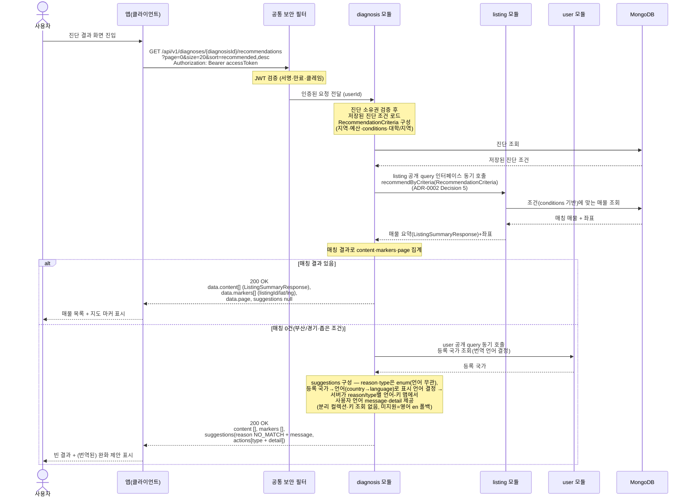

# US-2-2 — 진단 결과(추천 매물 + 지도 좌표) 조회

> 모듈: 맞춤 진단 & 매물 추천 · [유저 스토리](../../../requirements/user-stories.md) · [API 스펙](../../../api/specs/02-diagnosis-recommendation.md)

## 흐름 요약

- `GET /api/v1/diagnoses/{diagnosisId}/recommendations`로 본인 진단 조건에 맞는 매물과 지도 좌표를 조회한다(공통 보안 필터(SEC)가 컨트롤러 앞단에서 JWT를 검증한 뒤 diagnosis 모듈로 전달하고, diagnosis 모듈이 소유권을 확인, 기본 정렬 `recommended,desc`).
- diagnosis 모듈이 MongoDB에서 진단 조건을 조회한 뒤 `RecommendationCriteria`(지역·예산·`conditions`·대학/지역) 값객체를 만들어 listing 모듈의 **공개 query 인터페이스를 동기 호출**한다(`recommendByCriteria` 류, ADR-0002 Decision 5 — 모듈 간 동기 query 협력). listing 내부 구현은 본 문서 범위가 아니며, listing 모듈은 진단 `conditions` 기반으로 MongoDB에서 매물을 조회해 매물 요약(`ListingSummaryResponse`)과 좌표를 반환하고 diagnosis 모듈이 결과를 집계한다.
- 결과가 있으면 `200 OK` + `content[]`(매물 요약 `ListingSummaryResponse`)·`markers[]`(listingId/lat/lng)·`page` 메타를, 0건이면 빈 목록 + `suggestions`(조정 제안)를 동일하게 `200 OK`로 반환한다. `suggestions`의 `reason`/`type`은 언어 무관 enum이고, 사람이 보는 `message`/`detail`은 `user` 공개 query로 취득한 등록 국가→언어(`country→language`)로 정한 언어로 **서버가 제공**한다 — `reason`/`type`별 언어-키 맵(언어 코드를 키로 하는 맵)에서 사용자 언어 값을 골라 채우며, 해당 언어 키가 없으면 영어(`en`)로 폴백한다(US-2-6 일관). 분리 컬렉션(`diagnosisMessages`)·메시지 키 조회는 쓰지 않는다.
- 타인 진단은 `403 FORBIDDEN`, 없는 진단은 `404 DIAGNOSIS_NOT_FOUND`로 처리된다.
