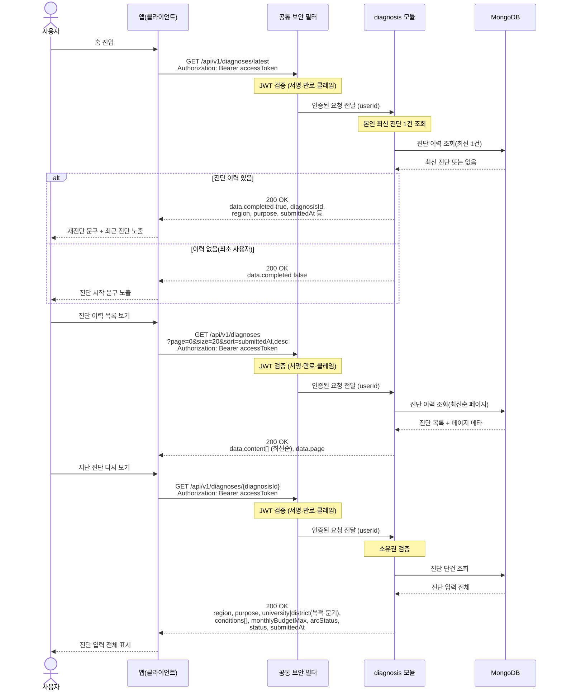

# US-2-3 — 진단 이력 조회 및 최근 진단 다시 보기

> 모듈: 맞춤 진단 & 매물 추천 · [유저 스토리](../../../requirements/user-stories.md) · [API 스펙](../../../api/specs/02-diagnosis-recommendation.md)

## 흐름 요약

- 홈에서 `GET /api/v1/diagnoses/latest`로 diagnosis 모듈이 MongoDB에서 최신 1건을 조회해 `completed` 값으로 "진단 시작/재진단" 문구를 분기한다(이력 없음도 `200 OK`). 모든 요청은 공통 보안 필터(SEC)가 컨트롤러 앞단에서 JWT를 검증한 뒤 모듈로 전달한다.
- `GET /api/v1/diagnoses`로 diagnosis 모듈이 MongoDB에서 진단 이력을 최신순(`submittedAt,desc`) 오프셋 페이지네이션으로 조회한다.
- `GET /api/v1/diagnoses/{diagnosisId}`로 diagnosis 모듈이 소유권을 검증한 뒤 MongoDB에서 본인 소유 진단의 입력 전체(6단계 — `region`/`purpose`/대학·지역 선택(목적 분기 `university`|`district`)/`conditions`/`monthlyBudgetMax`/`arcStatus`)를 조회해 다시 본다(타인 `403 FORBIDDEN`, 부재 `404 DIAGNOSIS_NOT_FOUND`).
