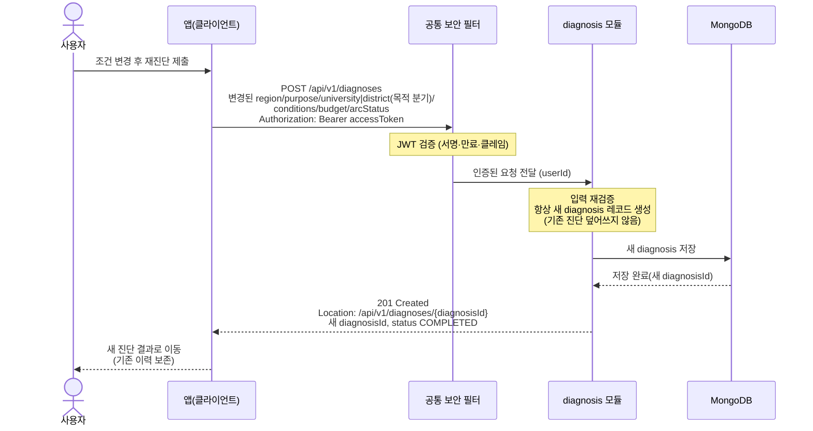

# US-2-4 — 재진단(새 진단 생성)

> 모듈: 맞춤 진단 & 매물 추천 · [유저 스토리](../../../requirements/user-stories.md) · [API 스펙](../../../api/specs/02-diagnosis-recommendation.md)

## 흐름 요약

- 재진단도 US-2-1과 동일한 `POST /api/v1/diagnoses`이며, 공통 보안 필터(SEC)가 컨트롤러 앞단에서 JWT를 검증한 뒤 diagnosis 모듈로 전달하고 diagnosis 모듈이 항상 새 diagnosis를 MongoDB에 저장해 새 `diagnosisId`를 발급하며 기존 진단을 덮어쓰지 않고 이력을 보존한다(`201 Created`).
- 재진단 본문도 US-2-1과 동일한 입력 검증 규칙을 적용한다(위반 시 `400 INVALID_INPUT` + `errors[]`).
