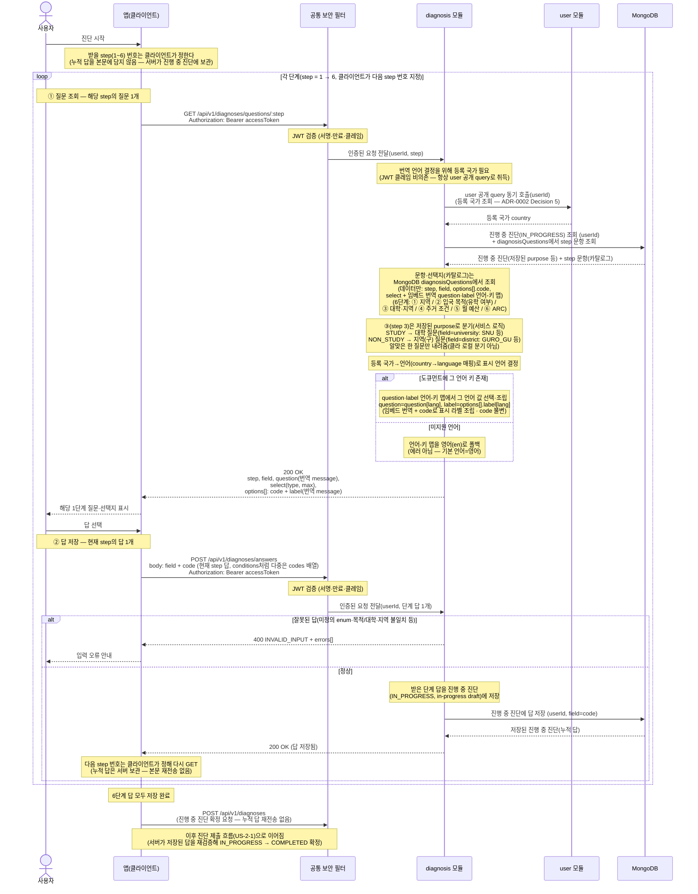

# US-2-5 · US-2-6 — 진단 문항·선택지 단계별 server-driven 제공 + 국가 기반 번역

> 모듈: 맞춤 진단 & 매물 추천 · [유저 스토리](../../../requirements/user-stories.md) · [API 스펙](../../../api/specs/02-diagnosis-recommendation.md)

## 흐름 요약

- 진단 문항·선택지는 앱이 하드코딩하지 않고 백엔드가 **한 단계씩(server-stateful)** 제공한다. 단계마다 두 엔드포인트로 나뉜다(둘 다 인증 필수) — 질문 조회 `GET /api/v1/diagnoses/questions/{step}`와 답 저장 `POST /api/v1/diagnoses/answers`. 진행 답은 **서버가 저장**한다 — 사용자당 진행 중 진단 1건(`status=IN_PROGRESS`, in-progress draft)에 단계마다 채워 간다. 공통 보안 필터(SEC)가 컨트롤러 앞단에서 JWT를 검증한 뒤 diagnosis 모듈로 전달한다. 한 번에 모든 단계를 주지 않으며, 분기는 서버 비즈니스 로직으로 결정한다(클라 로컬 분기 아님).
- 클라이언트는 받을 `step`(1~6)을 **path로 지정**해 `GET /api/v1/diagnoses/questions/{step}`를 호출하고, 서버는 그 step 질문 1개와 선택지를 반환한다(`200 OK`). 다음 step 번호는 클라이언트가 정한다. ③(step 3)은 클라이언트 분기가 아니라 서버 비즈니스 로직이 저장된 `purpose`로 `university`/`district` 질문을 선택해 내려준다.
- 질문 조회 응답은 `{ step, field, question(message), select{ type, max }, options[]{ code, label(message) } }`이다. `question`·`label`은 `diagnosisQuestions` 도큐먼트의 인라인 언어-키 맵에서 사용자 언어 값을 골라 채운 표시 문자열이고 `code`는 언어 무관 키다. 예: 저장된 답의 `purpose`가 `STUDY`면 서버가 ③ `university` 질문(대학 목록)을, `NON_STUDY`면 ③ `district` 질문(지역구 목록)을 반환한다.
- 클라이언트는 화면에서 받은 답(현재 step의 `field`+`code`; `conditions`처럼 다중 선택은 `codes` 배열)을 `POST /api/v1/diagnoses/answers` 본문으로 보내고, 서버가 그 답을 진행 중 진단에 저장한다(`200 OK`). 누적 답을 본문에 담지 않는다 — 다음 step은 클라이언트가 다시 `GET /questions/{step}`로 조회한다. 이 루프를 6단계가 모두 저장될 때까지 반복한다.
- 6단계 답이 모두 저장되면 클라이언트는 `POST /api/v1/diagnoses`로 진행 중 진단을 확정 제출한다(누적 답 재전송 없음 — 서버가 저장된 답을 재검증해 `IN_PROGRESS` → `COMPLETED` 확정).
- 문항·선택지 카탈로그는 **MongoDB `diagnosisQuestions` 컬렉션**에 **데이터만** 둔다(앱·DB 어디에도 하드코딩하지 않는다) — `step`, `field`, `options[]{ code }`, `select`. 분기 메타(`branchOn` 등)는 두지 않으며, 어느 질문을 낼지는 서비스(비즈니스 로직)가 결정한다. 표시 문자열(번역)은 별도 컬렉션 없이 **같은 도큐먼트에 임베드**하되 **언어 코드를 키로 하는 맵**으로 둔다 — 예: `question: { "en": "Select a region", "ja": "エリアを選択", "ko": "지역 선택" }`, `options: [ { "code": "SEOUL", "label": { "en": "Seoul", "ja": "ソウル" } } ]`. 서버가 (카탈로그 데이터 + 저장된 답)으로 다음 질문을 선정하고 사용자 언어 값으로 표시 라벨을 조립해 한 단계만 내려준다.
- ③ 대학·지역 문항은 ②(`purpose`) 답변에 따라 **서버 비즈니스 로직**이 분기한다 — `STUDY`면 `field=university`로 대학 질문을, `NON_STUDY`면 `field=district`로 지역(구) 질문을 내려준다(알맞은 한 질문만 내려주고 두 목록을 함께 주지 않는다). 대학 질문·지역 질문은 각각 카탈로그 데이터(별도 step)로 존재하고, 노출은 저장된 `purpose`를 보고 서비스가 결정한다. `university` enum 값: `SNU, CAU, SOONGSIL, HUFS, KHU, KOREA, SKKU, SUNGSHIN, KONKUK, SEJONG, HYU, HONGIK, YONSEI, EWHA, ETC`. `district` enum 값(UPPER_SNAKE): `GURO_GU, YEONGDEUNGPO_GU, GEUMCHEON_GU, GWANAK_GU, DONGDAEMUN_GU, ETC`.
- 잘못된 답(미정의 enum, 목적-대학/지역 불일치 등)은 공통 `INVALID_INPUT`(400)+`errors[]`로 반환한다.
- 번역(US-2-6)은 반환 질문의 **표시 `question`·`label`만** 대상이며, 사용자의 등록 국가(온보딩 수집값)→언어(`country→language` 매핑)로 표시 언어를 정한 뒤 `diagnosisQuestions` 도큐먼트의 인라인 언어-키 맵에서 그 언어 값을 골라 채운다 — `question`은 `question[lang]`, 선택지 `label`은 `options[].label[lang]`에서 고른다. 선택지 `code`는 언어와 무관하게 동일(UPPER_SNAKE·불변)하다. `Accept-Language` 헤더에 의존하지 않는다. 해당 언어 키가 없으면 **영어(`en`)로 폴백**한다(에러 아님; 기본 언어=영어).
- 번역 언어 결정을 위한 등록 국가는 `user`가 보유한다. diagnosis 모듈은 JWT 클레임에 의존하지 않고 **항상 `user`의 공개 query를 동기 호출**해 등록 국가(`country`)를 취득한다(즉시 결과가 필요한 조회 → ADR-0002 Decision 5). 이를 위해 모듈 의존 `diagnosis → user`를 추가한다. 국가→언어 매핑은 diagnosis가 보유한 `country→language` reference로 도출하고, 표시 문자열은 위 `diagnosisQuestions` 도큐먼트의 인라인 언어-키 맵에서 그 `lang` 값으로 해소한다.
- 선택지 `code`는 진단 제출(`POST /api/v1/diagnoses`) 검증 enum과 **1:1 동일 출처**다 — 문항 카탈로그에서 받은 `code`로 답 저장(`POST /api/v1/diagnoses/answers`) 본문을 구성하면 동일 enum으로 검증·저장되므로 라벨 번역(언어-키 맵) 여부와 무관하게 수용된다.
