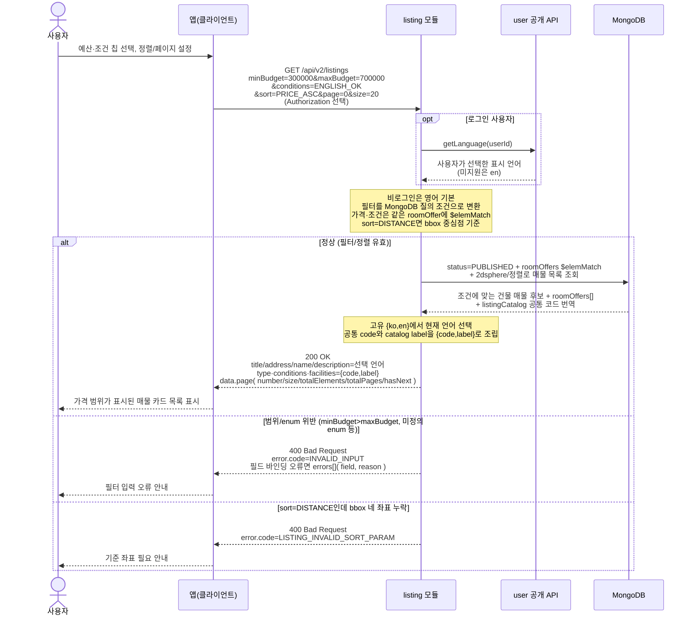

# US-3-1 — 매물 리스트 탐색(필터·정렬·페이지네이션)

> 모듈: 매물 등록 · 탐색 · 찜 · [유저 스토리](../../../requirements/user-stories.md) · [API 스펙](../../../api/specs/03-listings-favorites.md)
>
> 경로는 **`/api/v2`가 정본**이다 — 같은 경로의 `/api/v1` 목록은 구버전 앱 호환용 `deprecated` 스텁이라 MongoDB에 접근하지 않고 빈 페이지(`content: []`, `totalElements: 0`)만 반환하므로 아래 흐름에 관여하지 않는다.

## 흐름 요약

- 비로그인/로그인 모두 `GET /api/v2/listings`로 `listing` 모듈에서 필터·정렬·오프셋 페이지 목록을 조회하며, 성공 시 `listing` 모듈이 MongoDB에서 `status=PUBLISHED` 건물 매물 중 조건에 맞는 `roomOffers[]`를 `$elemMatch`로 찾은 뒤 조건을 만족하는 active roomOffer들을 매물 단위로 묶어 `200 OK` + `data.content[]`·`data.page`를 받는다.
- 목록 항목 1개는 `Listing` 단위 매물 카드다. 필터가 없으면 조회 범위 안의 모든 active roomOffer가 집계 대상이고, 필터가 있으면 조건을 만족하는 active roomOffer만 집계 대상이다. 같은 매물 안에 조건을 만족하는 방 상품이 여러 개 있어도 같은 `listingId`는 한 번만 내려간다.
- 목록은 별도 가격 집계 필드 대신 조건을 통과한 `roomOffers[]`를 그대로 반환한다. 가격·보증금·관리비는 `roomOffers[].pricing`에서 읽고, 계약기간은 `roomOffers[].contract.minStayMonths/maxStayMonths`를 사용한다. 다만 상위 `conditions`는 필터에 매칭된 방 상품만이 아니라 매물 전체 ACTIVE roomOffer의 태그 합집합이다.
- 로그인 사용자는 계정 표시 언어가 적용되지만, 목록 항목의 `favorited`는 현재 구현상 로그인 여부와 관계없이 항상 `false`다. 실제 찜 상태는 상세·찜 목록·최근 본 목록에서 반영된다.
- 로그인 사용자는 `user::api getLanguage`로 계정에서 선택한 표시 언어(`users.lang`)를 얻고, 비로그인은 영어를 쓴다. 매물 고유 `{ko,en}` 문구는 문자열 하나로 선택하고 공통 코드는 `listingCatalog` label과 `{code,label}`로 조립한다. 클라이언트는 label을 표시하고 필터 요청에는 code를 보낸다.
- 범위/enum 위반은 `400 INVALID_INPUT`으로, `sort=DISTANCE`인데 bbox 네 좌표가 없으면 `400 LISTING_INVALID_SORT_PARAM`으로 거부한다(검증 실패 분기는 MongoDB 접근 없음). `errors[]`는 필드 바인딩 오류에는 상세가 들어가지만 최소값>최대값 같은 서비스 계층 교차 필드 검증에서는 빈 배열일 수 있다.
