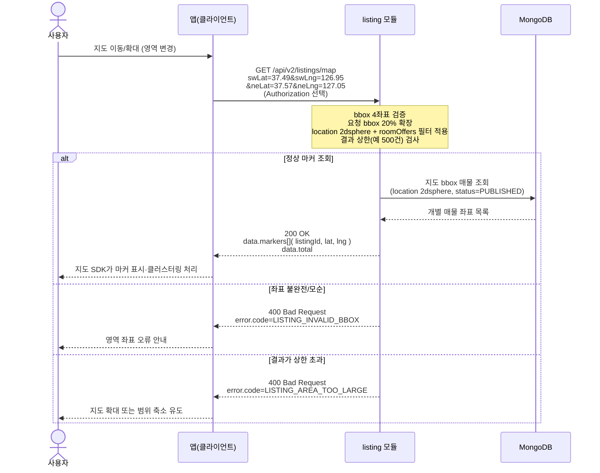

# US-3-2 — 지도 bbox 마커 조회

> 모듈: 매물 등록 · 탐색 · 찜 · [유저 스토리](../../../requirements/user-stories.md) · [API 스펙](../../../api/specs/03-listings-favorites.md)
>
> 경로는 **`/api/v2`가 정본**이다 — 같은 경로의 `/api/v1` 지도 조회는 구버전 앱 호환용 `deprecated` 스텁이라 MongoDB에 접근하지 않고 빈 결과(마커 0건)만 반환하므로 아래 흐름에 관여하지 않는다.

## 흐름 요약

- 지도 패닝 시 `GET /api/v2/listings/map`을 호출해 `listing` 모듈이 MongoDB `location`의 `2dsphere` 인덱스로 bbox 영역의 공개 건물 매물을 조회한다. 가격·조건 필터는 `roomOffers[]` 기준으로 적용하고, 성공 시 프론트 지도 SDK가 사용할 `data.markers[]`(`listingId`, `lat`, `lng`)와 `total`을 반환한다.
- `location`은 스키마 validator의 `required`에 없어 등록 직후 매물은 좌표가 비어 있을 수 있다. 다만 **좌표 없는 매물은 관리자 승인을 통과하지 못하므로** 이 조회의 대상인 `PUBLISHED` 매물은 항상 좌표를 가진다([ADR-0039](../../../adr/0039-listing-schema-v4-registration-form.md)).
- 서버는 클러스터링을 하지 않는다. 프론트 지도 SDK가 화면상 가까운 마커를 자체 기준으로 묶는다.
- bbox 4좌표 불완전·범위 위반·모순(`swLat>=neLat` 또는 `swLng>=neLng`)은 `listing` 모듈이 `400 LISTING_INVALID_BBOX`로 거부한다(검증 실패 분기는 MongoDB 접근 없음).
- 결과가 서버 상한을 초과하면 `400 LISTING_AREA_TOO_LARGE`로 범위 축소 또는 확대 조회를 유도한다.
