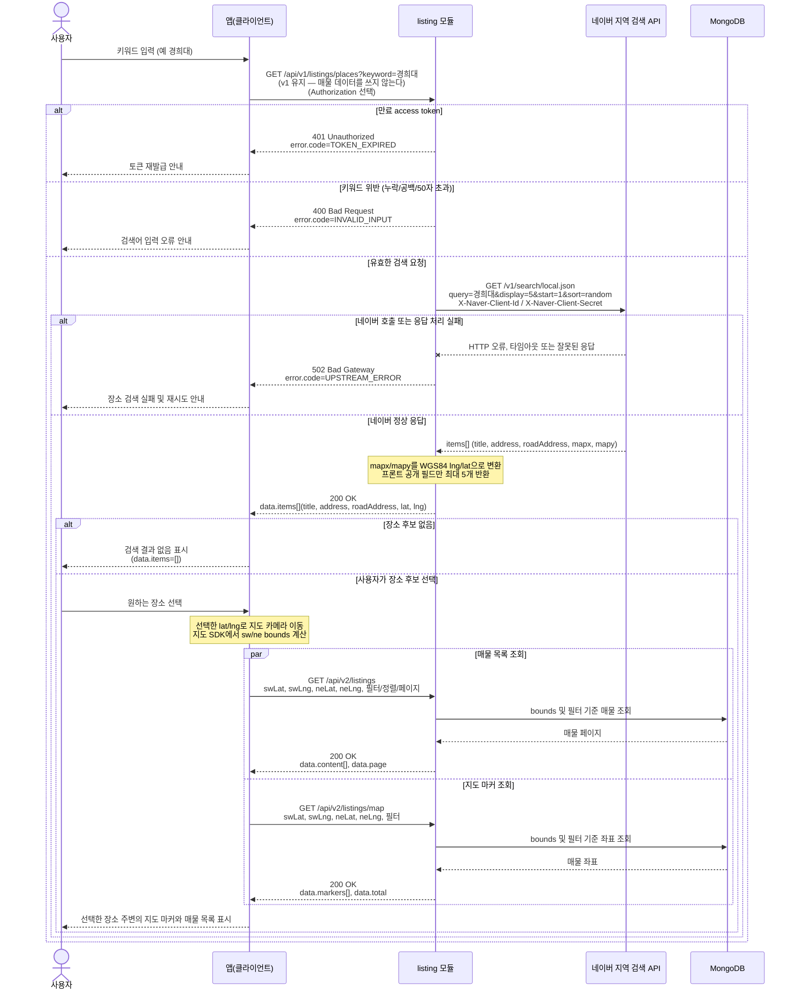

# US-3-3 — 네이버 장소 검색 및 주변 매물 조회

> 모듈: 매물 등록 · 탐색 · 찜 · [유저 스토리](../../../requirements/user-stories.md) · [API 스펙](../../../api/specs/03-listings-favorites.md)
>
> **한 흐름에 두 버전이 섞인다** — 장소 검색 `GET /api/v1/listings/places`는 매물 데이터를 쓰지 않으므로 **v1 그대로 동작**하고, 후속 매물 조회(목록·지도)는 **`/api/v2`가 정본**이다. `/api/v1`의 목록·지도는 구버전 앱 호환용 `deprecated` 스텁이라 MongoDB에 접근하지 않고 빈 결과만 반환하므로 아래 흐름에 관여하지 않는다.

## 흐름 요약

- `GET /api/v1/listings/places?keyword=...`는 공개 API이며, 백엔드가 네이버 지역 검색 API를 호출해 장소 후보를 최대 5개 반환한다. **매물 데이터를 쓰지 않으므로 조회 계열의 v2 이관 대상이 아니고 v1 경로 그대로 동작한다.** 토큰 없음·위조/형식 오류는 익명으로 통과하고 만료 토큰만 `401 TOKEN_EXPIRED`다. 이 단계에서는 MongoDB 매물을 조회하지 않는다.
- 네이버 원본의 `mapx/mapy`는 백엔드가 WGS84 `lng/lat`으로 변환하고, `title`·`address`·`roadAddress`·`lat`·`lng`만 공개한다. 검색 결과가 없으면 에러가 아닌 `200 OK`와 `data.items=[]`를 반환한다.
- 사용자가 후보를 선택하면 앱이 해당 좌표로 지도 카메라를 이동하고 bounds를 계산한다. 이후 매물 조회는 정본인 `/api/v2/listings`와 `/api/v2/listings/map`에 같은 bounds·필터를 전달해 매물 목록과 지도 마커를 얻는다(같은 흐름 안에서 장소 검색만 v1, 매물 조회는 v2다).
- 키워드 누락·공백·50자 초과는 `400 INVALID_INPUT`, 네이버 HTTP 오류·타임아웃·인증정보 누락·응답 형식 이상은 `502 UPSTREAM_ERROR`로 구분한다.
- 시드 POI 사전을 쓰던 옛 키워드 검색(`GET /listings/search`)은 **v1·v2 양쪽에서 제거됐다** — 이 흐름이 그 자리를 대체했고 클라이언트가 호출하지 않았기 때문이다([ADR-0043](../../../adr/0043-remove-seeded-poi-keyword-search.md)).
