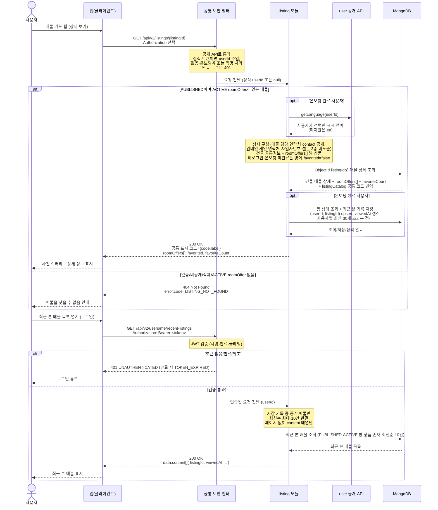

# US-3-4 — 매물 상세 조회 + 최근 본 매물 기록

> 모듈: 매물 등록 · 탐색 · 찜 · [유저 스토리](../../../requirements/user-stories.md) · [API 스펙](../../../api/specs/03-listings-favorites.md)
>
> 경로는 **`/api/v2`가 정본**이다 — 같은 경로의 `/api/v1` 상세는 구버전 앱 호환용 `deprecated` 스텁이라 MongoDB에 접근하지 않고 항상 `404 LISTING_NOT_FOUND`를, `/api/v1/users/me/recent-listings`는 빈 결과(`content: []` — 이 응답에는 페이지 객체가 없다)를 반환하므로 아래 흐름에 관여하지 않는다.

## 흐름 요약

- `GET /api/v2/listings/{listingId}`는 공개 API다. 공통 보안 필터는 온보딩 완료 토큰이면 `userId`를 전달하고, 비로그인·온보딩 미완료·위조/형식 오류 토큰은 익명으로 통과시킨다. 만료 토큰은 `401 TOKEN_EXPIRED`다. `listing` 모듈은 MongoDB에서 건물 공통 상세(`imageUrls[]`·`type`·`location`·`address`·`arcRequired`·`facilities`·`languagesSupported`·`nearbyFacilities`·`contact`)와 방 상품 목록(`roomOffers[]`: 가격·계약기간·필터 태그)을 조회한다. 매물별 담당 연락처 `contact`(담당자명·지점 대표 전화)는 임대인 개인 연락처(`users.phone_number`)와 별개 값이라 **응답에 그대로 공개**하고(개인 번호는 매물 문서에 복사하지 않는다 — [ADR-0039](../../../adr/0039-listing-schema-v4-registration-form.md) Amended), `businessRegistrationNumber`와 설문 3종(`preferredNationalities`·`contractDifficulties`·`serviceFeedback`)은 응답에서 제외한다([ADR-0039](../../../adr/0039-listing-schema-v4-registration-form.md)).
- 온보딩 완료 사용자의 상세 조회만 `(userId, listingId)` 유니크 upsert로 최근 본 매물을 기록하고 사용자별 최신 30개 초과분을 정리한다. 비로그인·온보딩 미완료 조회는 기록하지 않으며 로그인 후 소급 이전하지 않는다. 저장/정리 실패는 상세 조회를 실패시키지 않고 로그로 남긴다.
- 정식 사용자는 `user::api getLanguage(userId)`로 표시 언어를 얻고 실제 찜 상태를 조회한다. 그 외 공개 조회는 영어와 `favorited=false`를 사용한다. 시설·조건 등 공통 코드는 `listingCatalog`의 번역과 결합해 `{code,label}`로 반환한다.
- 없음/비공개/삭제 또는 ACTIVE roomOffer가 없는 매물은 `404 LISTING_NOT_FOUND`다. 최근 본 매물은 인증 필수 `GET /api/v2/users/me/recent-listings`로 공통 보안 필터(SEC)가 컨트롤러 앞단에서 JWT를 검증한 뒤 `listing` 모듈로 전달하며(토큰 없음/만료/위조면 SEC가 `401`로 차단해 MongoDB 접근 없음), 검증 통과 후 MongoDB에서 `PUBLISHED`이면서 ACTIVE roomOffer가 있는 매물만 최신순 최대 10건 조회한다.
