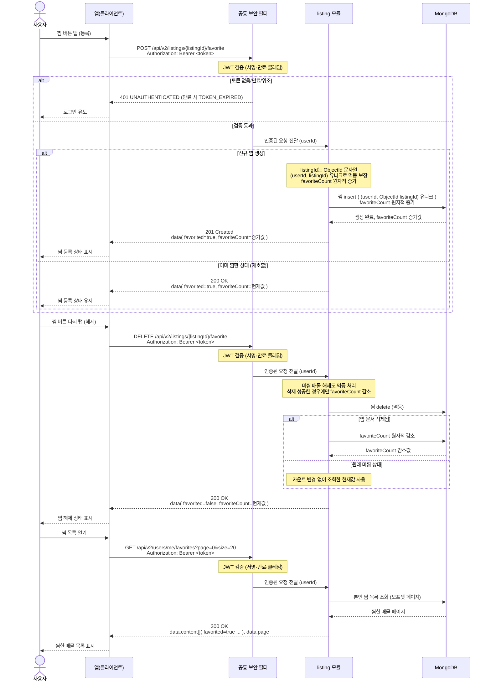

# US-3-5 — 찜 토글·찜 목록(인증 필수)

> 모듈: 매물 등록 · 탐색 · 찜 · [유저 스토리](../../../requirements/user-stories.md) · [API 스펙](../../../api/specs/03-listings-favorites.md)
>
> 경로는 **`/api/v2`가 정본**이다 — 같은 경로의 `/api/v1` 찜 토글은 구버전 앱 호환용 `deprecated` 스텁이라 저장소에 접근하지 않고 항상 `404 LISTING_NOT_FOUND`를, `/api/v1/users/me/favorites`는 빈 페이지(`content: []`, `totalElements: 0`)를 반환하므로 아래 흐름에 관여하지 않는다. v2에서도 찜 토글·찜 목록은 `permitAll`이 아닌 **정식 자원(`ROLE_USER`)** 이다.

## 흐름 요약

- 찜 등록은 `POST /api/v2/listings/{listingId}/favorite`로 `listing` 모듈이 처리하며, `listingId`는 ObjectId 문자열이다. 신규 생성 시 MongoDB에 찜 insert(`(userId, listingId)` 유니크)·`favoriteCount` 원자적 증가 후 `201 Created`(이미 찜이면 멱등하게 `200 OK`) + `data( favorited, favoriteCount )`를 반환한다.
- 찜 해제는 `listing` 모듈의 `DELETE .../favorite`로 MongoDB에서 찜 문서를 삭제하고, 실제 삭제가 성공한 경우에만 `favoriteCount`를 감소시킨 뒤 항상 `200 OK`를 반환한다. 원래 미찜 상태면 카운트를 변경하지 않고 현재값을 반환한다.
- 찜·찜 목록은 모두 인증 필수(`me` 스코프)라 공통 보안 필터(SEC)가 컨트롤러 앞단에서 JWT를 검증한 뒤 `listing` 모듈로 전달하며, 토큰 없음/만료/위조는 SEC가 `401 UNAUTHENTICATED`/`TOKEN_EXPIRED`로 차단한다(검증 실패 분기는 저장소 접근 없음). 목록은 `GET /api/v2/users/me/favorites`로 별도 sort 파라미터 없이 `favoritedAt desc` 고정 조회한다. 현재 구현은 대상 매물의 `PUBLISHED`만 검사하므로 ACTIVE roomOffer가 없는 공개 매물이 빈 `roomOffers[]`로 포함될 수 있다.
