# US-3-6 — 임대인 매물 등록(POST /api/v2/listings)

> 모듈: 매물 등록 · 탐색 · 찜 · [유저 스토리](../../../requirements/user-stories.md) · [API 스펙](../../../api/specs/03-listings-favorites.md)
>
> 온보딩을 마친 임대인(`ROLE_USER`, `ACTIVE`, `userType=LANDLORD`)이 주소를 찾고 사진을 올려 등록 폼으로 매물을 만드는 흐름이다. **요청이 넷으로 나뉜다** — 주소는 `GET /api/v1/listings/addresses`로 검색해 표준 도로명 주소와 좌표를 받고([ADR-0042](../../../adr/0042-road-address-search-with-ncp-geocoding.md)), 인근 역은 `GET /api/v1/listings/stations`로 검색해 표준 역 이름과 도보 시간 제안을 받고([ADR-0044](../../../adr/0044-nearby-station-search-with-kakao-local.md)), 사진은 `POST /api/v2/listings/images`로 **한 장씩** 올려 키를 받고, 등록(`POST /api/v2/listings`)은 그 값들을 담은 JSON이다([ADR-0041](../../../adr/0041-listing-image-upload-to-s3.md)). 앞선 두 호출이 준 값을 클라이언트가 되돌려 보내는 모양이 같다. 요청을 파일마다 가르는 이유는 브라우저가 요청 단위로만 진행률을 주기 때문이다 — 한 요청에 몰아 실으면 파일별 진행률·속도를 만들 수 없고 실패한 파일만 다시 올릴 수도 없다. **매물 도메인의 첫 `/api/v2` 엔드포인트**였고, 이어서 조회 계열 5종도 `/api/v2`로 이관돼 같은 네임스페이스가 **GET은 공개 조회, POST는 임대인 등록**으로 갈린다([ADR-0040](../../../adr/0040-listing-query-api-v2-and-v1-sunset.md) — `/api/v1` 조회는 빈 결과·`404`만 내는 `deprecated` 스텁이다). 저장 스키마는 등록 폼 기준 v4([ADR-0039](../../../adr/0039-listing-schema-v4-registration-form.md))이고, 등록된 매물은 `status=PENDING`으로 저장돼 **관리자 승인 전까지 탐색·상세에 노출되지 않는다**(US-3-1·US-3-4는 `PUBLISHED`만 조회한다).

```mermaid
sequenceDiagram
    actor U as 사용자
    participant C as 앱(브라우저)
    participant SEC as 공통 보안 필터
    participant LIST as listing 모듈
    participant USER as user 공개 API
    participant S3 as 이미지 저장소(S3)
    participant NCP as NCP Geocoding
    participant KAKAO as 카카오 로컬 API
    participant DB as MongoDB

    Note over U,C: ⓪ 도로명 주소 검색 — 주소 칸을 채울 때<br/>등록이 받는 주소·좌표의 출처다. 자유 입력이 아니다

    U->>C: 주소 입력("신촌로 12")
    C->>SEC: GET /api/v1/listings/addresses?keyword=…<br/>Authorization: Bearer 정식 토큰
    Note over SEC: hasRole("USER") 명시 매처<br/>공개 조회 매처(GET /api/v1/listings/*)보다 먼저 선언해야 한다
    SEC->>LIST: 인증된 요청 전달 (userId)
    LIST->>USER: getUserType(userId)
    USER-->>LIST: userType

    alt 임대인 아님 (userType=TENANT)
        LIST-->>C: 403 FORBIDDEN
    else 임대인 (userType=LANDLORD)
        LIST->>NCP: GET /map-geocode/v2/geocode?query=…&count=5

        alt 외부 오류·타임아웃·인증정보 누락
            NCP-->>LIST: 오류
            LIST-->>C: 502 UPSTREAM_ERROR
            Note over U,DB: ↑ 키가 없으면 요청 자체를 보내지 않고 502다
        else 정상
            NCP-->>LIST: addresses[] (roadAddress · x · y)
            Note over LIST: 도로명 없는 결과 제외 · x/y → lng/lat<br/>후보를 거르지 않는다 — 카탈로그를 보지 않는다
            LIST-->>C: 200 { items[]: roadAddress · lat · lng }
            C-->>U: 후보 표시(모두 선택 가능)
        end
    end

    Note over U,C: ⓪-b 인근 역 검색 — 역 칸을 채울 때<br/>역 이름도 자유 입력이 아니다. 좌표를 함께 보내면 거리순 + 도보 시간 제안을 받는다

    U->>C: 역 이름 입력("신촌")
    C->>SEC: GET /api/v1/listings/stations?keyword=신촌&lat=…&lng=…<br/>Authorization: Bearer 정식 토큰
    Note over SEC: hasRole("USER") 명시 매처<br/>/stations도 한 세그먼트라 공개 조회 매처보다 먼저 선언해야 한다
    SEC->>LIST: 인증된 요청 전달 (userId)
    LIST->>USER: getUserType(userId)
    USER-->>LIST: userType

    alt 임대인 아님 (userType=TENANT)
        LIST-->>C: 403 FORBIDDEN
    else 임대인 (userType=LANDLORD)
        LIST->>KAKAO: GET /v2/local/search/keyword.json<br/>query=신촌 & category_group_code=SW8 & x/y & sort=distance

        alt 외부 오류·타임아웃·REST 키 누락
            KAKAO-->>LIST: 오류
            LIST-->>C: 502 UPSTREAM_ERROR
        else 정상
            KAKAO-->>LIST: documents[] (place_name · x · y · distance)
            Note over LIST: x/y → lng/lat · distance → distanceMeters<br/>suggestedWalkMinutes = ceil(distance / 80), 최소 1
            LIST-->>C: 200 { items[]: name · lat · lng · distanceMeters · suggestedWalkMinutes }
            C-->>U: 후보 표시(도보 시간 제안값을 함께 준다)
        end
    end

    Note over U,C: ① 사진 업로드 — 파일 수만큼 반복한다<br/>요청이 파일마다 갈려야 진행률·속도·재시도가 파일 단위로 성립한다

    loop 고른 사진 1장마다
        U->>C: 사진 선택 / 드래그
        C->>SEC: POST /api/v2/listings/images (multipart, file 1개)<br/>Authorization: Bearer 정식 토큰
        SEC->>LIST: 인증된 요청 전달 (userId)

        alt 형식·크기 위반
            Note over LIST: 허용 형식 JPEG · PNG · WebP · HEIC / 장당 10MB / 빈 파일 불가
            LIST-->>C: 400 LISTING_IMAGE_REQUIRED(빈 파일)<br/>413 LISTING_IMAGE_TOO_LARGE<br/>415 LISTING_IMAGE_UNSUPPORTED_TYPE
            Note over U,DB: ↑ 형식·크기가 가장 앞이다 — user 모듈도 저장소도 부르지 않는다
        else 형식·크기 통과
            LIST->>USER: getUserType(userId)
            USER-->>LIST: userType

            alt 임대인 아님 (userType=TENANT)
                LIST-->>C: 403 FORBIDDEN
                Note over U,DB: ↑ 파일이 멀쩡해도 세입자 토큰은 여기서 거절된다
            else 임대인 (userType=LANDLORD)
                LIST->>S3: PutObject uploads/{landlordId}/{uuid}.{ext}
                S3-->>LIST: 저장 완료
                LIST-->>C: 201 { key, url }
                C-->>U: 진행률 100% · 미리보기 표시
            end
        end
    end

    Note over U,C: ② 매물 등록 — 폼을 다 채우고 1회<br/>사진은 파일이 아니라 ①에서 받은 key 목록으로 참조한다

    U->>C: 등록 제출
    C->>SEC: POST /api/v2/listings (application/json)<br/>{ 등록 정보, address(fullAddress·lat·lng), imageKeys[], roomOffers[].roomImageKeys[] }
    Note over SEC: JWT 검증 · hasRole("USER") 명시 매처<br/>같은 경로의 GET(매물 조회)은 permitAll이라 method로 갈린다

    alt 토큰 없음/만료/위조
        SEC-->>C: 401 UNAUTHENTICATED (만료 시 TOKEN_EXPIRED)
    else 온보딩 스코프 토큰 (ROLE_ONBOARDING)
        SEC-->>C: 403 AUTH_ONBOARDING_REQUIRED
    else 정식 토큰 (ROLE_USER)
        SEC->>LIST: 인증된 요청 전달 (userId)
        LIST->>USER: getUserType(userId)
        USER-->>LIST: userType

        alt 임대인 아님 (userType=TENANT)
            LIST-->>C: 403 FORBIDDEN
            Note over U,DB: ↑ 역할 재검사 실패 — 저장소 접근 없음
        else 임대인 (userType=LANDLORD)
            Note over LIST: 사진 키 검사 — S3를 부르기 전에 끝난다<br/>개수: imageKeys 1~5 · roomImageKeys 방마다 2~5 → 위반 400 LISTING_IMAGE_REQUIRED<br/>소유권: uploads/{내 landlordId}/ 로 시작하는가 → 아니면 400 LISTING_IMAGE_KEY_NOT_FOUND
            Note over LIST: 폼 1칸 → 스키마 2필드 파싱("1~2" · "20~35")<br/>주소 토큰에서 city · district 파싱 → 못 찾으면 ETC<br/>사업자등록번호는 형식만 검증(진위는 관리자 승인 심사)
            LIST->>DB: listingCatalog에서 코드 필드 대조
            DB-->>LIST: 카탈로그 엔트리

            alt 입력 검증 실패
                LIST-->>C: 400 INVALID_INPUT<br/>LISTING_UNKNOWN_CATALOG_CODE / LISTING_IMAGE_REQUIRED / LISTING_IMAGE_KEY_NOT_FOUND
                Note over U,DB: ↑ 복사도 저장도 없다
            else 검증 통과
                LIST->>DB: universities에서 location 반경 2km 조회 ($geoWithin)
                DB-->>LIST: 인근 대학 코드 (없으면 빈 집합 — 등록은 계속)
                Note over LIST: 서버가 채우는 값<br/>schemaVersion=4 · status=PENDING · favoriteCount=0<br/>rentalType=MONTHLY_RENT · pricing.currency=KRW · roomOffers[].status=ACTIVE<br/>다국어 8종은 {ko, en} 양쪽에 같은 값<br/>location은 요청의 address.lat·lng를 옮긴 값 · nearbyUniversityCodes는 그 좌표에서 파생
                Note over LIST: 확정 키가 식별자를 포함하므로 저장 전에 발급한다<br/>listingId · roomOffers[].roomOfferId
                LIST->>S3: CopyObject × N<br/>uploads/… → listings/{listingId}/cover/… · /rooms/{roomOfferId}/…

                alt 원본 없음 (오타 · 7일 만료)
                    S3-->>LIST: NoSuchKey
                    LIST->>S3: DeleteObject × 이미 복사한 분
                    LIST-->>C: 400 LISTING_IMAGE_KEY_NOT_FOUND
                    C-->>U: 사진을 다시 올리도록 안내
                else 저장소 장애
                    S3-->>LIST: 오류
                    LIST->>S3: DeleteObject × 이미 복사한 분
                    LIST-->>C: 502 UPSTREAM_ERROR
                    Note over U,S3: ↑ 임시본은 지우지 않는다 — 그대로 다시 제출할 수 있다
                else 복사 성공
                    S3-->>LIST: 복사 완료
                    Note over LIST: 문서에 넣는 URL은 CDN 기준<br/>https://{cdn}/listings/… (버킷은 비공개 — OAC)
                    Note over LIST: ListingValidator.validateForSave로 v4 불변식 재검증
                    LIST->>DB: listings insert (status=PENDING)

                    alt 저장 실패
                        DB-->>LIST: 오류
                        LIST->>S3: DeleteObject × 복사본
                        LIST-->>C: 500 Internal Server Error
                        Note over U,S3: ↑ 임시본은 남는다 — 같은 키로 재시도 가능
                    else 저장 성공
                        DB-->>LIST: 저장된 매물 문서
                        LIST->>S3: DeleteObject × 임시본 (실패해도 7일 만료가 치운다)
                        LIST-->>C: 201 Created<br/>data( listingId, status=PENDING, imageUrls[](확정 URL) ... )
                        C-->>U: 등록 완료 + 관리자 승인 대기 안내
                    end
                end
            end
        end
    end

    Note over U,S3: 등록하지 않고 떠나면 uploads/ 의 임시본은 7일 뒤 만료로 사라진다<br/>listings/ 아래 확정본은 그 규칙에 걸리지 않는다
```

## 흐름 요약

- **요청이 셋으로 나뉜다.** 주소는 `GET /api/v1/listings/addresses`로 검색해 `{ roadAddress, lat, lng, supported }`를 받고, 사진은 `POST /api/v2/listings/images`로 **한 장씩** 올려 `{ key, url }`을 받고, 등록 `POST /api/v2/listings`는 그 주소·좌표·키를 담은 **JSON**이다. 등록이 성공하면 `201 Created` + 생성된 매물(상세 응답 구조)을 반환한다. **매물 도메인의 첫 `/api/v2` 엔드포인트**였으며, 조회 계열 6종이 뒤이어 `/api/v2`로 이관돼 등록과 조회가 한 네임스페이스에 모였다([ADR-0040](../../../adr/0040-listing-query-api-v2-and-v1-sunset.md)).
- **왜 한 장씩인가.** 브라우저는 **요청 단위로만** 업로드 진행률을 준다. 파일을 한 요청에 몰아 실으면 파일별 진행률·전송 속도를 만들 수 없고, 실패한 파일만 다시 올릴 수도 없다. 확정된 등록 화면이 그 셋을 요구하므로 요청을 파일마다 가른다([ADR-0041](../../../adr/0041-listing-image-upload-to-s3.md)).
- **사진과 방의 짝은 JSON 구조가 표현한다** — 커버는 `imageKeys`, 방은 `roomOffers[].roomImageKeys`이고 배열 순서가 곧 표시 순서다. part 이름에 인덱스를 박던 방식이 사라져 파일명·part 이름 규칙에 기댈 일이 없다.
- **키가 두 벌이다.** 업로드 시점에는 `listingId`를 모르므로 `uploads/{landlordId}/{uuid}.{ext}`에 두고, 등록이 확정될 때 `listings/{listingId}/cover/…`·`listings/{listingId}/rooms/{roomOfferId}/…`로 복사한다. 확정 키가 식별자를 포함하므로 `listingId`·`roomOfferId`를 저장 전에 발급한다. 문서에 넣는 URL은 **CloudFront 도메인 기준**이다 — 버킷이 비공개(OAC)라 S3 URL로는 읽히지 않는다.
- **임시 키의 `landlordId`가 소유권 검사다.** 등록 요청이 남의 `uploads/{다른 id}/…`를 가리키면 문자열 비교만으로 걸러져 S3를 부르기 전에 막힌다. 없는 키·만료된 키와 **한 코드(`LISTING_IMAGE_KEY_NOT_FOUND`)로 묶는다** — 구분해 알려주면 남의 키가 있는지 없는지가 새어 나간다.
- **존재 확인을 따로 하지 않는다.** 없는 원본은 `CopyObject`가 `NoSuchKey`로 알려주고, 복사는 `Content-Type`도 보존한다. 확인과 복사 사이에 만료가 걸릴 수 있어 복사 실패 경로는 어차피 필요하므로, 선검사는 그 경로를 없애지 못하고 파일 수만큼 왕복만 늘린다.
- **고아를 prefix로 가른다.** 사진이 매물보다 먼저 저장되므로 폼을 버리면 임시본이 남는다 — `uploads/`에만 **7일 만료**를 걸어 정리한다. prefix가 갈리므로 만료 규칙이 살아 있는 매물 사진(`listings/`)을 건드릴 수 없다.
- **실패하면 복사본만 되돌리고 임시본은 남긴다.** 복사나 저장이 실패하면 이미 복사한 것을 지우되 `uploads/`의 원본은 그대로 둔다 — 사용자가 같은 키로 다시 제출할 수 있고, 안 하면 만료가 치운다. 복사까지 성공한 뒤 저장과 보상 삭제가 **둘 다** 실패하면 `listings/` 아래 고아가 남는데 그 prefix에는 만료가 없다(정리 배치는 후속).
- **인가는 두 겹이고 두 엔드포인트에 모두 적용된다.** SecurityConfig에 `POST /api/v2/listings`·`POST /api/v2/listings/images` **명시 매처(`hasRole("USER")`)** 를 둔다 — 매처 없이 `anyRequest().authenticated()`에 맡기면 온보딩 스코프(`ROLE_ONBOARDING`) 토큰도 컨트롤러까지 도달한다(v2 진단과 달리 `permitAll`이 아니다). 스코프 부족 403은 SEC의 `AccessDeniedHandler` 책임이라 모듈에 닿지 않는다([ADR-0010](../../../adr/0010-jwt-authentication-filter.md)). 그 뒤 **서비스가 `user` 공개 query `getUserType(userId)`로 임대인 여부를 재검사**해 `userType=TENANT`면 `403 FORBIDDEN`으로 거절한다(모듈 간 동기 질의 — [ADR-0002](../../../adr/0002-inter-module-communication-via-events.md) Decision 5). `landlordId`는 요청 본문이 아니라 **토큰의 `userId`** 에서 가져오므로 남의 이름으로 등록할 수 없다.
- **다국어 문구는 한국어 한 값만 받는다.** 서버가 `{ko, en}` 양쪽에 같은 값을 넣는다(`en = ko`). 대상 8종 — `title`·`address.fullAddress`·`address.detail`·`nearestTransit.name`·`description`·`extraNotes`·`refundPolicy`·`roomOffers[].name`. 저장 계약(`LocalizedText`)이 두 언어를 모두 요구하므로 영어가 빈 문서는 만들 수 없고, 실제 번역은 관리자가 승인 심사에서 채운다. 등록 직후는 `PENDING`이라 세입자 조회에 노출되지 않는다.
- **서버가 채우는 값은 요청 본문에 없다**: `_id`·`roomOffers[].roomOfferId`(저장 어댑터가 ObjectId 발급)·`schemaVersion`(4)·`status`(`PENDING`)·`favoriteCount`(0)·`createdAt`/`updatedAt`·`rentalType`(`MONTHLY_RENT` 고정)·`pricing.currency`(`KRW` 고정)·`roomOffers[].status`(`ACTIVE`). 등록 직후 상태가 `PENDING`이므로 목록·지도·상세(`PUBLISHED`만 조회)에는 아직 나오지 않는다.
- **폼 1칸이 스키마 2필드로 갈라지는 입력은 서버가 파싱한다** — 지점 운영층 `1~2` → `building.usedFloorMin`·`usedFloorMax`, 이용 연령대 `20~35` → `ageMin`·`ageMax`. 형식이 어긋나면 `400 INVALID_INPUT`이고, `min ≤ max`와 `usedFloorMax ≤ totalFloors`는 `ListingValidator.validateForSave`가 저장 직전에 다시 확인한다.
- **주소는 검색으로 받고, 서버는 정규화하지 않는다** — `address.fullAddress`는 받은 그대로 저장하고, 주소를 공백으로 끊어 카탈로그 라벨과 완전히 같은 토큰을 찾아 `address.city`·`district` 코드를 파생한다. **못 찾아도 거절하지 않는다** — `ETC`로 저장하고 관리자 승인 심사가 확정한다(지원 지역은 영업 범위 정책이지 저장 계약이 아니다, [ADR-0046](../../../adr/0046-administrative-region-as-catalog-data.md)).
- **좌표는 검색 결과를 되돌려 받아 저장한다** — 요청의 `address.lat`·`lng`가 `location`이 된다. 서버는 등록 시점에 지오코딩을 다시 하지 않는다(등록마다 외부 왕복과 502 경로가 생기는 것을 피한다 — [ADR-0042](../../../adr/0042-road-address-search-with-ncp-geocoding.md) §2). 좌표 위조는 관리자 승인 심사가 흡수한다. 좌표는 저장 계약의 **필수** 필드라 좌표 없는 매물은 아예 저장되지 않는다(changeUnit `0116`).
- **인근 대학은 그 좌표에서 파생한다** — 서버가 대학 좌표 원장(`universities`, 시드 14건)을 `$geoWithin`으로 훑어 **반경 2km 안의 코드를 모두** `nearbyUniversityCodes`에 담는다([ADR-0045](../../../adr/0045-nearby-university-mapping-from-seeded-coordinates.md)). 이 값이 진단 추천의 대학 매칭 키라, 비어 있으면 그 매물은 유학 목적 진단 결과에 나오지 않는다. 그럼에도 **빈 결과가 등록을 막지는 않는다** — 대학가 밖 매물과 원장 미시드를 구분할 수 없어 막으면 정상 매물이 함께 걸린다. 서버는 경고 로그로만 알린다. 임대인에게 대학을 묻지 않는 이유는 노출을 노린 과다 선택을 막기 위해서다.
- **코드 필드는 `listingCatalog` 대조로 검증한다** — 요청의 각 코드가 `(category, code)`로 카탈로그에 존재해야 하며, 없는 코드는 `400 LISTING_UNKNOWN_CATALOG_CODE`다(사용자 오타가 아니라 앱 코드표와 서버 카탈로그의 불일치라 `INVALID_INPUT`과 분리한다 — [error-response-guide](../../../api/error-response-guide.md); 카탈로그 19개 카테고리는 [ADR-0037](../../../adr/0037-listing-localization-and-code-catalog.md)·[ADR-0039](../../../adr/0039-listing-schema-v4-registration-form.md)). 구조 검증은 `roomOffers` 최소 1개이며, **문자열 길이 제한은 두지 않는다**(정의서에서 길이 컬럼을 삭제한 결정과 일관). 사진은 전용 코드를 쓴다 — 업로드 API가 형식·크기로 `LISTING_IMAGE_TOO_LARGE`·`LISTING_IMAGE_UNSUPPORTED_TYPE`을, 등록이 키로 `LISTING_IMAGE_KEY_NOT_FOUND`를 쓰고, 장수 규칙인 `LISTING_IMAGE_REQUIRED`는 두 곳이 함께 쓴다(업로드는 빈 파일, 등록은 `imageKeys` 1~5·방마다 `roomImageKeys` 2~5 위반). 검증 실패 분기에는 `listings` 저장도 S3 복사도 없다.
- **사업자등록번호는 등록 시점에 자동 검증하지 않는다** — 형식만 확인하고 원문을 매물 문서에 저장한다([ADR-0039](../../../adr/0039-listing-schema-v4-registration-form.md) §3). `auth`의 무상태 검증 `POST /api/v1/auth/business/verify`([US-1-8](../01-auth-onboarding/us-1-8-business-verification.md))를 **호출하지 않으며**, 진위 확인은 관리자가 승인 심사에서 수동으로 한다(엔드포인트 자체는 그대로 둔다).
- **담당자 연락처는 지점 값만 받는다** — `contact`는 `managerName`·`phone`(지점 대표 전화) 둘이다. 문자문의 칸은 받지 않는다 — 임대인이 거기 적게 되는 값은 온보딩에서 인증한 개인 번호(`users.phone_number`)라 [ADR-0034](../../../adr/0034-landlord-phone-sms-verification.md)의 마스킹 대상 PII를 매물 응답으로 평문 공개하게 되고, 계정 단위 값이 매물마다 복제된다([ADR-0039](../../../adr/0039-listing-schema-v4-registration-form.md) Amended). **임대인 개인 연락처는 매물 문서에 복사하지 않는다** — 필요해지면 저장이 아니라 조회 시점에 `user :: api`로 가져오고(booking이 신청자 프로필을 실시간 조인하는 방식), 가져온 번호는 마스킹 대상이라 세입자에게 평문으로 나가지 않는다.
- **응답 노출 범위는 상세 조회(US-3-4)와 같다** — 매물별 담당 연락처 `contact`(담당자명·지점 대표 전화)는 임대인 개인 연락처와 별개 값이라 **세입자에게 공개**하고, `businessRegistrationNumber`와 설문 3종(`preferredNationalities`·`contractDifficulties`·`serviceFeedback`)은 응답에서 제외한다. `status`는 카탈로그 번역 대상이 아니므로 **코드 문자열 그대로** 내려간다.
- **후속(이번 범위 아님)**: 관리자 승인(`PENDING → PUBLISHED`/`REJECTED`, 승인 조건에 `location` 보유 포함 — 이제 등록이 좌표를 채우므로 자동 충족된다. ·임대인 매물 수정(좌표가 바뀌면 `nearbyUniversityCodes` 재파생이 따라온다)·등록 가능 지역 확대(`DISTRICT` 카탈로그 + enum)·재고 관리.
