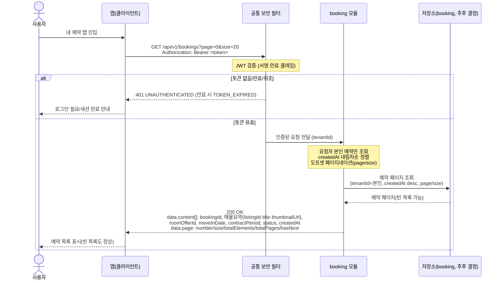
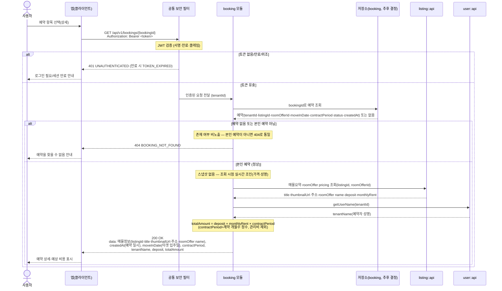

# US-4-2 — 내 예약 조회(목록·단건 상세)

> 모듈: 매물 예약(신청) · [유저 스토리](../../../requirements/user-stories.md) · [API 스펙](../../../api/specs/04-booking-inquiry-chat.md)

## 목록 조회 — GET /api/v1/bookings

## 단건 상세 조회 — GET /api/v1/bookings/{bookingId}

## 흐름 요약

- 보호 엔드포인트이므로 **공통 보안 필터(SEC)** 가 컨트롤러 앞단에서 `Authorization: Bearer <token>`의 JWT(서명·만료·클레임)를 검증한 뒤 인증된 요청(tenantId)을 **booking 모듈**로 전달한다. 토큰이 없거나 만료/위조면 필터가 `401 UNAUTHENTICATED`(만료 시 `TOKEN_EXPIRED`)로 막는다.
- **목록(`GET /api/v1/bookings`)**: booking 모듈이 **저장소**에서 요청자 본인(`tenantId`) 예약만 `createdAt` 내림차순으로 오프셋 페이지네이션(api-design-guide §4-1)해 조회한다. 각 항목에 `bookingId`·매물 요약(`listingId`·`title`·`thumbnailUrl`)·`roomOfferId`·`moveInDate`·`contractPeriod`·`status`·`createdAt`가 담기고 `page` 메타(`number`/`size`/`totalElements`/`totalPages`/`hasNext`)를 포함해 `200 OK`로 응답한다. 예약이 하나도 없으면 빈 `content: []`·`totalElements: 0`을 반환(에러 아님)하며, 타인 예약은 목록에 절대 포함되지 않는다.
- **단건 상세(`GET /api/v1/bookings/{bookingId}`)**: booking 모듈이 예약을 조회해 **요청자 본인 예약인지 먼저 확인**하고, 예약이 없거나 본인 예약이 아니면 존재 여부를 노출하지 않도록 `404 BOOKING_NOT_FOUND`로 **통일**한다.
- **가격·매물 정보·성명은 예약에 스냅샷 저장하지 않고 조회 시점에 실시간 조인**한다(cross-store 조인 금지 → 애플리케이션 레벨 조합, [ADR-0005](../../../adr/0005-polyglot-persistence.md)) — **`listing::api`** 로 `(listingId, roomOfferId)`의 매물 요약(제목·썸네일·주소·방 상품명)과 `pricing`(보증금 `deposit`·월세 `monthlyRent`)을, **`user::api`(`getUserName`)** 로 예약자 성명(`tenantName`)을 가져온다(둘 다 신규 공개 조회 메서드 필요). **총 금액 `totalAmount` = `deposit` + `monthlyRent` × `contractPeriod`**(`contractPeriod`는 계약 개월수 정수, **관리비 `maintenanceFee` 제외**)로 계산해, 매물 정보·예약 일시(`createdAt`)·타겟 입주일(`moveInDate`)·계약기간(`contractPeriod`)·예약자 성명·보증금·총 금액을 `200 OK`로 내려준다.
- **정합성**: 예약 이후 방 상품 가격이 바뀌어도 스냅샷이 아니라 **현재 가격 기준**으로 보증금·총 금액을 계산한다. 예약한 방 상품이 이후 비공개/삭제된 경우 매물 정보·가격 파트의 표기 정책(매물 필드 `null`/tombstone vs 별도 상태 코드)은 **(확인 필요)** — 예약 코어 내역(날짜·계약기간·상태)은 유지한다.

> 신설 의존: 신규 에러코드 `BOOKING_NOT_FOUND`(404), `listing::api`(매물 요약·`roomOffer` 가격 조회)·`user::api`(`getUserName`) 공개 메서드, 그리고 `booking → {listing::api, user::api}` 의존 화이트리스트(`booking/package-info.java`) 추가가 선행돼야 한다([ADR-0002](../../../adr/0002-inter-module-communication-via-events.md)).
