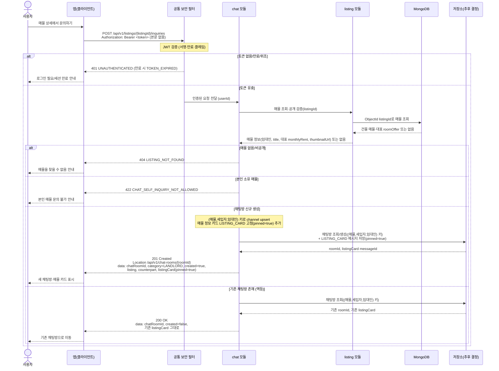

# US-4-2 — 매물 문의(채팅방 생성/조회) 및 매물 카드 고정

> **[후속·이연]** 이 다이어그램은 인앱 채팅(기존 F-03 chat 결합)으로 1차 MVP에서 후속으로 분리·이연되었다. 매물 예약(신청, US-4-1·US-4-2)과는 별개 기능이며, 파일명은 legacy이고 대응 US 번호는 **US-4-3(매물 문의)** 로 재정합됨.
>
> 모듈: 신청 · 문의 (인앱 채팅) · [유저 스토리](../../../requirements/user-stories.md) · [API 스펙](../../../api/specs/04-booking-inquiry-chat.md)

## 흐름 요약

- 보호 엔드포인트이므로 **공통 보안 필터(SEC)** 가 컨트롤러 앞단에서 `Authorization: Bearer <token>`의 JWT(서명·만료·클레임)를 검증한 뒤 인증된 요청(userId)을 **chat 모듈**로 전달한다. 토큰이 없거나 만료/위조면 필터가 `401 UNAUTHENTICATED`(만료 시 `TOKEN_EXPIRED`)로 막는다.
- 세입자가 `POST /api/v1/listings/{listingId}/inquiries`(빈 본문)를 호출하면 **chat 모듈**이 **listing 모듈**에 매물 조회·공개 검증을 동기 호출(`->>`)해 임대인·매물 대표 정보를 받은 뒤 (매물, 세입자, 임대인) 키로 `category=LANDLORD` 채팅방을 **저장소(추후 결정)**에 upsert(조회/생성)한다. `listingId`는 MongoDB ObjectId 문자열이며, 매물 조회는 listing 모듈이 MongoDB에서, 채팅방·카드 저장은 chat 모듈이 저장소(추후 결정)에서 각자 자기 데이터를 읽고 쓴다.
- 신규 생성 시에만 chat 모듈이 매물 정보 카드(listing 참조)를 `LISTING_CARD`·`pinned=true`로 저장소(추후 결정)에 추가하고 `201 Created` + `created=true`를, 기존 방이면 저장소(추후 결정)에서 방·카드를 조회해 `200 OK` + `created=false`로 동일 방을 반환(멱등)한다.
- 본인 소유 매물 문의는 `422 CHAT_SELF_INQUIRY_NOT_ALLOWED`, 없는 매물은 `404 LISTING_NOT_FOUND`로 거절되며, 거절 경로에서는 채팅방 도메인 상태를 저장소(추후 결정)에 쓰지 않는다. 이 비즈니스 판단은 필터가 아니라 chat 모듈의 몫이다.
