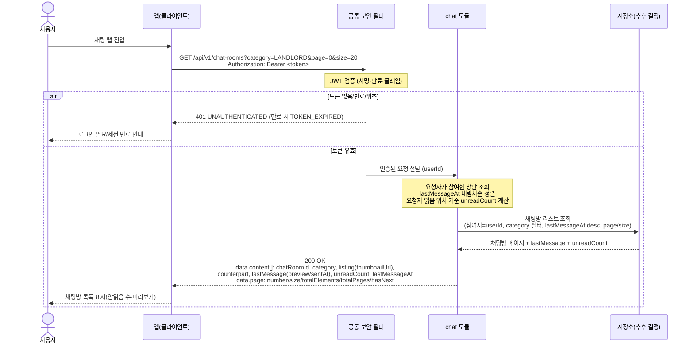

# US-4-3 — 채팅방 리스트 조회

> **[후속·이연]** 이 다이어그램은 인앱 채팅(기존 F-03 chat 결합)으로 1차 MVP에서 후속으로 분리·이연되었다. 매물 예약(신청, US-4-1·US-4-2)과는 별개 기능이며, 파일명은 legacy이고 대응 US 번호는 **US-4-4(채팅방 리스트 조회)** 로 재정합됨.
>
> 모듈: 신청 · 문의 (인앱 채팅) · [유저 스토리](../../../requirements/user-stories.md) · [API 스펙](../../../api/specs/04-booking-inquiry-chat.md)

## 흐름 요약

- 보호 엔드포인트이므로 **공통 보안 필터(SEC)** 가 컨트롤러 앞단에서 `Authorization: Bearer <token>`의 JWT(서명·만료·클레임)를 검증한 뒤 인증된 요청(userId)을 **chat 모듈**로 전달한다. 토큰이 없거나 만료/위조면 필터가 `401 UNAUTHENTICATED`(만료 시 `TOKEN_EXPIRED`)로 막는다.
- 세입자가 `GET /api/v1/chat-rooms`(선택 `category`·`page`·`size`)를 호출하면 **chat 모듈**이 **저장소(추후 결정)**에서 요청자가 참여한 방만 `lastMessageAt` 내림차순으로 오프셋 페이지네이션해 조회·반환한다.
- 각 항목에 `listing.thumbnailUrl`·`counterpart`·`lastMessage`·`unreadCount`가 담기고 `page` 메타(`number`/`size`/`totalElements`/`totalPages`/`hasNext`)를 포함해 chat 모듈이 `200 OK`로 응답한다. 매물 썸네일 등은 chat 모듈이 저장소(추후 결정)에 보유한 비정규화 뷰로 응답하므로 listing 모듈 조회가 필요 없다.
- 참여 중인 방이 없으면 빈 `content[]` + `totalElements=0`을 반환(에러 아님)하며, 타인 방은 목록에 절대 포함되지 않는다.
