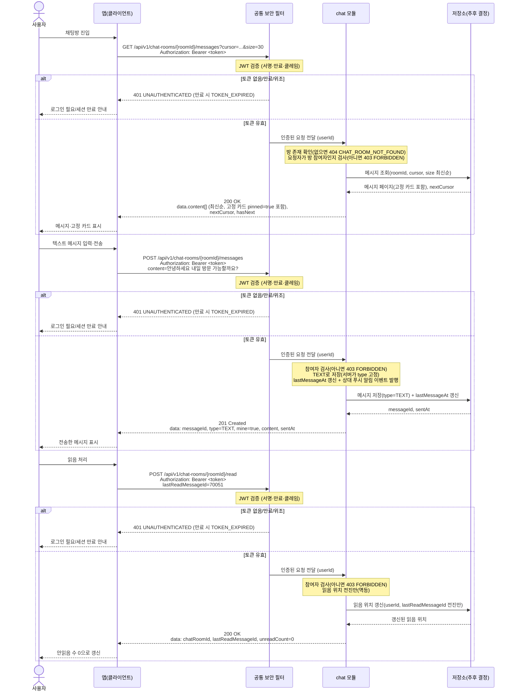

# US-4-4 — 채팅 메시지 조회·전송·읽음 처리

> **[후속·이연]** 이 다이어그램은 인앱 채팅(기존 F-03 chat 결합)으로 1차 MVP에서 후속으로 분리·이연되었다. 매물 예약(신청, US-4-1·US-4-2)과는 별개 기능이며, 파일명은 legacy이고 대응 US 번호는 **US-4-5(채팅 메시지 조회·전송·읽음 처리)** 로 재정합됨.
>
> 모듈: 신청 · 문의 (인앱 채팅) · [유저 스토리](../../../requirements/user-stories.md) · [API 스펙](../../../api/specs/04-booking-inquiry-chat.md)

## 흐름 요약

- 세 API 모두 보호 엔드포인트이므로 **공통 보안 필터(SEC)** 가 컨트롤러 앞단에서 각 요청의 `Authorization: Bearer <token>` JWT(서명·만료·클레임)를 검증한 뒤 인증된 요청(userId)을 **chat 모듈**로 전달한다. 토큰이 없거나 만료/위조면 필터가 `401 UNAUTHENTICATED`(만료 시 `TOKEN_EXPIRED`)로 막는다.
- `GET /api/v1/chat-rooms/{roomId}/messages`는 **chat 모듈**이 **저장소(추후 결정)**에서 최신순 커서 페이지네이션(`cursor`·`size`)으로 메시지를 조회·반환하며 고정 카드(`pinned=true`)도 목록에 포함된다.
- `POST /api/v1/chat-rooms/{roomId}/messages`는 `content`만 받아 chat 모듈이 `TEXT`로 **저장소(추후 결정)**에 저장(서버가 type 고정)하고 `lastMessageAt`을 갱신한 뒤 `201 Created` + `mine=true` 메시지를 반환하며 상대 푸시 이벤트를 발행한다.
- `POST /api/v1/chat-rooms/{roomId}/read`는 저장소(추후 결정)의 읽음 위치를 전진만 시키는 멱등 연산으로 chat 모듈이 `200 OK` + `unreadCount=0`을 반환하고, 모든 메시지 API는 방이 없으면 `404 CHAT_ROOM_NOT_FOUND`, 비참여자면 `403 FORBIDDEN`으로 거절한다(거절 경로에서는 저장소 접근 없음). 방 참여 여부(`403 FORBIDDEN`)는 토큰이 유효한 상태에서의 권한 판단이므로 필터가 아니라 chat 모듈이 처리한다.
