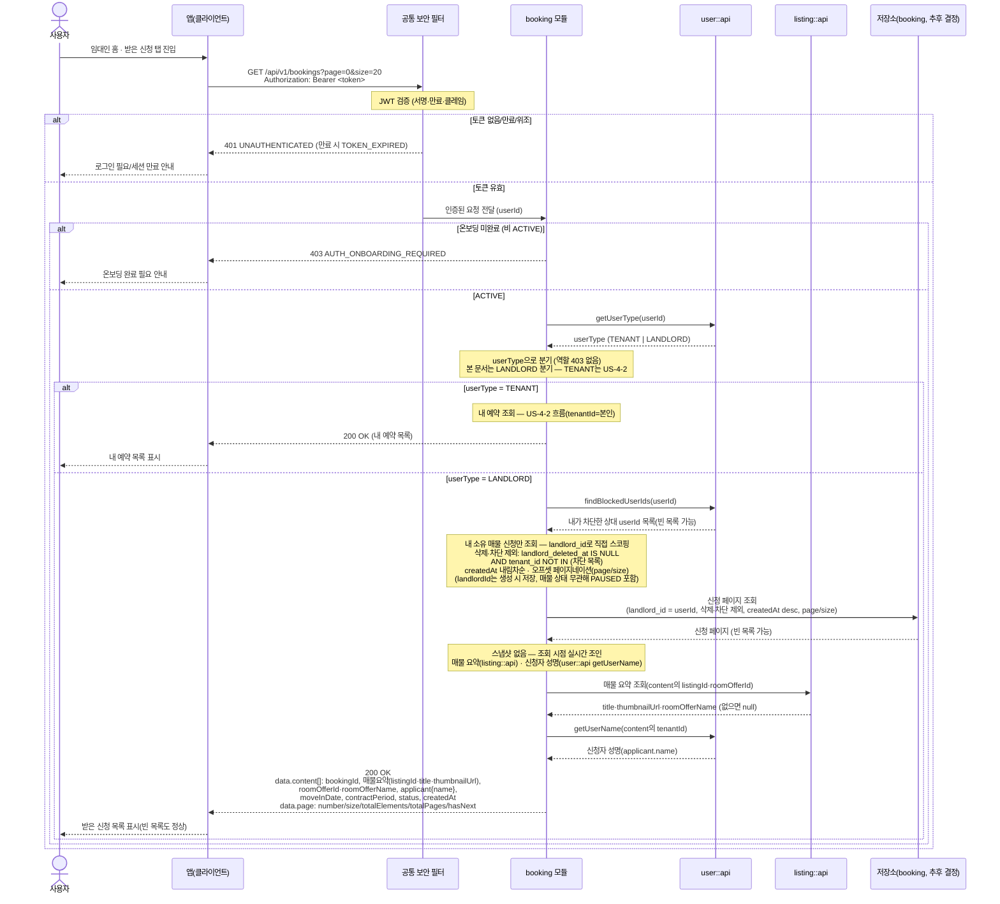
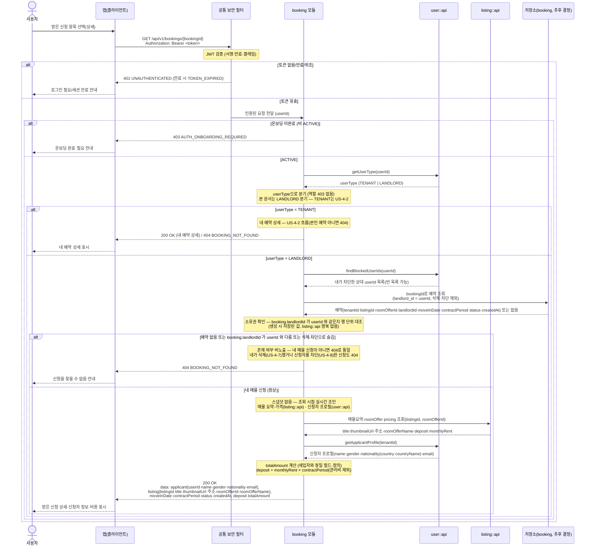

# US-4-6 — 임대인 받은 신청 조회(내 매물, userType 분기)

> 모듈: 매물 예약(신청) · [유저 스토리](../../../requirements/user-stories.md) · [API 스펙](../../../api/specs/04-booking-inquiry-chat.md)

임대인이 **자기 소유 매물(`listing.landlordId`=본인)에 신청된** 예약을 목록·단건 상세로 조회한다. **별도 임대인 전용 API를 두지 않고** 세입자와 **동일한 엔드포인트**(`GET /api/v1/bookings`·`GET /api/v1/bookings/{bookingId}`)에서 요청자 `userType`으로 분기한다 — `TENANT`면 내 예약([US-4-2](us-4-2-booking-retrieve.md)), `LANDLORD`면 내 매물에 신청된 예약(본 문서). 두 역할 모두 유효한 요청이라 **역할에 따른 `403`은 없다**.

소유권은 예약 **생성 시(US-4-1)** 매물 소유자(`listing.landlordId`)를 `Booking.landlordId`로 **비정규화 저장**해 두므로, 임대인 조회는 booking 저장소의 `landlord_id`로 직접 판정한다(cross-store 조인 없음, [ADR-0005](../../../adr/0005-polyglot-persistence.md); `chat_rooms`의 `landlord_id` 비정규화 선례와 일치). 매물 요약·가격·신청자 프로필은 스냅샷 없이 조회 시점에 실시간 조인한다.

## 목록 조회 — GET /api/v1/bookings (LANDLORD 분기)

## 단건 상세 조회 — GET /api/v1/bookings/{bookingId} (LANDLORD 분기)

## 흐름 요약

- 보호 엔드포인트이므로 **공통 보안 필터(SEC)** 가 컨트롤러 앞단에서 `Authorization: Bearer <token>`의 JWT를 검증한 뒤 인증된 요청(`userId`)을 **booking 모듈**로 전달한다. 토큰이 없거나 만료/위조면 `401 UNAUTHENTICATED`(만료 시 `TOKEN_EXPIRED`)로 막는다. 비 ACTIVE(온보딩 미완료)는 다른 보호 엔드포인트와 동일한 온보딩 게이트로 `403 AUTH_ONBOARDING_REQUIRED`이다.
- **userType 분기(별도 임대인 API 없음)**: 조회 엔드포인트(`GET /api/v1/bookings`·`/{bookingId}`)는 세입자·임대인이 **같은 경로**를 호출하고, booking 모듈이 `user::api`(`getUserType`)로 요청자 역할을 판정해 동작을 분기한다 — `TENANT`면 내 예약([US-4-2](us-4-2-booking-retrieve.md)), `LANDLORD`면 내 소유 매물에 신청된 예약(본 문서)을 반환한다. `userType`은 토큰 클레임이 아니라 서비스 계층 조회이며(`ROLE_LANDLORD` 없음, URL 티어는 `ROLE_USER`), **두 역할 모두 유효한 요청이라 역할 `403`은 없다**.
- **임대인 분기 — 소유권 스코핑(생성 시 landlordId 비정규화)**: 예약 **생성 시(US-4-1)** 매물 소유자(`listing.landlordId`)를 `Booking.landlordId`로 저장해 두므로, 소유권 판정이 booking 행에 있다. cross-store 조인 없이 booking 저장소만으로 처리한다:
  - **목록**: `landlord_id = 요청자`를 `createdAt` 내림차순 오프셋 페이지네이션(api-design-guide §4-1)으로 조회. `landlordId`는 매물 상태와 무관하게 저장돼 `PAUSED`(일시중지) 매물의 신청도 자동 포함된다. 신청이 없으면 빈 페이지(`200`, `content: []`).
  - **상세**: 예약을 `bookingId`로 조회한 뒤 **`booking.landlordId == 요청자`인지 행 단위로 확인**한다. 예약이 없거나 내 소유 매물의 신청이 아니면 존재 여부를 노출하지 않도록 `404 BOOKING_NOT_FOUND`로 **통일**한다(세입자 분기의 '타인 예약→404'와 동일한 규약).
  - **삭제·차단 제외 필터(목록·상세 공통)**: 임대인 분기의 술어는 세입자 분기와 대칭이다 — `landlord_deleted_at IS NULL`(내가 삭제하지 않은 신청, [US-4-7](us-4-7-booking-delete.md))이고 `tenant_id NOT IN (내가 차단한 신청자, [US-4-8](us-4-8-booking-block.md))`인 행만 본다. 삭제는 **참여자별 컬럼**이라 임대인이 지운 신청도 세입자 목록에는 그대로 남고, 차단 숨김도 **차단자 기준 단방향**이다. 차단 목록은 `user::api`(`findBlockedUserIds`)로 받아 **애플리케이션 레벨 조인**하며(booking이 `user_blocks`를 직접 조인하지 않는다, [ADR-0002](../../../adr/0002-inter-module-communication-via-events.md)), 술어는 응용 계층 후처리가 아니라 저장소 조회로 내려 페이지 메타(`totalPages`/`hasNext`)와 어긋나지 않게 한다. 차단이 0건이면 `NOT IN`이 모든 행을 지우지 않도록(`NOT IN ()`은 문법 오류, `NOT IN (null)`은 `UNKNOWN`이라 **모든 행이 사라진다**) 어댑터 내부에서 빈 목록을 sentinel `-1L` 한 건으로 정규화한다 — `users.id`는 `BIGINT AUTO_INCREMENT`라 `-1`이 실제 식별자와 충돌할 수 없다(세입자 분기 [US-4-2](us-4-2-booking-retrieve.md)와 동일).
  - `landlordId`는 생성 시점 스냅샷이라 **소유권 이전 시 stale**하나, 소유권 이전은 MVP 범위 밖이라 충분하다(이전 도입 시 백필 또는 조회 시점 해석으로 전환).
- **스냅샷 없음 — 조회 시점 실시간 조인**: 매물 요약·가격·신청자 정보는 예약에 스냅샷 저장하지 않고 조회 시점에 조립한다. **목록**은 항목별 매물 요약(`listing::api`)과 신청자 성명(`user::api` `getUserName`)만 조인한다(경량). **상세**는 매물 요약·주소·방 상품명·`pricing`(보증금·월세)을 `listing::api`로, 신청자 프로필(성명·성별·국적·이메일)을 `user::api`(신규 `getApplicantProfile(tenantId)`)로 조인한다. 신청자는 세입자이므로 프로필(`gender`·`country`·`email`)이 존재하며 **마스킹 없이 평문으로 노출**한다. 탈퇴 회원은 PII 익명화([ADR-0014](../../../adr/0014-withdrawal-pii-anonymization.md))로 값이 비어 있을 수 있다.
- **비용**: `deposit`(보증금)은 `listing::api` `pricing`에서, `totalAmount`(총 금액)는 조회 시점 계산값이며 **세입자 분기와 동일한 필드·정의**(`deposit + monthlyRent × contractPeriod`, 계약 개월수 정수, **관리비 제외**)다. 가격 변경 시 스냅샷이 아니라 **현재가 기준**으로 계산한다.

> 신설 의존: 예약 **생성** 시 소유자 캡처를 위해 `listing::api`의 매물 조회 뷰(`RoomOfferBookingView`)에 `landlordId` 추가 노출; `user::api` — `getApplicantProfile(userId)`(신청자 성명·성별·국적·이메일)·`findBlockedUserIds(blockerId)`(차단 필터) 공개 조회 메서드; `bookings.landlord_deleted_at` 컬럼과 삭제·차단 술어를 반영한 조회; booking 저장소의 `landlord_id` 컬럼 + `(landlord_id, created_at)` 인덱스(신규 마이그레이션). 임대인 조회에 listing::api 소유권 조회 메서드는 불필요하다(소유권은 booking 행에서 판정). 에러코드는 신규 없이 공통 `AUTH_ONBOARDING_REQUIRED` + 기존 `BOOKING_NOT_FOUND`(404)를 재사용한다(역할 `403` 없음). `booking → {listing::api, user::api}` 의존 화이트리스트는 이미 선언돼 있다([ADR-0002](../../../adr/0002-inter-module-communication-via-events.md)).
