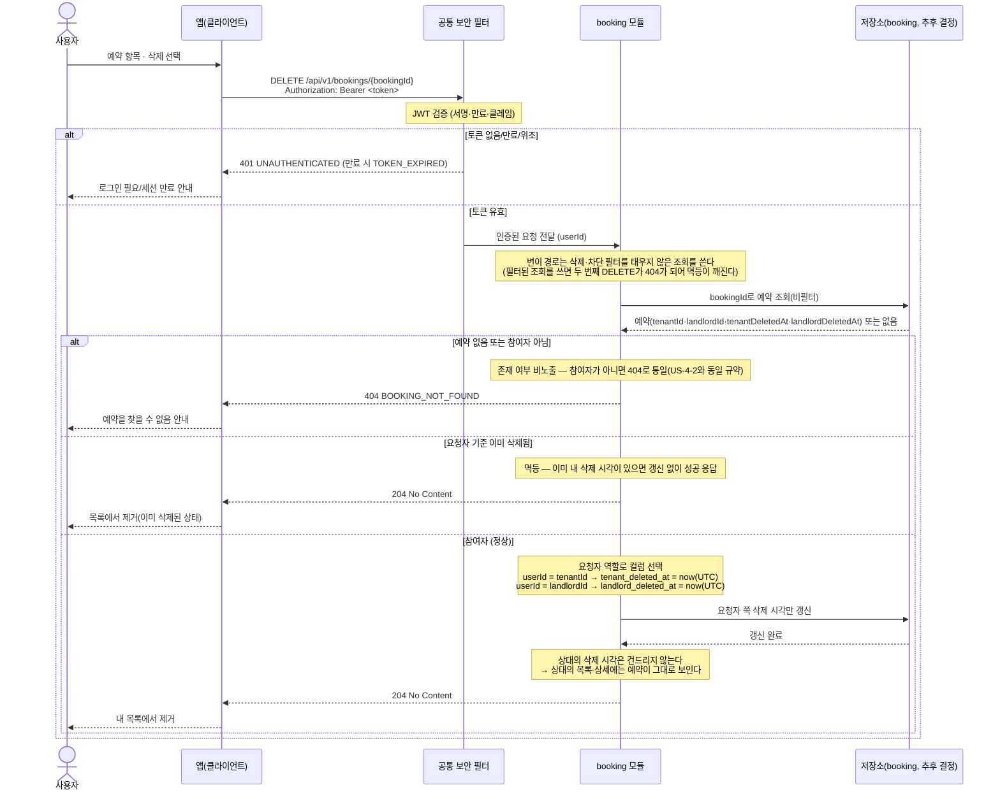

# US-4-7 — 예약 내역 삭제(내 목록에서만 숨김)

> 모듈: 매물 예약(신청) · [유저 스토리](../../../requirements/user-stories.md) · [API 스펙](../../../api/specs/04-booking-inquiry-chat.md)

예약 1행은 `tenant_id`·`landlord_id` **두 참여자가 공유**하므로 삭제 표식도 참여자별로 나눈다(`tenant_deleted_at`·`landlord_deleted_at`). 단일 삭제 flag를 두면 한쪽이 지울 때 상대의 기록까지 사라지고, `status=CANCELED`로도 대체할 수 없다 — `status`는 두 참여자가 함께 보는 공유 필드이고 취소와 숨김은 다른 의미다. 삭제는 **요청자 목록에서만** 예약을 감추며 상대에게는 그대로 보인다.

## 예약 삭제 — DELETE /api/v1/bookings/{bookingId}

## 흐름 요약

- 보호 엔드포인트이므로 **공통 보안 필터(SEC)** 가 컨트롤러 앞단에서 `Authorization: Bearer <token>`의 JWT(서명·만료·클레임)를 검증한 뒤 인증된 요청(`userId`)을 **booking 모듈**로 전달한다. 토큰이 없거나 만료/위조면 필터가 `401 UNAUTHENTICATED`(만료 시 `TOKEN_EXPIRED`)로 막는다.
- **참여자별 소프트삭제**: booking 모듈이 예약을 조회해 요청자가 `tenantId`인지 `landlordId`인지 판정하고, **자기 쪽 컬럼 하나만**(`tenant_deleted_at` 또는 `landlord_deleted_at`) 현재 시각(UTC)으로 세팅한 뒤 `204 No Content`로 응답한다. 예약 1행을 두 참여자가 공유하므로 **단일 삭제 flag는 상대의 기록까지 지우는 데이터 손실**이 된다. 삭제·숨김을 `status` 값으로 표현하지 않는 것도 같은 이유다(`status`는 공유 필드이며 취소 ≠ 숨김).
- **멱등**: 이미 삭제한 예약을 다시 `DELETE` 해도 갱신 없이 `204`다. 이를 위해 **변이 경로는 필터되지 않은 조회**를 쓴다 — 조회 경로(US-4-2·US-4-6)와 같은 필터된 조회를 쓰면 이미 삭제된 행이 보이지 않아 두 번째 요청이 `404`가 되고 멱등이 깨진다.
- **권한·존재 비노출**: 예약이 없거나 요청자가 그 예약의 참여자(`tenantId`·`landlordId` 중 하나)가 아니면 존재 여부를 노출하지 않도록 `404 BOOKING_NOT_FOUND`로 **통일**한다(US-4-2 상세 조회와 동일한 규약, 소유권 `403`을 쓰지 않는다).
- **관측 방식**: 응답 DTO에 삭제 관련 필드를 새로 추가하지 않는다 — 삭제는 이후 목록·상세에서 **그 항목이 사라지는 것**으로만 관측되며(US-4-2·US-4-6의 필터), 상대 쪽 응답은 전혀 달라지지 않는다.

> 신설 의존: booking 저장소의 `bookings.tenant_deleted_at`·`bookings.landlord_deleted_at` 컬럼(둘 다 nullable, NULL = 미삭제)과 삭제·차단 필터를 적용하지 않는 **변이 전용 조회**(`findById`)가 선행돼야 한다. 신규 에러코드는 없다 — 기존 `BOOKING_NOT_FOUND`(404)를 재사용한다. 모듈 의존 추가 없음(booking 내부 처리).
