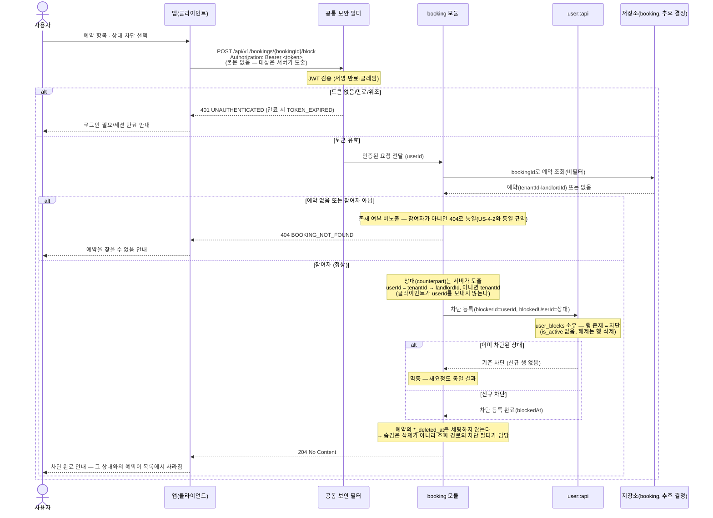

# US-4-8 — 예약 상대 차단

> 모듈: 매물 예약(신청) · [유저 스토리](../../../requirements/user-stories.md) · [API 스펙](../../../api/specs/04-booking-inquiry-chat.md)

차단은 **예약 단위가 아니라 사용자 단위**(`user_blocks(blocker_id, blocked_user_id)`)다. 한 임대인은 **매물을 여러 개**(`Listing.landlordId`), 한 매물은 **방 상품을 여러 개**(`Listing.roomOffers`) 가지므로, 예약 #1에서 상대를 차단해도 그 상대의 **다른 방 상품**에 신청하면 새 예약이 생겨 차단이 우회된다 — 차단 대상이 예약이면 상대가 방을 하나 더 가진 순간 무력해진다. 차단은 본질적으로 **사람**에 대한 것이다. 차단 대상은 클라이언트가 보내지 않고 **서버가 예약에서 상대를 도출**한다.

테이블은 `user` 모듈이 소유하고 목록·해제 엔드포인트도 `user`(`/api/v1/users/me/blocks`)에 둔다. 다만 **생성만 `booking`에 있다** — 경로가 `/bookings/{bookingId}/block`이라 상대를 도출하려면 예약을 읽어야 하는데, `user`가 생성을 소유하면 `user → booking` 의존이 새로 생기고 `booking → user::api`가 이미 있어 **모듈 의존 사이클**이 된다. 그래서 컨트롤러는 `booking`, 저장은 `user::api` 호출로 처리한다.

## 예약 상대 차단 — POST /api/v1/bookings/{bookingId}/block

## 흐름 요약

- 보호 엔드포인트이므로 **공통 보안 필터(SEC)** 가 컨트롤러 앞단에서 `Authorization: Bearer <token>`의 JWT(서명·만료·클레임)를 검증한 뒤 인증된 요청(`userId`)을 **booking 모듈**로 전달한다. 토큰이 없거나 만료/위조면 필터가 `401 UNAUTHENTICATED`(만료 시 `TOKEN_EXPIRED`)로 막는다.
- **대상은 서버가 도출**: booking 모듈이 예약을 조회해 요청자가 참여자인지 확인하고, `요청자 == tenantId`면 `landlordId`를, 아니면 `tenantId`를 차단 대상으로 정한다. 클라이언트는 차단할 `userId`를 보내지 않으므로 **임의 사용자 차단**이 구조적으로 불가능하다. 예약이 없거나 참여자가 아니면 `404 BOOKING_NOT_FOUND`로 **통일**한다(존재 비노출, US-4-2와 동일 규약).
- **사용자 단위 차단(예약 단위 아님)**: 저장은 `user::api` 호출로 `user_blocks(blocker_id, blocked_user_id)` 행을 만든다. 임대인은 매물을 여러 개(`Listing.landlordId`), 매물은 방 상품을 여러 개(`Listing.roomOffers`) 갖기 때문에 **방/예약 단위 차단은 상대의 다른 방으로 우회**된다 — 같은 방 재신청을 막든 안 막든 성립하는 구조적 이유다. 사용자 단위라야 그 상대와의 예약이 과거·미래를 통틀어 모두 숨는다. (보조: 같은 방 재신청은 이제 `uq_bookings_tenant_room_offer` UNIQUE(`tenant_id, room_offer_id`, 위반 시 `409 BOOKING_ALREADY_EXISTS`)로 막히지만, 임대인은 매물·방 상품을 여러 개 가지므로 **다른 방으로는 여전히 우회된다** — 그래서 여전히 사용자 단위여야 한다.)
- **차단 생성만 booking에 있는 이유**: `user_blocks`의 소유자는 `user` 모듈이지만, 생성 경로는 `bookingId`에서 상대를 도출해야 한다. 생성을 `user`가 소유하면 `user → booking` 의존이 생기고 기존 `booking → user::api`와 맞물려 **사이클**이 되어 `ApplicationModules.verify()`가 깨진다. 그래서 **컨트롤러는 `booking`, 쓰기는 `user::api` 위임**으로 모듈 의존을 그대로 둔다(새 엣지 0개).
- **멱등**: 이미 차단한 상대를 다시 차단해도 `204`다. `is_active` 같은 상태 컬럼을 두지 않고 **행 존재 = 차단, 해제 = 행 삭제**로 표현한다.
- **목록 숨김은 단방향**: 차단 후 **그 상대와의 모든 예약**이 내 목록·상세에서 제외된다(US-4-2·US-4-6의 차단 필터). **상대의 목록은 그대로**다 — 상대의 목록·상세만으로는 차단 사실이 드러나지 않는다(신규 신청 시도 시에는 양방향 가드의 `403 FORBIDDEN`으로 드러난다 — 차단 관계는 존재 비노출 대상이 아니다. [API 스펙](../../../api/specs/04-booking-inquiry-chat.md) 참조). 차단은 예약의 `*_deleted_at`을 건드리지 않는다 — 삭제(US-4-7)와 차단은 독립된 숨김 사유다.
- **해제 경로는 예약 밖에 있다**: 차단하면 그 예약이 목록에서 사라져 `bookingId`를 다시 얻을 수 없으므로, 해제는 예약과 무관한 `GET /api/v1/users/me/blocks`(내 차단 목록)·`DELETE /api/v1/users/me/blocks/{userId}`(해제)로 한다. 신규 예약 신청(`POST /api/v1/listings/{listingId}/bookings`)은 **양방향** 차단 가드로 `403 FORBIDDEN` — 없으면 생성은 되는데 양쪽 목록엔 보이지 않는 예약이 생긴다.

> 신설 의존: `user_blocks` 테이블(`user` 모듈 소유, `(blocker_id, blocked_user_id)` 유니크)과 `user::api`의 차단 공개 표면 — 조회 경로 필터용 **공개 쿼리** `findBlockedUserIds(blockerId)`·신규 신청 가드용 `isBlockedBetween(a, b)`, 그리고 예약에서 도출한 상대 식별자를 받는 **차단 생성 공개 명령** — 이 선행돼야 한다. **목록 조회·해제는 이 표면에 없다** — `user`가 자기 엔드포인트(`/api/v1/users/me/blocks`)로 직접 제공하므로 `booking`이 호출하지 않는다. `booking → user::api` 의존은 이미 화이트리스트에 있어 **새 모듈 의존 엣지는 없다**. 신규 에러코드는 없다(기존 `BOOKING_NOT_FOUND`(404)·공통 `FORBIDDEN` 재사용).
