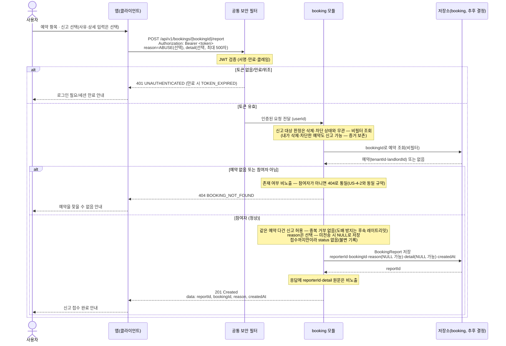
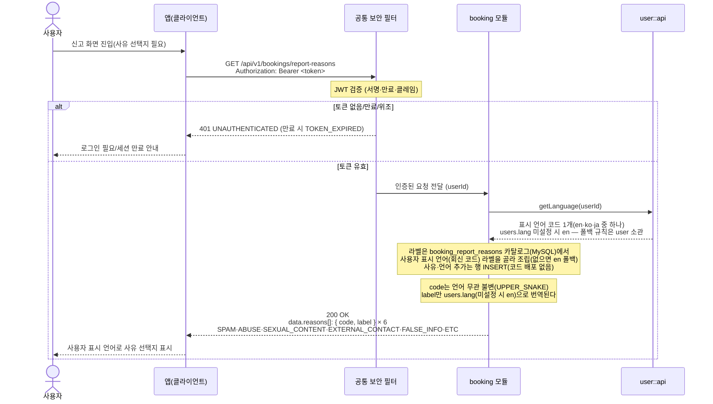

# US-4-9 — 예약 신고(접수)

> 모듈: 매물 예약(신청) · [유저 스토리](../../../requirements/user-stories.md) · [API 스펙](../../../api/specs/04-booking-inquiry-chat.md)

예약 신고는 **`booking` 모듈이 접수(capture)까지만** 담당한다. 접수는 "대상 예약이 실재하는가 / 요청자가 그 예약의 참여자인가"를 검증해야 하는데 그건 예약만 아는 정보이기 때문이다. [신고 처리(07-reports)](../07-reports/README.md)의 `report` 모듈은 게시글·댓글·채팅 메시지 신고를 담당하며 **예약과 대상이 겹치지 않는다** — 예약 신고를 `report`가 접수하면 `report → booking::api` 포트를 새로 뚫어야 하지만, `booking`이 접수하면 모듈 내부 호출이라 새 의존이 없다.

범위가 접수까지이므로 **운영자 검토·제재·상태 전이 흐름이 없고**, 저장 레코드에 `status` 컬럼도 두지 않는다(불변 기록).

## 예약 신고 — POST /api/v1/bookings/{bookingId}/report

## 신고 사유 목록 — GET /api/v1/bookings/report-reasons

## 흐름 요약

- 보호 엔드포인트이므로 **공통 보안 필터(SEC)** 가 컨트롤러 앞단에서 `Authorization: Bearer <token>`의 JWT(서명·만료·클레임)를 검증한 뒤 인증된 요청(`userId`)을 **booking 모듈**로 전달한다. 토큰이 없거나 만료/위조면 필터가 `401 UNAUTHENTICATED`(만료 시 `TOKEN_EXPIRED`)로 막는다. 사유 목록(`GET /api/v1/bookings/report-reasons`)도 같은 규약을 따른다 — **인증 필수(`ROLE_USER`)** 이며, 고정·소규모 집합이라 페이지네이션이 없다.
- **왜 07-reports가 아니라 booking인가**: 신고 **접수**의 불변식("대상 예약이 실재하는가", "요청자가 참여자인가")이 전부 예약 상태에 의존하므로 **대상 모듈만 판단할 수 있다**. `report` 모듈(미구현)은 게시글·댓글·메시지 신고 담당이라 **대상이 겹치지 않아** 두 곳이 공존해도 충돌이 없다. `booking_reports`도 `report`가 예약해 둔 `reports` 테이블과 별개다.
- **접수 범위**: booking 모듈이 참여자 검증을 통과한 요청을 `booking_reports`에 저장하고 `201 Created` + `reportId`·`bookingId`·`reason`·`createdAt`을 반환한다. **운영자 검토·제재·상태 전이는 범위 밖**이라 레코드에 `status` 컬럼이 없다(접수 시점 불변 기록). `reason`은 **선택**이며 미전송 시 `NULL`로 저장한다. 응답에는 **`reporterId`·`detail` 원문을 노출하지 않는다**.
- **삭제·차단과 무관한 비대칭(의도된 설계)**: 신고 대상 판정은 **필터되지 않은 조회**를 쓴다. 내가 삭제(US-4-7)했거나 상대를 차단(US-4-8)한 예약도 신고할 수 있다 — 숨김은 내 목록 표시의 문제일 뿐 신고 증거는 보존돼야 한다. 그래서 같은 예약이 `GET /api/v1/bookings/{bookingId}`에서는 `404`인데 신고는 `201`이 되는 비대칭이 생기며, 이는 버그가 아니라 의도된 동작이다.
- **권한**: 예약이 없거나 요청자가 참여자가 아니면 존재 비노출로 `404 BOOKING_NOT_FOUND`(소유권 `403`을 쓰지 않는다 — 기존 booking 규약과 통일).
- **다건 신고 허용**: 같은 신고자가 같은 예약을 **여러 번 신고할 수 있다** — 새 사유·지속되는 문제를 다시 접수할 수 있어야 하기 때문이다. 중복을 거부하지 않으므로 `409`나 유니크 제약이 없다. **도배 방지는 레이트리밋(`429`)** 으로 다루며 이는 **후속·이연**이다(현재 미구현). 그때의 집계를 위해 `booking_reports`에 보조 인덱스 `idx_booking_reports_reporter_created (reporter_id, created_at)`·`idx_booking_reports_booking (booking_id)`를 둔다(유니크 아님).
- **자기 신고는 별도 코드가 없다**: 예약은 세입자만 생성할 수 있고 `userType`은 온보딩 확정 후 불변이라 `tenantId != landlordId`가 **구조적으로 보장**된다 — 요청자가 자기 자신을 신고하는 경로 자체가 존재하지 않으므로 전용 에러코드를 만들지 않는다.
- **신고 사유 카탈로그**: `GET /api/v1/bookings/report-reasons`가 6종(`SPAM`·`ABUSE`·`SEXUAL_CONTENT`·`EXTERNAL_CONTACT`·`FALSE_INFO`·`ETC`)을 내려준다. 사유 집합은 `booking` 모듈이 소유한 **MySQL 카탈로그 테이블 `booking_report_reasons`**(`(code, lang)` 한 쌍이 한 라벨)로 관리하며, 값이 같아도 [07-reports](../07-reports/README.md)의 `ReportReason`과 **별개**다 — 카탈로그를 공유하면 `booking → report` 모듈 의존이 생긴다.
- **`label`은 서버가 사용자 표시 언어로 번역한다**: booking 모듈이 `user::api`의 공개 쿼리 **`getLanguage(userId)`** 를 동기 호출해 표시 언어 코드를 받는다. `user`는 `users.lang`(사용자가 고른 표시 언어)이 있으면 그 값을, 없으면 `en`을 소문자 코드 문자열 하나로 회신하므로 **booking은 폴백 규칙을 알지 못한다** — `diagnosis`·`gamification`·`lifetip`이 이미 쓰는 것과 같은 경로다. 지원 언어는 `EN`·`KO`·`JA` 3종이고 미지원·미설정은 `en` 폴백이다. `booking → user::api`는 **이미 의존 화이트리스트에 있어**(`booking/package-info.java`) 새 모듈 의존 엣지가 생기지 않는다.
- **`code`는 언어 무관 불변, `label`만 언어별**이다. 클라이언트는 `code`(UPPER_SNAKE)로 신고를 전송하고 `label`은 표시에만 쓴다 — 번역이 바뀌어도 전송 값과 저장 값은 그대로다.
- **번역 라벨은 MySQL 카탈로그 테이블 `booking_report_reasons`에 둔다**: 신고 사유는 **코드 배포 없이 행 추가로 동적 관리**하려고 DB 카탈로그에 둔다 — 사유를 하나 늘리는 것도, 언어를 하나 늘리는 것도 **행 INSERT**로 끝나고 enum·스키마 변경이 없다. 컬럼은 `code`(VARCHAR32)·`lang`(VARCHAR8)·`label`(VARCHAR100)·`display_order`(INT)·`active`(BIT)이고 `(code, lang)`이 유니크라 **한 쌍이 한 라벨**이다. 리소스 번들(Spring MessageSource)은 쓰지 않는다 — `messages` 번들은 [ADR-0030](../../../adr/0030-error-message-i18n-resource-bundle.md)이 **에러 메시지 전용**으로 규정하고 `Locale`을 `Accept-Language`로 정하는 반면, 사유 라벨은 사용자 표시 언어(`getLanguage(userId)`)로 카탈로그 행을 골라 조립하는 **본문 콘텐츠**라 경로가 다르다.
- ⚠️ **라벨 언어는 `getLanguage(userId)`가 회신한 코드로 고른다** — 카탈로그의 `lang` 컬럼을 그 코드로 매칭해 행을 뽑고(없으면 `en` 폴백), `LocaleContextHolder`/`Accept-Language`는 쓰지 않는다. 두 경로는 명시적으로 분리돼 있다([domain-model](../../domain-model.md) `user` 협력 절): `getLanguage`는 **본문 콘텐츠(사유 라벨) 조회에만** 쓰이고, **에러 메시지**는 `Accept-Language`/`LocaleContextHolder` 경로를 그대로 쓴다. 즉 이 엔드포인트의 `label`은 `users.lang`을, 실패 시 에러 메시지는 `Accept-Language`를 따르며 서로 다른 언어일 수 있다(의도된 동작).

> 신설 의존: booking 저장소의 `booking_reports` 테이블(유니크 제약 없음 — 다건 신고 허용, 보조 인덱스 `idx_booking_reports_booking (booking_id)`·`idx_booking_reports_reporter_created (reporter_id, created_at)`, `reason`·`detail` nullable, `status` 없음)과 신고 사유 카탈로그 테이블 `booking_report_reasons`(마이그레이션 `V17__create_booking_report_reasons.sql`)가 선행돼야 한다. `booking_reports.reason`은 카탈로그의 **`code` 문자열을 값 참조**로 저장한다(선택·nullable·FK 없음). 접수가 booking 모듈 내부에서 끝나고 `booking → user::api`는 이미 화이트리스트라 **모듈 의존 추가는 없다**(`report` 모듈은 손대지 않는다).
>
> ⚠️ **사유 카탈로그는 전부 신설이다(#169 구현 범위)**: `V17__create_booking_report_reasons.sql`이 테이블과 함께 **6종×3언어(en/ko/ja) 시드 행**을 넣는다 — 사유·언어 추가는 이후에도 코드 배포 없이 **행 INSERT**로 한다. **일본어 라벨도 #169 범위**다 — US-4-9의 정상 AC가 `ja` 사용자에게 일본어 라벨을 요구하므로, `ja` 시드 행 누락 시 나가는 `en` 폴백은 **허용되는 상태가 아니라 미구현 시의 실패 양상**이다(`en` 폴백은 `users.lang`이 미설정·미지원인 경우에만 정상 동작이다).
