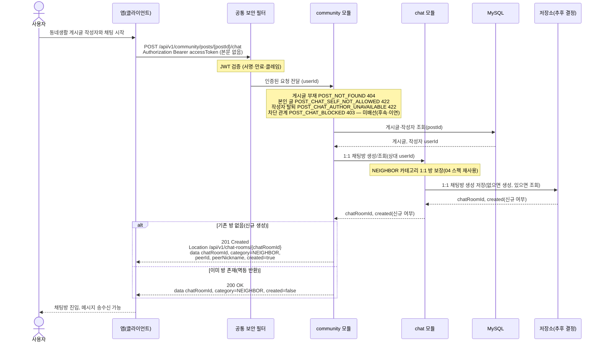

# US-5-5 — 동네친구 1:1 채팅 시작

> 모듈: 커뮤니티 (게시판 · 동네친구) · [유저 스토리](../../../requirements/user-stories.md) · [API 스펙](../../../api/specs/05-community.md)

## 흐름 요약

- 채팅 시작은 인증 필수로, 공통 보안 필터(SEC)가 컨트롤러 앞단에서 JWT(서명·만료·클레임)를 검증한 뒤 인증된 요청(userId)을 community 모듈로 전달한다. 토큰이 없거나 만료·위조면 필터가 401(UNAUTHENTICATED / TOKEN_EXPIRED)로 막는다.
- POST /api/v1/community/posts/{postId}/chat으로 community 모듈이 MySQL에서 게시글·작성자를 조회한 뒤, chat 모듈에 NEIGHBOR 카테고리 1:1 방 생성/조회를 동기 호출하고, chat 모듈이 저장소(추후 결정)에 1:1 채팅방을 생성 저장(없으면 생성, 있으면 조회)해 chatRoomId와 신규 여부를 돌려준다. 신규면 201(created=true), 기존 방이면 200(created=false)으로 멱등하게 반환한다.
- community 모듈이 본인 글(POST_CHAT_SELF_NOT_ALLOWED 422), 탈퇴 작성자(POST_CHAT_AUTHOR_UNAVAILABLE 422), 게시글 부재(POST_NOT_FOUND 404)를 분기로 차단한다.
- 차단 관계(POST_CHAT_BLOCKED 403)는 아직 배선되지 않았다(후속·이연) — community의 allowedDependencies가 {common}이라 user_blocks를 조회할 수 없고, community → user :: api(isBlockedBetween) 의존 신설이 선행한다(§5 자체가 1차 MVP 범위 밖).
- chat 모듈이 생성한 방은 Location /api/v1/chat-rooms/{chatRoomId}로 안내되어 메시지 송수신은 04 채팅 스펙을 재사용한다.
