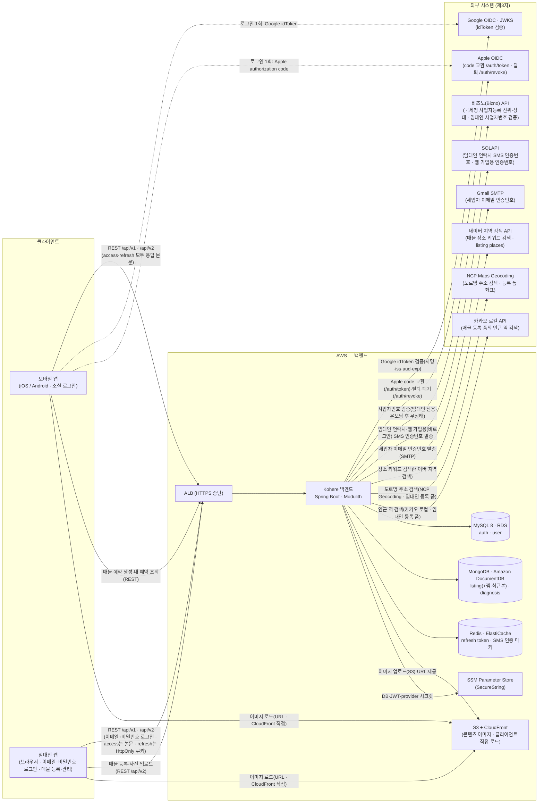
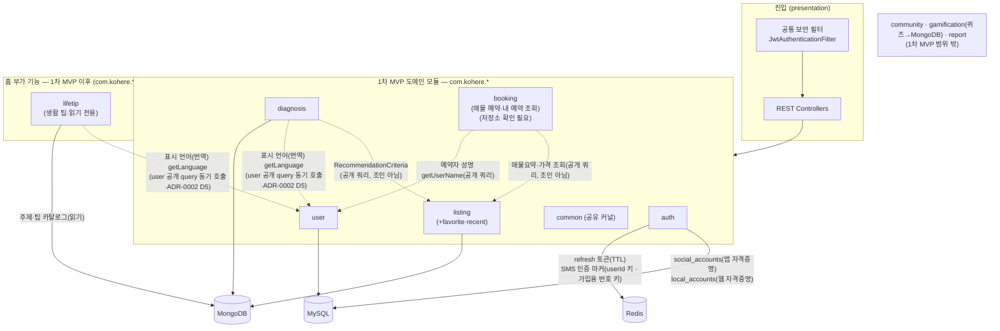
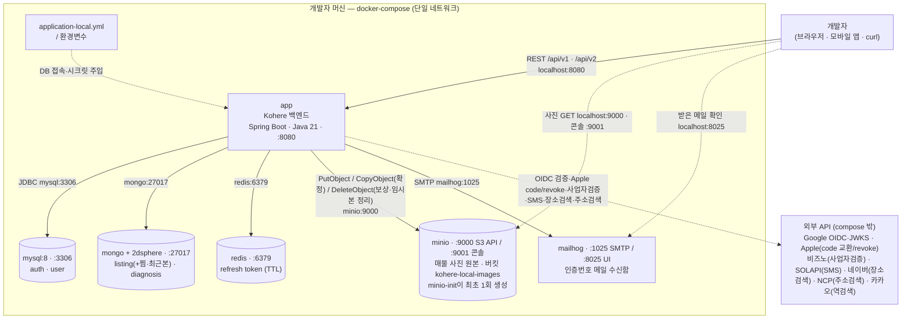
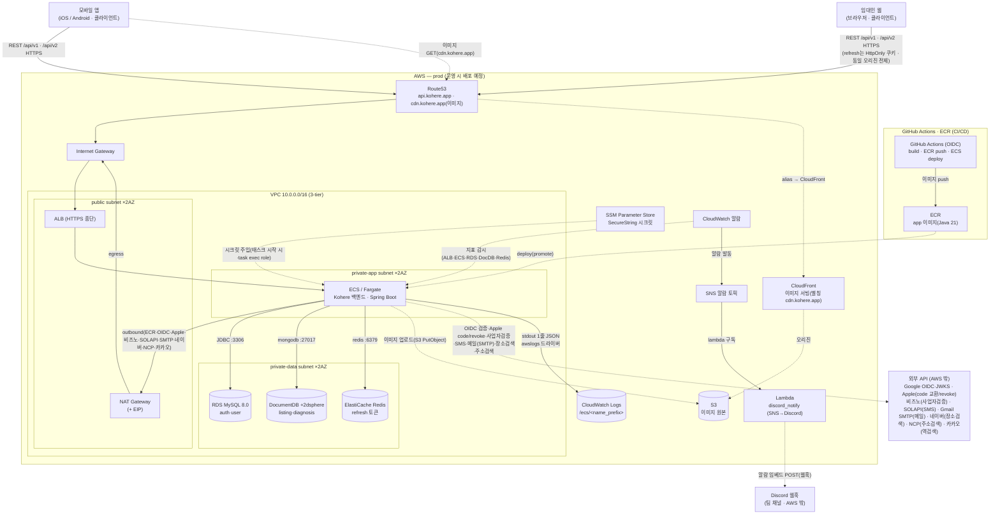
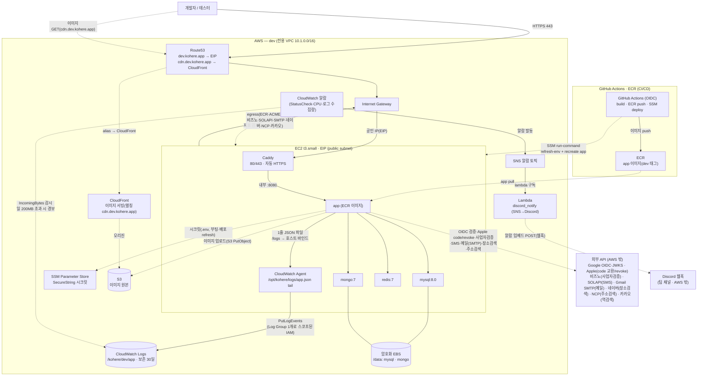

# System Overview

> Kohere 백엔드의 시스템 큰 그림(컨텍스트·컴포넌트·기술 스택·NFR 요약). **1차 MVP(2026-07-10)** 범위를 기준으로 작성한다. 영속 배치의 정본은 **[ADR-0005](../adr/0005-polyglot-persistence.md)**, 모듈 경계는 [ADR-0001](../adr/0001-bounded-context-module-decomposition.md), 통신은 [ADR-0002](../adr/0002-inter-module-communication-via-events.md), 마일스톤·트랙 분담은 [project-brief §7](../project/project-brief.md#7-마일스톤-milestones).
>
> **영속(ADR-0005, 데이터 특성 기준):** `listing`(+`favorite`·`recent-listing`)·`diagnosis` → **MongoDB**, `auth`·`user` → **MySQL**.
> **본 문서의 추가 결정(팀 확정):** ① **refresh 토큰 → Redis** — **[ADR-0006](../adr/0006-refresh-token-store-redis.md)** 으로 확정(ADR-0005 `RefreshToken` 배치 보완, ADR-0003 후속 닫힘). ② **매물 예약(신청) = 독립 기능**(예약 저장 + 내 예약 목록·상세 조회)으로 1차 MVP 편입. `booking`이 조회 시점에 `listing`·`user` 공개 쿼리를 동기 참조해 매물 요약·가격·예약자 성명을 조합한다(이벤트 결합 아님). **인앱 채팅 기록**(예약 시 채팅방 `BOOKING_CARD` 자동 전송·`BookingCreatedEvent`)·문의·실시간 WebSocket·푸시는 **후속·이연**. booking 저장소는 (확인 필요, ADR-0005 표 미확정), chat 저장소는 후속 결정. ③ **클라이언트가 둘이다** — 모바일 앱(소셜 로그인)에 더해 **임대인 웹**(이메일+비밀번호 로컬 로그인)이 **같은 `/api/v1/auth` 표면**을 쓴다. 자격증명은 `users`·`social_accounts` 옆의 `local_accounts`로 분리하고([ADR-0047](../adr/0047-web-local-credentials-and-phone-based-account-linking.md)), 웹 refresh는 응답 본문이 아니라 **HttpOnly 쿠키**로 나른다([ADR-0048](../adr/0048-web-refresh-token-httponly-cookie.md)).
> **스택 상태:** 현재 배선된 의존성 정본은 [build.gradle](../../build.gradle)(`web`·`validation`·`data-jpa`·`data-redis`·`security`·`oauth2-jose`·`jjwt`·`spring-modulith-starter-core` + 테스트 `test`·`modulith-starter-test`·Testcontainers·REST Docs/restdocs-api-spec). `추후`=1차 MVP 이후.

## 목적

처음 합류한 백엔드 개발자가 **무엇이 어디서 돌아가고, 무엇으로 만들며, 어떤 제약을 지켜야 하는지**를 한 장에서 파악하도록 한다. 선택의 *근거*는 ADR, *상세 의존성*은 build.gradle, *기능 흐름*은 시퀀스 다이어그램으로 분리해 추적한다.

## 1차 MVP 범위 (2026-07-10)

| # | 영역                                                           | 모듈                                           | 저장소                          |
| - | -------------------------------------------------------------- | ---------------------------------------------- | ------------------------------- |
| 1 | 로그인·온보딩(소셜→JWT) · **임대인 웹 로컬 로그인·회원가입**(이메일+비밀번호, `/api/v1/auth/signup`·`/login`) | `auth`·`user`                             | MySQL(`local_accounts` 포함) +**Redis**(refresh·인증 마커) |
| 2 | ★ F-01 큐레이션 챗봇(6단계 진단: 지역·입국목적(유학여부)·대학(그룹)/지역선택·주거조건·월세 범위·ARC) | `diagnosis`                                  | MongoDB                         |
| 3 | ★ F-02 맞춤 매물 추천(리스트+지도, 거리·예산 필터)           | `listing`(+`favorite`·`recent-listing`) | MongoDB                         |
| 4 | 매물 탐색·찜(지도 탭 검색·조건 필터·매물 상세, 찜·최근 본) | `listing`(+`favorite`·`recent-listing`) | MongoDB                         |
| 5 | 매물 예약(신청) — 예약 저장 + 내 예약 목록·상세 조회(독립 기능) | `booking`(→ `listing`·`user` 공개 쿼리 참조) | (저장소 확인 필요) |
| 6 | 매물 등록(임대인 — 등록 주체 클라이언트는 **임대인 웹**) — 등록 폼 기준 v4 스키마로 `PENDING` 저장(`POST /api/v2/listings`, **1차 MVP 이후**) | `listing`(→ `user` 공개 쿼리로 임대인 인가 재검사) | MongoDB |

★ = 보호 핵심. **1차 MVP 범위 밖(코드 골격만 존재, MVP 이후로 이연):** `community`(커뮤니티)·`report`(신고). 저장소 미정(추후 ADR). **홈 부가 기능(1차 MVP 이후):**

## 1. 시스템 컨텍스트 다이어그램

클라이언트(**모바일 앱 · 임대인 웹** 둘)·외부 시스템·AWS 백엔드와 **세 저장소(MySQL·MongoDB·Redis)** 관계다.

> **전제(인프라 근거 없음):** 임대인 웹은 **API와 동일 오리진**에 배치한다는 전제로 CORS origin 추가·CSRF 토큰을 두지 않았지만(`SameSite=Lax` refresh 쿠키 + `csrf.disable()` 유지), [docker-compose.yml](../../docker-compose.yml)에도 dev [Caddyfile](../../infra/terraform/modules/dev/host/Caddyfile.tftpl)(`reverse_proxy app:8080` 하나)에도 **웹을 서빙하는 서비스가 아직 없다** — 다른 호스트로 배포되는 순간 쿠키 refresh가 CSRF 표면이 되므로 실제 배치 전에 이 전제를 먼저 확정한다([ADR-0048](../adr/0048-web-refresh-token-httponly-cookie.md)).

### 1-2. 내부 컴포넌트(모듈)와 저장소 매핑

진입(공통 보안 필터 + REST 컨트롤러) → 1차 MVP 도메인 모듈 + 공유 커널 `common` → 각 모듈의 인프라 어댑터 → **모듈별 저장소(ADR-0005)**. 모듈 간 협력은 직접 호출/조인이 아니라 **이벤트·공개 쿼리 API**로 한다([ADR-0002](../adr/0002-inter-module-communication-via-events.md)).

> 웹 임대인 인증 흐름(US-1-11 ~ US-1-13·US-1-15, [ADR-0047](../adr/0047-web-local-credentials-and-phone-based-account-linking.md)): `auth`가 `POST /api/v1/auth/phone/signup/verification-code`·`/phone/signup/verify`(비로그인 permitAll, **번호 키** 챌린지 `signup-phone:*`)로 번호 소유를 증명받고, `POST /api/v1/auth/signup`·`/login`으로 웹 자격증명 `local_accounts`(이메일 UNIQUE·BCrypt 해시·`failed_login_attempts`·`locked_at`)를 소유한다. 계정·프로필 전이는 `user :: api` 공개 포트(`createPendingUser` → `agreeToTerms` → `completeLandlordOnboarding`)를 **한 트랜잭션에서 연속 호출**해 `PENDING → TERMS_AGREED → ACTIVE`(`userType=LANDLORD`)까지 완주하므로 **웹에는 부분 완료 상태가 없다**(`onboardingRequired`는 항상 `false`). 인증을 마친 휴대폰 번호로 기존 `ACTIVE`·`LANDLORD` 계정이 잡히면 **새 `users` 행을 만들지 않고 그 `user_id`에 자격증명만 붙여**(`linked=true`) `landlordId`가 갈라지지 않게 하고, 반대 방향(앱 온보딩에 웹 계정이 이미 있는 경우)은 `POST /api/v1/auth/landlord/onboarding`이 `social_accounts.user_id`를 옮기고 임시 `users` 행을 삭제해 병합한다(US-1-15). 두 방향 모두 `listing`·`booking` 데이터는 건드리지 않는다 — ID가 하나이므로 옮길 것이 없다.
>
> 추천 흐름(ADR-0005 Decision 2): `diagnosis`가 진단 조건을 값 객체 `RecommendationCriteria`로 만들어 넘기면 `listing`이 `recommendByCriteria(...)`로 **자기 Mongo 컬렉션만** 질의한다. 둘 다 Mongo지만 **cross-collection 조인은 하지 않는다**(co-location은 부수적).
>
> 문항·번역 흐름(US-2-5·US-2-6, ADR-0002 정합): 클라이언트는 `GET /api/v1/diagnoses/questions/{step}`(인증 필수)로 받을 단계 `step`(1~6)을 path로 지정해 그 단계 질문 1개를 받고(`{ step, field, question(사용자 언어 라벨 문자열), select{ type, max }, options[{ code, label }] }`), 그 단계 답을 `POST /api/v1/diagnoses/answers`(body `{ field, code }`, conditions처럼 다중은 `codes` 배열)로 보내면 서버가 **본인 in-progress 진단에 저장**한다(단계별 server-stateful, 누적 답 묶음 전송 없음; 다음 단계 번호는 클라이언트가 정한다). ③ 대학/지역 질문은 **서비스 비즈니스 로직**이 저장된 `purpose`로 골라 반환한다(`STUDY`→`university`, `NON_STUDY`→`district` — `diagnosisQuestions`에는 분기 메타 없음, 데이터만, 클라 분기 아님). 선택지 `code`는 제출 검증 enum과 **동일 출처**(1:1)·언어 무관 불변, 표시 `label`·`question`만 **사용자 언어로 채운다**(미지원 언어 키는 **영어 폴백**). 모든 단계 답이 저장되면 별도 제출(`POST /api/v1/diagnoses`)이 서버 저장 답을 재검증해 in-progress 진단을 `COMPLETED`로 확정한다(201, `data.diagnosisId`·status `COMPLETED`·`submittedAt`, `Location` 헤더). 번역에 필요한 **표시 언어는 `diagnosis`가 `user` 모듈 공개 query `getLanguage(userId)`를 동기 호출**해 취득한다([ADR-0002](../adr/0002-inter-module-communication-via-events.md) Decision 5; 토큰 클레임 분기 없음, 모듈 간 직접 호출/엔티티 공유 없이). **번역은 별도 컬렉션·키 없이 `diagnosisQuestions` 도큐먼트 안에 인라인 언어-키 맵으로 임베드**한다 — 질문 `question: { "en": .., "ja": .., "ko": .. }`, 옵션 `options: [ { "code": "SEOUL", "label": { "en": "Seoul", "ja": "ソウル" } }, ... ]`처럼 **언어 코드를 키로 하는 맵**으로 둔다. 서버가 사용자 언어 키로 값을 고르고 부재 시 `en` 폴백한다(`code`는 언어 무관 불변). 표시 언어도 서버가 처리한다 — **`users.lang`(사용자가 고른 표시 언어)이 있으면 그 값, 없으면 `en`** 으로 정한다(Accept-Language 비의존, [ADR-0029](../adr/0029-diagnosis-i18n-strategy.md) 개정(#141)).
>
> 생활 팁 흐름(US-8-1 ~ US-8-3, [ADR-0029](../adr/0029-diagnosis-i18n-strategy.md) 정합): `lifetip`은 **1차 MVP 이후 홈 부가 기능**으로 **읽기 전용**이다(발행/구독 도메인 이벤트 없음). 클라이언트가 `GET /api/v1/life-tips/topics`(주제 전체 목록·비페이지)와 `GET /api/v1/life-tips/topics/{topicCode}/tips`(해당 주제 팁 전체·비페이지)로 조회하면(모두 정식 인증 `ROLE_USER`=`ACTIVE` 세입자, 온보딩 미완료 토큰은 `403 AUTH_ONBOARDING_REQUIRED`), 서버가 자기 Mongo 컬렉션(`lifeTipTopics`·`lifeTips`)만 질의한다(주제 : 팁 = 1 : N, `topicCode`로 **애플리케이션 레벨 조인**·DB 조인 없음). 존재하지 않는 주제 코드는 `404 LIFE_TIP_TOPIC_NOT_FOUND`(신규 도메인 코드)다. **번역은 진단과 완전히 동일한 전략**을 재사용한다 — 표시 문자열(주제 `name`·`shortDescription`·`longDescription`, 팁 `title`·`content`)을 도큐먼트 안 인라인 언어-키 맵(`{ "en": .., "ja": .., "ko": .. }`)으로 임베드하고, 표시 언어는 **`lifetip`이 `user` 모듈 공개 query `getLanguage(userId)`를 동기 호출**해 취득한다([ADR-0002](../adr/0002-inter-module-communication-via-events.md) Decision 5; `Accept-Language`·토큰 클레임 비의존, `user`가 **`users.lang`이 있으면 그 값, 없으면 `en`** 으로 결정). 미지원 언어 키는 `en` 폴백(에러 아님), 식별자(topic code / tip id)와 이미지 URL(주제 `imageUrl`·`backgroundImageUrl`, 팁 `imageUrl`)은 언어 무관 불변이다. 컬렉션 시드는 진단 카탈로그와 동일하게 Mongock `@ChangeUnit`(모듈별)로 적재한다([ADR-0032](../adr/0032-mongodb-migration-runner.md)).

### 1-3. 아키텍처: 로컬 개발 ↔ 클라우드 배포

> **M0–M4는 전 구간 로컬(개발자 머신) 컨테이너(docker-compose)로 개발**(클라우드 비용 0)하고, **[M7](../project/project-brief.md#7-마일스톤-milestones)(7/8–7/10)에서 AWS로 이전·배포**한다. (커뮤니티는 **MVP 이후로 이연** — M4→M7 사이는 비워둔다.) 두 환경은 **동일 애플리케이션 Docker 이미지**를 쓰며 **인프라만 로컬↔매니지드로 교체**한다 — 클라우드 실배포는 1차 MVP 최종 목표에 그대로 포함되되 시점만 M7이다.

#### 1-3-1. 로컬 개발 아키텍처 (M0–M4, 클라우드 비용 0)

개발자 머신에서 **단일 `docker-compose`** 로 app + MySQL + MongoDB + Redis + MailHog + **MinIO**(매물 사진용 S3 호환 저장소, `minio-init`이 버킷을 최초 1회 만든다)를 함께 기동한다(`./gradlew bootRun`은 같은 이미지의 앱을 단일 JVM으로 띄울 수도 있음). M0–M4 동안 AWS 인프라는 띄우지 않는다(러닝 비용 0 — 사진도 S3가 아니라 로컬 MinIO에 올린다). 아래 매핑은 두 환경이 동일하게 따르는 표준이며, **클라우드 대응 열의 매니지드 서비스는 M7에서 프로비저닝**한다.

| 요소         | 로컬 구성                                                             | 클라우드 대응(M7)                                   |
| ------------ | --------------------------------------------------------------------- | --------------------------------------------------- |
| 앱 실행      | `./gradlew bootRun`(단일 JVM)                                       | ECS/Fargate + ALB(HTTPS)                            |
| 패키징       | `Dockerfile` + CI `docker build`(이미지 빌드 검증, 러닝 인프라 0) | 동일 이미지 ECR push 후 배포                        |
| MySQL        | `mysql:8` 컨테이너                                                  | RDS for MySQL 8.0 (auth·user)                      |
| MongoDB      | `mongo` 컨테이너 + `2dsphere`                                     | Amazon DocumentDB (listing[+찜·최근본]·diagnosis) |
| Redis        | `redis` 컨테이너                                                    | ElastiCache (refresh 토큰 TTL)                      |
| 매물 사진      | `minio` 컨테이너(S3 호환 · :9000 API/:9001 콘솔) + `minio-init`(버킷 생성) — **업로드 API가 한 장씩 받아 `uploads/`에 올리고, 등록이 확정될 때 `listings/`로 복사** | 같은 S3 버킷의 `uploads/`(임시)·`listings/`(확정) prefix(앱 역할에 `PutObject`·`GetObject`·`DeleteObject`) + CloudFront |
| 콘텐츠 이미지  | 그 밖의 이미지(생활팁·국기 등)는 백엔드 미보관 — URL만 저장           | S3 + CloudFront(Route53 별칭→클라이언트 로드)      |
| 메일(인증번호) | `mailhog` 컨테이너(:1025 SMTP / :8025 UI)                           | Gmail SMTP                                          |
| 시크릿·설정 | `application-local.yml` / 환경변수                                  | SSM Parameter Store(SecureString)                   |
| 로그         | 콘솔 텍스트 + `logs/app.json`(1줄 JSON, `app.log.dir`) — compose는 `./logs` 바인드 | dev=Agent tail → CloudWatch Logs, prod=`awslogs` 드라이버 |

> **booking·chat 저장소는 추후 결정**(추후 ADR) — 위 매핑에는 강제 반영하지 않는다.

로컬 `docker-compose` 구성도 — 한 도커 네트워크 안에서 app·MySQL·MongoDB·Redis·MinIO·MailHog가 **서비스명**으로 서로를 찾는다:

> 컨테이너는 서로를 **서비스명**(`mysql`·`mongo`·`redis`·`minio`·`mailhog`)으로 부르고, 개발자는 `localhost:8080`으로 app에 접속한다 — 올라간 사진은 `localhost:9001`(MinIO 콘솔), 받은 인증 메일은 `localhost:8025`(MailHog UI)에서 확인한다. 클라우드 이전(§1-3-2) 시 **app 이미지는 그대로**, 접속 대상만 서비스명 → 매니지드 엔드포인트(RDS·DocumentDB·ElastiCache·S3·Secrets Manager)로 교체된다. Google/Apple OIDC·비즈노(사업자검증)·**연락처 SMS(SOLAPI)**·네이버 지역검색(장소) 는 제3자 외부 실호출이다. 이메일 인증 메일은 **로컬은 MailHog**, dev/prod는 **Gmail SMTP**다.
>
> **매물 사진만 백엔드가 원본을 보관한다.** 업로드 API(`POST /api/v2/listings/images`)가 한 장씩 받아 임시 위치에 올리고, 등록이 확정될 때 확정 위치로 복사해 그 URL을 매물 문서에 저장한다 — 로컬은 MinIO(업로드는 compose 안에서 `minio:9000`, 응답 URL은 호스트에서 열리는 `http://localhost:9000/kohere-local-images/…`), dev/prod는 S3 업로드 + CloudFront URL이다([ADR-0041](../adr/0041-listing-image-upload-to-s3.md)). 그 밖의 콘텐츠 이미지(생활팁 등)는 백엔드가 보관하지 않고 URL만 저장하며 클라이언트가 CloudFront에서 직접 로드한다.

#### 1-3-2. prod 클라우드 배포 아키텍처 (운영 시 배포 예정, AWS)

**prod은 실제 운영 시점에 배포 예정**이며 현재는 미배포(IaC만 준비). **M7(7/8–7/10) 첫 클라우드 배포는 dev**(§1-3-3)이고, prod은 로컬과 동일 이미지를 ECR에 push해 배포한다. 각 매니지드 서비스의 책임은 아래와 같다.

| 요소         | 구성                                        | 비고                                                                                                                                                                                                                                 |
| ------------ | ------------------------------------------- | ------------------------------------------------------------------------------------------------------------------------------------------------------------------------------------------------------------------------------------ |
| 패키징       | Docker 이미지(Java 21 런타임)               | 로컬과 동일 이미지를 ECR push                                                                                                                                                                                                        |
| 도메인·노출 | Route53 → ALB(HTTPS)                       | `api.kohere.app`, ACM 인증서로 443 종단                                                                                                                                                                                            |
| 실행         | ECS/Fargate                                 | private-app 서브넷. access 무상태라 수평 확장 여지([ADR-0003](../adr/0003-jwt-auth-after-oauth-login.md))                                                                                                                             |
| 네트워크     | 3-tier 서브넷 + NAT                         | public(ALB·NAT) / private-app(ECS) / private-data(DB)                                                                                                                                                                               |
| MySQL        | RDS for MySQL 8.0                           | auth·user                                                                                                                                                                                                                           |
| MongoDB      | Amazon DocumentDB                           | listing(+찜·최근본)·diagnosis,`2dsphere` 인덱스                                                                                                                                                                                  |
| Redis        | ElastiCache                                 | refresh 토큰(TTL).**AOF·복제 권장**(§3-7)                                                                                                                                                                                    |
| 콘텐츠 이미지  | S3 + CloudFront (+ Route53 별칭)            | 백엔드는 S3 업로드 + URL 응답.**클라이언트는 `cdn.kohere.app`(Route53 alias→CloudFront)에서 로드**(커스텀 도메인 미설정 시 `*.cloudfront.net` 직접). 인증서는 us-east-1 ACM                                               |
| 시크릿       | **SSM Parameter Store**(SecureString) | DB·JWT·provider 시크릿. 태스크 시작 시 주입,**변경 반영은 배포(태스크 롤)**([ADR-0024](../adr/0024-secret-change-propagation.md)). **Secrets Manager 미사용**([ADR-0023](../adr/0023-secrets-in-ssm-parameter-store.md)) |
| 모니터링     | CloudWatch 알람 + SNS                       | ALB·ECS·RDS·DocDB·Redis 지표 → SNS →**Lambda → Discord**(+ 이메일 옵션, [ADR-0027](../adr/0027-dev-discord-alerting.md))                                                                                                 |
| 로그         | ECS `awslogs` 드라이버 → CloudWatch Logs `/ecs/<name_prefix>` | 태스크 stdout을 그대로 실어 **이중 래핑이 없다**(dev의 Docker json-file과 대비). 앱은 dev와 동일한 1줄 JSON을 낸다. **CD 미연결이라 실적재 미검증**([ADR-0038](../adr/0038-application-logging-and-cloudwatch.md)) |
| CI/CD        | GitHub Actions (OIDC)                       | build·ECR push·ECS deploy([ADR-0019](../adr/0019-infrastructure-as-code-terraform.md))                                                                                                                                              |

> **booking·chat 저장소는 추후 결정**(추후 ADR) — 위 표/토폴로지에는 강제 반영하지 않는다.
>
> **MongoDB 백엔드 = Amazon DocumentDB 확정**([ADR-0018](../adr/0018-documentdb-for-mongodb-on-aws.md), Atlas 대비). AWS 네이티브라 단일 provider·VPC 내부에서 운영하며, 위 토폴로지는 [`infra/terraform`](../../infra/terraform/README.md)로 IaC 구현돼 있다(ECS Fargate·RDS·DocumentDB·ElastiCache·S3+CloudFront·SSM Parameter Store·ECR·GitHub Actions OIDC). IaC 도구·구조·원격 상태 결정은 [ADR-0019](../adr/0019-infrastructure-as-code-terraform.md)·[ADR-0020](../adr/0020-terraform-remote-state-s3-dynamodb.md). 단, listing 지도검색의 **지오공간 쿼리(`2dsphere`·`$geoNear`/`$geoWithin`)** 가 DocumentDB에서 요구대로 동작하는지 검증해야 하며, 호환성 갭이 확인되면 Atlas로 전환한다. (Mongo 드라이버 배선 시 앱 이미지에 DocumentDB CA 번들 포함 — `infra/terraform/README.md` 참고.)

AWS 배포 토폴로지 — GitHub Actions가 빌드한 **동일 이미지**가 ECR→Fargate로 올라가고, 로컬 컨테이너(§1-3-1)가 매니지드 서비스로 교체된다:

> 로컬과 동일한 app 이미지를 GitHub Actions가 ECR에 push하고, **prod은 운영 시점에** Fargate로 deploy한다(현재 배포 예정) — 로컬 docker-compose(§1-3-1)와 같은 그림에서 접속 대상만 서비스명 → 매니지드 엔드포인트(RDS·DocumentDB·ElastiCache·S3+CloudFront·**SSM Parameter Store**)로 교체되고, 3-tier 서브넷이 app·DB를 감싼다. Google/Apple OIDC·비즈노(사업자검증)·**연락처 SMS(SOLAPI)**·Gmail SMTP(메일)·네이버 지역검색(장소)는 로컬·클라우드 공통으로 AWS 밖 외부 실호출이다. 임대인 웹은 **같은 ALB로 들어오는 브라우저 클라이언트**로만 그려져 있다 — 웹 정적 서빙 인프라는 아직 없다(§1 전제).

#### 1-3-3. dev 배포 아키텍처 (비용 최소화 — 단일 EC2 compose)

> **dev는 위 매니지드 토폴로지(§1-3-2)를 쓰지 않는다.** prod 매니지드 스택(ALB·ECS·RDS·DocumentDB·ElastiCache·NAT ~$370/mo)은 dev엔 **과투자**라, **단일 EC2**에 컨테이너로 올린 dev 전용 구성을 쓴다([ADR-0021](../adr/0021-cost-optimization-profile.md)). prod(매니지드) ↔ dev(단일 EC2)는 Terraform `environments/{prod,dev}` 루트로 분리하며, **앱 이미지·DB 엔진은 동일**(`mysql:8.0`·`mongo:7`·`redis:7`)하다.
>
> **M7(7/8–7/10) 첫 클라우드 배포는 dev**다(prod은 운영 시점에 배포 예정, §1-3-2). 배포는 GitHub Actions가 이미지를 ECR(`:dev`)에 push한 뒤 **SSM run-command로 dev EC2에서 `refresh-env.sh`(SSM→`.env` 재조회) → `docker compose pull` → `up --force-recreate app`** 하는 방식이다(ECS 없음). **시크릿 변경 반영도 이 배포 경로**이며, 코드 변경 없이 시크릿만 바꿨다면 배포 워크플로를 수동 트리거한다([ADR-0024](../adr/0024-secret-change-propagation.md)).

| 요소     | dev 구성                                                           | 비고                                                                                                                                                                                                  |
| -------- | ------------------------------------------------------------------ | ----------------------------------------------------------------------------------------------------------------------------------------------------------------------------------------------------- |
| 컴퓨트   | EC2`t3.small` 1대(2vCPU/2GB, x86), `docker compose` 컨테이너들 | ALB·ECS 없음                                                                                                                                                                                         |
| HTTPS    | **Caddy**(자동 인증서·Let's Encrypt)                        | 80/443 종단 → app(내부 8080) 프록시. 갱신·reload 자체 처리([ADR-0022](../adr/0022-dev-https-caddy.md))                                                                                               |
| DB       | 자가호스팅`mysql:8.0`·`mongo:7`·`redis:7`(같은 EC2)        | local과 동일 엔진. 매니지드(RDS/DocDB/ElastiCache) 대체                                                                                                                                               |
| 메일     | 실 SMTP(Gmail SMTP)                                                | **MailHog는 로컬 compose 전용이라 dev엔 없음**                                                                                                                                                  |
| 시크릿   | **SSM Parameter Store SecureString**(무료)                   | Secrets Manager 미사용. 부팅·배포 시`refresh-env.sh`로 SSM→`.env` 재조회 후 app recreate(JWT/pepper 자동 생성). **변경 반영은 배포**([ADR-0024](../adr/0024-secret-change-propagation.md)) |
| 이미지   | **S3 + CloudFront**(+ Route53 별칭, prod 동일 모듈)          | 앱은 S3 업로드 + URL 응답.**클라이언트는 `cdn.dev.kohere.app`(Route53 alias→CloudFront)에서 GET**(미설정 시 `*.cloudfront.net` 직접). 인증서는 us-east-1 ACM                               |
| 노출     | EIP → Route53 A 레코드(`dev.kohere.app`)                        | SG 80/443만. 관리자 접속은 SSM 전용(SSH 미개방)                                                                                                                                                       |
| 데이터   | 전용 암호화 EBS(`/data`) bind-mount                              | 인스턴스 교체에도 보존                                                                                                                                                                                |
| 모니터링 | CloudWatch StatusCheckFailed·CPU·**로그 수집량** 알람 + SNS       | 단일 박스 다운·로그 폭주 → SNS →**Lambda → Discord** 통보([ADR-0027](../adr/0027-dev-discord-alerting.md)). 셋 다 같은 SNS 토픽을 쓴다. **로그 내용 기반 알람은 없다**(metric filter 미도입 — "ERROR가 N건" 같은 조건 불가) |
| 로그     | 앱이 `/logs/app.json`(1줄 JSON) → **CloudWatch Agent** tail → Log Group `/kohere/dev/app`(보존 30일) | 컨테이너 `/logs`는 호스트 `/opt/kohere/logs` 바인드 — 없으면 컨테이너 레이어에 갇혀 Agent가 못 읽고 `--force-recreate`에 소실된다. 로테이션 두 겹(`RollingFileAppender` 50MB×7일 + compose `logging` app 50MB×3). 토글 `enable_cloudwatch_agent`. 일 수집량 상한 **200MB**는 `IncomingBytes`(AWS 기본 지표·무료) 알람으로 감시한다 — AWS가 Log Group당 하드 리밋을 주지 않아 **차단이 아닌 조기 경보**다([ADR-0038](../adr/0038-application-logging-and-cloudwatch.md)) |
| 비용     | EC2 ~$30/mo + EBS~$2/mo + S3/CF(CF 무료티어) ≈ **~$32/mo+**, CloudWatch Logs 최대 ~$5/mo | 매니지드 복제 대비 큰 절감. **로그 비용은 수집량 비례**라 일 수집량 상한을 **200MB(≈ 월 $5)** 로 뒀다 — 1GB/일이면 월 ~$24로 호스트 비용을 넘는다([ADR-0038](../adr/0038-application-logging-and-cloudwatch.md)) |

> dev는 클라우드 EC2 한 대에 각 서비스를 **컨테이너 박스**로 올린 구성이라 로컬↔dev 엔진이 일치한다(`SPRING_PROFILES_ACTIVE=dev`). MailHog는 로컬 전용이라 dev는 실 SMTP를 쓰고, HTTPS는 Caddy([ADR-0022](../adr/0022-dev-https-caddy.md))가, 시크릿은 SSM Parameter Store SecureString(무료·SM 미사용, [ADR-0023](../adr/0023-secrets-in-ssm-parameter-store.md))이 담당하며, **변경 반영은 배포(`refresh-env` + app recreate)** 경로로 한다([ADR-0024](../adr/0024-secret-change-propagation.md)). 단일 호스트 SPOF·인터넷 노출은 SG(80/443)·SSM 전용·IMDSv2·EBS 암호화로 통제하며 dev 단계에서 수용한다. 상태(state)는 prod·dev 공통 S3 + native lockfile([ADR-0020](../adr/0020-terraform-remote-state-s3-dynamodb.md)), `key`로 분리한다.

## 2. 주요 컴포넌트 표

| 컴포넌트            | 책임                                                                                                      | 저장소                          | 기술                                                   |
| ------------------- | --------------------------------------------------------------------------------------------------------- | ------------------------------- | ------------------------------------------------------ |
| 공통 보안 필터      | 보호 요청 JWT(서명·만료·클레임) 검증,`userId`·온보딩 스코프 주입                                     | —                              | Spring Security + 커스텀 `OncePerRequestFilter`      |
| presentation        | REST 엔드포인트, DTO, 형식 검증, 공통 래퍼 응답(ResponseBodyAdvice 자동 적용, [ADR-0013](../adr/0013-response-auto-wrapping.md)) | —                              | Spring MVC, Bean Validation                            |
| application         | 유스케이스 조율, 트랜잭션 경계, 이벤트 발행                                                               | —                              | `@Service`, `@Transactional`                       |
| domain              | Aggregate·VO·도메인 규칙,**Repository 인터페이스**                                                | —                              | POJO, enum                                             |
| infrastructure      | **Repository 구현**, 외부 어댑터(OIDC·SMS·사업자검증·장소검색·주소검색·**오브젝트 스토리지**)                | 모듈별 저장소 + S3(사진 원본)   | Spring Data JPA / Data MongoDB / Data Redis / AWS SDK v2 |
| listing(매물)       | 카탈로그·탐색(학교·지역·지하철역 검색)·조건 필터·상세·찜·최근 본(**조회 계열 5종의 정본은 `/api/v2`** — `SecurityConfig`에 `GET /api/v2/listings`·`/api/v2/listings/*` `permitAll` 매처 필요. `/api/v1` 조회는 개정 전(v3) 구조를 복원한 `deprecated` 스텁이라 DB에 닿지 않고 빈 결과·`404 LISTING_NOT_FOUND`만 반환 — [ADR-0040](../adr/0040-listing-query-api-v2-and-v1-sunset.md)),**지도 bbox 마커 + 거리순**, 장소 키워드 검색(`PlaceSearchClient`→네이버 지역 검색 API·무상태)과 **도로명 주소 검색**(`AddressSearchClient`→NCP Geocoding·임대인 전용, [ADR-0042](../adr/0042-road-address-search-with-ncp-geocoding.md))·**인근 역 검색**(`NearbyPlaceSearchClient`→카카오 로컬·임대인 전용, [ADR-0044](../adr/0044-nearby-station-search-with-kakao-local.md)) — 셋 다 매물 데이터를 안 써서 **`/api/v1`에 남는 매물 경로**, **임대인 매물 등록**(`POST /api/v2/listings` — 매물 v2의 첫 엔드포인트. 사진은 `POST /api/v2/listings/images`로 **한 장씩 먼저 올려** 받은 저장 키를 `imageKeys`(1~5개)·`roomOffers[].roomImageKeys`(방마다 2~5개)로 참조하고 등록 요청 자체는 JSON이다 — 브라우저가 요청 단위로만 진행률을 주기 때문이며, 확정 시 `uploads/`에서 `listings/`로 복사한다, [ADR-0041](../adr/0041-listing-image-upload-to-s3.md). 등록 폼 기준 v4 스키마·`status=PENDING`으로 저장, `SecurityConfig` 명시 매처 `hasRole("USER")` + 서비스의 `userType=LANDLORD` 재검사 2단 인가([ADR-0010](../adr/0010-jwt-authentication-filter.md)), `landlordId`는 토큰에서 취득, 사업자등록번호는 형식 검증만 하고 진위는 관리자 승인 심사에서 수동 확인) — [ADR-0039](../adr/0039-listing-schema-v4-registration-form.md) | **MongoDB**               | `2dsphere` + 프론트 SDK 클러스터링용 마커 조회 + 네이버 지역 검색 API 어댑터(`NaverPlaceSearchClient`) + **매물 사진 저장 어댑터**(포트 `ListingImageStorage` → `S3ListingImageStorage`, 로컬은 MinIO). 등록은 **키 검사 → 확정 위치로 복사 → 단일 도큐먼트 원자 쓰기 → 임시본 삭제** 순서이며 복사·저장이 실패하면 복사본만 보상 삭제하고 임시본은 남긴다(임시 prefix는 7일 만료)(좌표는 주소 검색 결과를 요청으로 되돌려 받아 채우고 주변 대학 파생은 후속, 관리자 승인·임대인 수정도 후속)                          |
| diagnosis(진단)     | 6단계 진단 도큐먼트[지역·입국목적·대학(그룹, 6개)/지역선택·주거조건·월세 범위(min/max)·ARC], 단계별 문항 조회(`GET /questions/{step}`)·답 서버 저장(`POST /answers` → in-progress draft → `POST /diagnoses` 제출 시 COMPLETED 확정), 문항·선택지 제공(분기=서비스 로직, `diagnosisQuestions`=데이터만, 표시 언어 기반 번역; ③ 대학은 6개 그룹 단일선택, ⑤ 월세는 NUMBER_RANGE 자유입력), 결과 생성, 추천 criteria 발행(③ 그룹→멤버 대학코드 집합, ⑤ monthlyRentMin/Max), **v2 서버 주도 흐름**(`POST /api/v2/diagnoses/start` + `POST /api/v2/diagnoses/next` + `GET /api/v2/diagnoses/{id}/recommendations` — 서버는 다음 질문·분기·확정 시점만 판단하고 시작·매물 조회 시점은 클라가 결정, ① 지역 0건이면 카탈로그의 `regionRetry` 문항을 일반 질문으로 내고 예=`RESTART`/아니오=`TERMINATED`, 확정은 매칭을 조회하지 않고 `diagnosisId`만 반환하며 0건은 추천 조회의 빈 목록으로 드러남(제안 없음), 진행 세션 `diagnosisFlowSessions` 별도 저장, issue #157·[ADR-0036](../adr/0036-diagnosis-v2-server-driven-flow.md)) — [ADR-0028](../adr/0028-diagnosis-questions-catalog-store.md)                           | **MongoDB**               | 단일 도큐먼트 원자 쓰기                                |
| booking(매물 예약)  | 매물 예약(신청) 저장 + 내 예약 목록·상세 조회(독립). 조회 시 `listing`·`user` 공개 쿼리 실시간 조인. `BookingCreatedEvent` 발행은 (후속·이연) | (저장소 추후 결정)              | REST 조회 조인 / Application Events(후속)              |
| chat(채팅)          | (후속·이연, 1차 MVP 제외) F-03 신청 후 인앱 채팅방 기록(이벤트 수신)                                      | (저장소 추후 결정)              | 이벤트 리스너                                          |
| community(커뮤니티) | 게시글·댓글·좋아요, 키워드·해시태그 검색 (**MVP 이후로 이연**, 코드 골격만)                      | MySQL                           | FULLTEXT +**ngram**(한국어), 유니크·카운트 정합 |
| lifetip(생활 팁)    | 주제별 생활 정보 조회(주제 목록 `GET /life-tips/topics`·주제별 팁 `GET /life-tips/topics/{topicCode}/tips`), 큐레이션 카탈로그(주제 `LifeTipTopic`·팁 `LifeTip`, 1:N) 읽기 전용 제공, 표시 언어 기반 번역(`user` `getLanguage` 동기 호출 — `users.lang`이 있으면 그 값, 없으면 `en`, 인라인 언어-키 맵·`en` 폴백) (**1차 MVP 이후 · 홈 부가 기능**, 발행/구독 이벤트 없음) — [US-8](../requirements/user-stories.md#8-생활-팁-주제별-생활-정보) | **MongoDB** | 소규모 고정 카탈로그 읽기(비페이지 전체 배열) |
| auth·user          | 소셜 로그인→JWT,**세입자/임대인 온보딩 분기**(공통 약관 동의 후 세입자 이메일 인증·임대인 연락처 SMS 인증으로 본인 확인 분기, `userType` TENANT/LANDLORD 확정·이후 불변), 임대인 연락처 인증(`VerificationSmsSender`→SOLAPI)·사업자번호 검증(`BusinessRegistryVerifier`→비즈노, 온보딩과 분리·무상태), 프로필, **임대인 웹 로컬 로그인·회원가입**(`POST /api/v1/auth/signup`·`/login`·`/phone/signup/verification-code`·`/phone/signup/verify` — 넷 다 `permitAll`이라 `SecurityConfig` 매처와 `PublicPaths.ALL` **두 곳**에 등록해야 한다. 자격증명은 `local_accounts`(이메일 UNIQUE·BCrypt·`user_id` UNIQUE로 "계정당 웹 자격증명 1개" DB 보장)에 두고 `users`에 password 컬럼을 붙이지 않는다 — 자격증명은 `auth`, 프로필은 `user` 소유라는 경계 유지. 웹 가입은 한 트랜잭션으로 `ACTIVE`까지 완주하고, 인증된 번호로 잡힌 기존 임대인 계정에는 자격증명만 붙인다(`linked=true`) — [ADR-0047](../adr/0047-web-local-credentials-and-phone-based-account-linking.md)·[ADR-0048](../adr/0048-web-refresh-token-httponly-cookie.md)). **세입자는 `phone_number`가 NULL이라 번호 매칭 대상이 아니다 — 세입자→임대인 전환은 지원하지 않으며 별개 계정이 생긴다.** 웹 로그인은 5회 실패 시 `locked_at` 잠금(**423**)이고 **해제 경로가 없다**(운영자가 DB에서 비우는 것이 유일) | MySQL(`users`·`social_accounts`·**`local_accounts`**) +**Redis**(refresh·인증 마커 — 온보딩용 userId 키 · 가입용 번호 키) | JPA + Nimbus(JWKS) + jjwt +**SOLAPI·비즈노 API 어댑터** + BCrypt(`PasswordEncoder`) |
| 이벤트 버스         | 모듈 간 비동기 통신(**F-03 booking→chat(BookingCreatedEvent)는 후속·이연·1차 MVP 제외**)           | (도입 시)                       | Modulith Application Events                            |

## 3. 기술 스택

상태: **배선됨**=현재 build.gradle 존재 · **도입**=1차 MVP에 추가 · **추후**=이후.

### 3-1. 언어 · 프레임워크 · 빌드

| 영역        | 채택                                                                           | 상태   |
| ----------- | ------------------------------------------------------------------------------ | ------ |
| 언어/런타임 | Java 21 (Temurin), toolchain 21                                                | 배선됨 |
| 프레임워크  | Spring Boot 3.5, Spring MVC                                                    | 배선됨 |
| 모듈러리티  | Spring Modulith (BOM 2.1.0,`-starter-core`), `ApplicationModules.verify()` | 배선됨 |
| 빌드/포맷   | Gradle, Spotless + google-java-format(2-space), Lombok                         | 배선됨 |

### 3-2. 영속 — 폴리글랏 ([ADR-0005](../adr/0005-polyglot-persistence.md))

| 도메인/용도                                                   | 저장소                                                                                    | 상태               | 근거/비고                                                                                                                                                   |
| ------------------------------------------------------------- | ----------------------------------------------------------------------------------------- | ------------------ | ----------------------------------------------------------------------------------------------------------------------------------------------------------- |
| `listing`(+`favorite`·`recent-listing`), `diagnosis`, `lifetip`(1차 MVP 이후·읽기 전용 카탈로그) | **MongoDB** + Spring Data MongoDB                                                   | 도입               | 지오·가변 스키마·대량 읽기 / 문서형 애그리거트·배열·단일 도큐먼트 원자 쓰기                                                                             |
| `auth`, `user`                                            | **MySQL 8**(RDS) + Spring Data JPA + `mysql-connector-j`                          | 도입               | 계정·토큰 트랜잭션 / 유니크 제약·카운트 정합. HikariCP(기본). **웹 로컬 자격증명 `local_accounts`(V22)가 `users`·`social_accounts`와 같은 스토어에 나란히 매달린다** — 한 `users` 행에 앱(소셜)·웹(로컬) 자격증명이 병렬로 붙어 `landlordId`가 하나로 유지된다. FK는 걸지 않는다(`social_accounts` 선례). `users.phone_number` UNIQUE(V23)가 **동시 가입·온보딩으로 계정이 갈라지는 것을 막는 유일한 수단**이며(세입자·탈퇴자는 NULL이라 무영향), **번호 정규화 백필이 없어 기존 하이픈 표기 행은 매칭에서 누락될 수 있다**([ADR-0047](../adr/0047-web-local-credentials-and-phone-based-account-linking.md)) |
| **refresh 토큰 · 휴대폰 인증 마커**                     | **Redis**(ElastiCache)                                                              | 도입               | **[ADR-0006](../adr/0006-refresh-token-store-redis.md) 확정**(TTL·회전·재사용탐지). 해시 **SHA-256(+pepper)**. ADR-0005 보완·ADR-0003 후속 닫힘. 웹도 **같은 저장소·같은 TTL(14일)** 을 쓰고 **전달 채널만 HttpOnly 쿠키**다([ADR-0048](../adr/0048-web-refresh-token-httponly-cookie.md)). 인증 마커는 두 계열 — 온보딩용 `phone-verify:code:{userId}`·`phone-verify:verified:{userId}`(**userId 키**)와 웹 가입용 `signup-phone:code:{정규화번호}`·`signup-phone:verified:{정규화번호}`(**번호 키**, 계정이 없는 단계라 userId로 잡을 수 없다). 가입용 발송 레이트리밋도 Redis 키(`signup-phone:rate:phone:*`·`signup-phone:rate:ip:*`)다 |
| `booking`(매물 예약), `chat`(후속·이연)                | 추후 결정(추후 ADR)                                                                       | 도입(booking)      | booking=예약 저장+내 예약 조회(MySQL 유력, ADR-0005 확인 필요). 신청→인앱 채팅 기록(chat·`BookingCreatedEvent`)은 후속·이연. 저장소 임의 확정 금지 |
| 리포지토리 스택 분리                                          | `@EnableMongoRepositories`(listing·diagnosis·lifetip) / `@EnableJpaRepositories`(auth·user) | 도입               | 두 스택 스캔 분리(ADR-0005 Decision 1)                                                                                                                      |
| 지도 검색                                                     | MongoDB**2dsphere**($geoWithin/$near/$geoNear) + 개별 마커 좌표 조회               | 도입               | 마커 결과 상한(`LISTING_AREA_TOO_LARGE`), 클러스터링은 프론트 지도 SDK 담당                                                                                                            |
| 텍스트 검색(커뮤니티)                                         | MySQL**FULLTEXT + ngram parser**                                                    | **MVP 이후** | 한국어 토큰화. 규모 확장 시 Elasticsearch → 추후                                                                                                           |
| MySQL 마이그레이션                                            | **Flyway**(`flyway-core`,`flyway-mysql`)                                        | 도입               | **[ADR-0008](../adr/0008-mysql-migration-flyway.md)** 확정(+ JPA `ddl-auto=validate`). MongoDB=인덱스 부트스트랩+`schemaVersion`+**Mongock**(`@ChangeUnit`은 스키마·문서 이행만 — 카탈로그·원장 적재는 운영자가 정본 JSON으로 주입, [ADR-0032](../adr/0032-mongodb-migration-runner.md)), Redis=키스페이스 버전(스키마 없음). 정본 [migration-policy](../database/migration-policy.md)                                       |
| 소프트삭제·PII 보존                                          | [ADR-0014](../adr/0014-withdrawal-pii-anonymization.md)/[ADR-0015](../adr/0015-sensitive-column-encryption.md) 확정 | 도입               | 탈퇴=status=WITHDRAWN 전이+withdrawn_at 기록+PII 즉시 익명화+자격증명 삭제(`social_accounts` 매핑·웹 `local_accounts` 행 — 행 보존이라 둘 다 지워야 재로그인이 막힌다). 민감 컬럼 암호화는 MVP 미도입, 마스킹+at-rest 암호화로 갈음 |
| 데이터 설계 정본                                              | [database-design](../database/database-design.md)(초안)                                      | 도입               | 모듈별 스키마 작성됨(MySQL ERD / Mongo 컬렉션 / Redis 키스페이스). 영속 도입 시 식별자·미모델링 갭 정합                                                    |

### 3-3. 인증 · 보안

| 영역            | 채택                                                                                                                                                                                                                   | 상태   | 비고                                                                                                                                                                |
| --------------- | ---------------------------------------------------------------------------------------------------------------------------------------------------------------------------------------------------------------------- | ------ | ------------------------------------------------------------------------------------------------------------------------------------------------------------------- |
| 인증 토큰       | JWT access(무상태) + 불투명 refresh(해시 저장)                                                                                                                                                                         | 결정됨 | [ADR-0003](../adr/0003-jwt-auth-after-oauth-login.md). 수명: access 1h·온보딩 임시 30m·refresh 14d [ADR-0011](../adr/0011-token-lifetime-and-secret-policy.md) 확정 |
| refresh 저장    | **Redis**(TTL), 해시 SHA-256(+pepper)                                                                                                                                                                            | 도입   | 내구성은 §3-7                                                                                                                                                      |
| 웹 로컬 로그인(임대인) | **이메일 + 비밀번호** — 로그인 ID는 `local_accounts.email`(UNIQUE), 해시는 **BCrypt**(원문 미저장·미로깅). 비밀번호는 영문자·숫자·ASCII 특수문자 각 1자 이상 + **8~10자**·공백 불허 | 도입   | [ADR-0047](../adr/0047-web-local-credentials-and-phone-based-account-linking.md). 이메일 부재·비밀번호 불일치를 **401 `AUTH_INVALID_CREDENTIALS`로 통일**해 계정 존재 여부를 노출하지 않고, 5회 연속 실패는 `locked_at` 기록 후 **423 `AUTH_ACCOUNT_LOCKED`**(비밀번호가 맞아도 잠금 우선)다. 중복 검사는 `local_accounts.email`에만 걸고 `users.email`은 보지 않는다(소셜 이메일로 본인이 웹 가입하는 정상 경로가 막힌다). **알려진 한계 2가지** — ① **잠금 해제 기능이 없다**(시간 경과 자동 해제도 없음, 운영자가 DB에서 `locked_at`을 비우는 것이 유일한 경로라 대응 창구를 운영에서 정해야 한다) ② 남의 이메일로 5회 틀려 **의도적으로 잠그는 DoS**는 로그인 시도 레이트리밋(IP 30회/시간·이메일 10회/시간, Redis 고정 창 — 자격증명 조회·해시 대조보다 **먼저** 평가해 `permitAll` 경로의 BCrypt 증폭도 함께 막는다)으로 완화만 하고 수용한다 |
| 웹 refresh 채널 | **HttpOnly · Secure · SameSite=Lax · Path=`/api/v1/auth` 쿠키**(TTL은 앱과 동일 14일, `app.auth.refresh-ttl-seconds` 재사용) | 도입   | [ADR-0048](../adr/0048-web-refresh-token-httponly-cookie.md). 저장소·회전·재사용 탐지는 앱과 완전히 동일하고 **채널만 다르다** — 웹 응답 본문에는 refresh가 실리지 않는다. `reissue`·`logout`은 **쿠키 우선·본문 fallback**이라 앱 하위 호환이 깨지지 않는다(v1 유지, 둘 다 없으면 400 `INVALID_INPUT`·`field=refreshToken`). `logout`은 쿠키로 온 경우 `Max-Age=0` 삭제 쿠키를 함께 내리고, **탈퇴(`DELETE /api/v1/users/me`)는 같은 삭제 쿠키를 조건 없이 내린다**(쿠키 `Path`가 `/api/v1/auth`라 그 요청에는 쿠키가 실리지 않아 판정할 수 없다 — 가진 적 없는 앱에는 무해). `secure`는 base에서 `true`, `local` 프로파일에서만 `false` |
| 보안 프레임워크 | **Spring Security** + 커스텀 `JwtAuthenticationFilter`                                                                                                                                                         | 도입   | M0-A 산출물.[ADR-0010](../adr/0010-jwt-authentication-filter.md) 확정(ADR-0003 후속)                                                                                 |
| 소셜 OIDC 검증  | Nimbus`JwtDecoder`(JWKS 캐시) — **Google idToken 검증** + **Apple authorization code 교환**(`/auth/token`)·탈퇴 시 `/auth/revoke`([ADR-0031](../adr/0031-apple-sign-in-authorization-code-flow.md)) | 도입   | Boot 4 스타터명`spring-boot-starter-security-oauth2-*`                                                                                                            |
| 서버 JWT 서명   | jjwt(`io.jsonwebtoken`), **HS256**(대칭, HMAC-SHA256)                                                                                                                                                          | 도입   | **[ADR-0009](../adr/0009-jwt-signing-algorithm-hs256.md)** 확정. MSA 분해·외부 검증자 도입 시 RS256/ES256+JWKS 전환(트리거)                                   |
| 시크릿/키 관리  | env vars + SSM Parameter Store(SecureString)                                                                                                                                                                           | 도입   | 길이·주입[ADR-0011](../adr/0011-token-lifetime-and-secret-policy.md) 확정(≥256bit env 주입), 무중단 회전 절차 운영 후속                                            |
| 레이트리밋      | **Bucket4j(인메모리)**                                                                                                                                                                                           | 도입   | auth·share 등 429 + Retry-After. 다중 인스턴스 시 Redis 백엔드 → 추후. **비로그인 가입용 SMS 발송은 문자 폭탄·발송비 남용 표면이라 이중 제한**을 건다 — 번호 5회/1시간 + IP 20회/1시간(재발송 쿨다운 60초), 초과 시 429 `TOO_MANY_REQUESTS`                                                                                             |
| HTTP 헤더·CORS | Spring Security 헤더 + 명시적 CORS origin                                                                                                                                                                              | 도입   | HSTS·nosniff·X-Frame-Options. 임대인 웹은 **API와 동일 오리진** 전제라 CORS origin 추가도 CSRF 토큰도 두지 않는다(`SameSite=Lax` + `csrf.disable()` 유지) — **이 전제에는 아직 인프라 근거가 없다**(§1 전제)                                                                                                                                                      |

### 3-4. 통신 · 외부 연동

| 영역                         | 채택                                                                                                                                                                                       | 상태   | 비고                                                                                                                                                                                                                                                                                                                                     |
| ---------------------------- | ------------------------------------------------------------------------------------------------------------------------------------------------------------------------------------------ | ------ | ---------------------------------------------------------------------------------------------------------------------------------------------------------------------------------------------------------------------------------------------------------------------------------------------------------------------------------------- |
| 모듈 간 통신                 | 도메인 이벤트 + 즉시결과는 동기 공개 쿼리                                                                                                                                                  | 결정됨 | [ADR-0002](../adr/0002-inter-module-communication-via-events.md). 추천은 `diagnosis`→`listing` `RecommendationCriteria` 공개 쿼리. **번역용 표시 언어**는 `diagnosis`·`listing`→`user` **공개 query(`getLanguage`) 동기 호출**(user가 `users.lang`이 있으면 그 값, 없으면 `en`; ADR-0002 Decision 5·[ADR-0029](../adr/0029-diagnosis-i18n-strategy.md) 개정(#141); 토큰 클레임 분기 제거). 비로그인 listing 조회는 영어 기본. **(1차 MVP 이후) `lifetip`→`user`도 동일하게 `getLanguage` 동기 호출**(읽기 전용이라 발행/구독 이벤트 없음)            |
| 소셜 로그인 OIDC             | **Google**(idToken JWKS 검증) · **Apple**(authorization code 교환 `/auth/token`, 탈퇴 시 `/auth/revoke`) — 포트 `OidcTokenVerifier`/`AppleAuthClient`(인프라 어댑터) | 도입   | [ADR-0003](../adr/0003-jwt-auth-after-oauth-login.md)·[ADR-0031](../adr/0031-apple-sign-in-authorization-code-flow.md). Apple은 code 플로우(idToken 미수신), 탈퇴 시 앱↔Apple 연동 폐기(best-effort)                                                                                                                                     |
| 사업자등록번호 검증          | **비즈노(Bizno) API**(국세청 사업자등록정보 진위·상태 기반), 아웃바운드 포트 `BusinessRegistryVerifier`(인프라 어댑터)                                                            | 도입   | **임대인 전용·온보딩 후 무상태 검증**(`POST /api/v1/auth/business/verify`, 정식 토큰 `ROLE_USER`·`ACTIVE`). 정상(계속) 사업자면 `verified:true` 응답(결과 미저장). 미등록/휴폐업/진위실패 **422**(`AUTH_BUSINESS_NUMBER_VERIFICATION_FAILED`), 외부 장애 **502**(공통 `UPSTREAM_ERROR` 재사용). 타임아웃·재시도 정책은 ADR-0033 |
| 연락처 SMS 인증(임대인)      | **SOLAPI**(국내 SMS API SDK), 아웃바운드 포트 `VerificationSmsSender`(인프라 어댑터)                                                                                                | 도입   | 임대인 온보딩·프로필 연락처 변경 선행(`POST /api/v1/auth/phone/verification-code`·`/verify`). 인증번호 6자리·5분·재발송 60초(이메일과 통일), 발송 실패 **502**(`UPSTREAM_ERROR`). [ADR-0034](../adr/0034-landlord-phone-sms-verification.md)                                                                              |
| 이메일 인증(세입자)          | **Gmail SMTP**(dev/prod 실 SMTP · 로컬은 MailHog), 아웃바운드 포트 `VerificationEmailSender`(인프라 어댑터)                                                                       | 도입   | 세입자 온보딩 선행(`POST /api/v1/auth/email/verification-code`·`/verify`). 발송 실패 **502**(`UPSTREAM_ERROR`)                                                                                                                                                                                                              |
| 장소 키워드 검색(매물)       | **네이버 지역 검색 API**(`/v1/search/local.json`), 아웃바운드 포트 `PlaceSearchClient`(인프라 어댑터 `NaverPlaceSearchClient`)                                                    | 도입   | listing 지도 검색창 키워드→장소 후보(`GET /api/v1/listings/places?keyword`, 인증 불필요). 최대 5개(`title`[`<b>` 유지]·`address`·`roadAddress`·`lng`·`lat`, 네이버 `mapx/mapy`→WGS84 변환), **무상태**(매물 미조회·미저장). 키워드 누락·공백·50자 초과 **400**(`INVALID_INPUT`), 네이버 4xx/5xx·타임아웃·인증정보 누락·응답/좌표 형식 이상 **502**(공통 `UPSTREAM_ERROR` 재사용). 설정 `app.naver.search`(`NaverSearchProperties`), 시크릿 `NAVER_SEARCH_CLIENT_ID`/`NAVER_SEARCH_CLIENT_SECRET`(SSM SecureString) |
| 도로명 주소 검색(매물 등록)  | **NCP Maps Geocoding API**(`/map-geocode/v2/geocode`), 아웃바운드 포트 `AddressSearchClient`(인프라 어댑터 `NcpGeocodeClient`)                                                    | 도입   | 등록 폼 주소 칸→표준 도로명 주소 후보(`GET /api/v1/listings/addresses?keyword`, **임대인 전용**). 최대 5개(`roadAddress`·`jibunAddress`·`englishAddress`·`lat`·`lng`·`supported`, NCP `x/y`(문자열)→십진수 좌표), **무상태**(매물 미조회·미저장, 카탈로그만 읽어 `supported` 판정). 임대인이 고른 후보의 주소·좌표를 **등록 요청이 되돌려 보내** `location`을 채운다 — 등록 시점에 재지오코딩하지 않는다. 키워드 누락·공백·100자 초과 **400**(`INVALID_INPUT`), NCP 4xx/5xx·타임아웃·인증정보 누락·응답/좌표 형식 이상 **502**(공통 `UPSTREAM_ERROR` 재사용). 설정 `app.naver.geocode`(`NcpGeocodeProperties`), 시크릿 `NAVER_GEOCODE_CLIENT_ID`/`NAVER_GEOCODE_CLIENT_SECRET`(SSM SecureString — **네이버 지역 검색과 콘솔·키가 다르다**). [ADR-0042](../adr/0042-road-address-search-with-ncp-geocoding.md) |
| 인근 역 검색(매물 등록)      | **카카오 로컬 API**(`/v2/local/search/keyword.json`·`/v2/local/search/category.json`), 아웃바운드 포트 `NearbyPlaceSearchClient`(인프라 어댑터 `KakaoLocalPlaceClient`) | 도입   | 등록 폼 인근 역 칸→표준 역 이름(`GET /api/v1/listings/stations?keyword`·`/stations/nearby?lat&lng`, **임대인 전용**). 서버가 `category_group_code=SW8`(지하철역)을 고정하고, 좌표 검색은 반경 2km·거리순이다. 응답은 `name`·`roadAddress`·`jibunAddress`·`lat`·`lng`·`distanceMeters`·`suggestedWalkMinutes`이며 카카오 `x/y`(문자열)→십진수 좌표로 옮긴다(**x가 경도**). `suggestedWalkMinutes`는 직선거리 ÷ 80m를 올림한 **하한 제안**이며 등록에 강제되지 않는다 — `nearestTransit.walkMinutes`는 요청이 보낸 값을 그대로 저장한다. **무상태**(매물 미조회·미저장). 키워드 누락·공백·50자 초과, 좌표를 하나만 보냄·WGS84 범위 위반 **400**(`INVALID_INPUT`), 카카오 4xx/5xx·타임아웃·REST 키 누락·응답/좌표 형식 이상 **502**(공통 `UPSTREAM_ERROR` 재사용). 설정 `app.kakao.local`(`KakaoLocalProperties`), 시크릿 `KAKAO_REST_API_KEY`(SSM SecureString — **네이버·NCP와 콘솔이 다르고 ID/Secret 쌍이 아니라 키 하나다**). [ADR-0044](../adr/0044-nearby-station-search-with-kakao-local.md) |
| 임대인 연락                  | **F-03 매물 예약(신청) 저장 + 내 예약 조회**(booking 독립; 조회 시 `listing`·`user` 공개 쿼리 실시간 조인). 신청→인앱 채팅방 기록(booking→chat, `BookingCreatedEvent`)은 **후속·이연**                                                        | 도입(예약)   | 인앱 채팅 기록·실시간 WebSocket·푸시는 추후. booking 저장소 추후 결정                                                                                                                                                                                                                                                                            |
| 오브젝트 스토리지            | **AWS S3 + CloudFront**(로컬은 **MinIO** — 같은 어댑터에 endpoint만 교체), 아웃바운드 포트 `ListingImageStorage`(인프라 어댑터 `S3ListingImageStorage`, AWS SDK for Java v2 `s3`+`url-connection-client`) | 도입   | 콘텐츠 이미지 호스팅(매물 `listings/`·생활팁 `life-tips/` — 한 버킷을 키 프리픽스로 구분) — 클라이언트는 `cdn.kohere.app`(Route53 alias→CloudFront)에서 로드하고 백엔드는 **URL만 저장**한다(서빙 경로 비경유). **매물 사진은 업로드 API(`POST /api/v2/listings/images`)가 한 장씩 받아 `uploads/{landlordId}/{uuid}.{ext}`에 `PutObject`** 하고, 등록이 확정될 때 `listings/{listingId}/cover/…`·`listings/{listingId}/rooms/{roomOfferId}/…`로 `CopyObject` 한다 — 버킷이 비공개(OAC)라 문서에 넣는 URL은 CloudFront 기준이다. 복사·저장이 실패하면 복사본을 **보상 삭제**하고 임시본은 남긴다. 등록되지 않은 임시본은 `uploads/` prefix 만료(7일)가 치운다. 설정 `app.images.*`(`ListingImageProperties`), `enabled=false`면 `StubListingImageStorage` 폴백(기본값·test). 장당 10MB·`image/jpeg`·`png`·`webp`·`heic`. 그 밖의 사용자 업로드 UI는 MVP 밖이다. [ADR-0041](../adr/0041-listing-image-upload-to-s3.md) |
| 푸시 알림(FCM/APNs)          | —                                                                                                                                                                                         | 추후   | 1차 MVP 비핵심(인앱 채팅은 REST 기록만, 실시간 푸시 없음)                                                                                                                                                                                                                                                                                |
| 채팅 실시간(WebSocket/STOMP) | —                                                                                                                                                                                         | 추후   | F-03은 REST 채팅 기록만. 실시간 전송은 추후                                                                                                                                                                                                                                                                                              |

### 3-5. 테스트 · 관측성 · 운영

| 영역            | 채택                                                                                     | 상태   | 비고                                                                                                                                                                                      |
| --------------- | ---------------------------------------------------------------------------------------- | ------ | ----------------------------------------------------------------------------------------------------------------------------------------------------------------------------------------- |
| 테스트          | JUnit 5 · AssertJ · Mockito · Modulith test                                           | 배선됨 | —                                                                                                                                                                                        |
| 통합 테스트     | **Testcontainers** — MySQL·Redis(`@ServiceConnection`)·MongoDB + **MinIO**            | ✅ 배선 | auth-onboarding은 공용 `TestcontainersConfiguration`의 실제 MySQL·Redis로, listing·diagnosis·lifetip·gamification은 각 테스트가 직접 선언한 `MongoDBContainer`로 검증한다(Docker 필요; TC **1.21.4**로 신버전 Docker 호환, [ADR-0016](../adr/0016-downgrade-to-spring-boot-3.md)). **매물 사진 저장 어댑터는 `MinIOContainer`로 실제 S3 프로토콜을 태워** 업로드·확정 복사·보상 삭제를 검증한다 — 목으로는 키·URL 조립까지만 보이고 SDK 호출이 성립하는지는 알 수 없다([ADR-0041](../adr/0041-listing-image-upload-to-s3.md)) |
| 로깅            | **Logback + logstash-logback-encoder** — `CONSOLE` 텍스트 + `JSON_FILE` 1줄 JSON(`test` 제외 전 프로파일), MDC `traceId`·`userId`·`onboarding` | ✅ 배선 | **[ADR-0038](../adr/0038-application-logging-and-cloudwatch.md)** — 로그는 **다섯 용도**(활동추적·외부의존성·보안감사·성능지연·서버오류)가 요구하는 것만 남긴다("모든 예외 로깅" 폐기). 전 요청 접근 로그(`HandlerInterceptor`, `pathPattern`+`pathVars`+`latencyMs`), 401/403 감사 로그(`SecurityErrorResponder.write` 한 곳). PII 원천 배제. 4xx는 스택 없이 `status`·`errorCode`로만([error-response-guide §6](../api/error-response-guide.md)) |
| 로그 수집       | **dev**: CloudWatch Agent가 `/logs/app.json` tail → Log Group `/kohere/dev/app`(보존 30일) · **prod**: ECS `awslogs` 드라이버 → `/ecs/<name_prefix>` | dev ✅ 배선 / prod 미검증 | 로그 **내용**(JSON·MDC)과 **전송 경로**(CloudWatch)는 직교 — 앱은 파일까지만 책임지고 **로깅 자체는 AWS SDK를 타지 않는다**(반출은 Agent·`awslogs` 드라이버 몫이다 — 앱이 무는 AWS SDK는 매물 사진 업로드용 `s3` 하나뿐이고 로그 경로와 무관하다, [ADR-0041](../adr/0041-listing-image-upload-to-s3.md)). IAM은 해당 Log Group 하나로 스코프(관리형 `logs:*` 미사용, `CreateLogGroup`·`PutRetentionPolicy` 미부여). **일 수집량 상한 200MB**(≈ 월 $5)는 `IncomingBytes` 알람으로 감시 — 비용 기준으로 정했고 AWS가 하드 리밋을 주지 않아 조기 경보다. prod은 CD 미연결이라 실적재 미검증 |
| 메트릭/트레이싱 | Actuator(health)                                                                         | 도입   | Micrometer/Prometheus → 추후. **호스트 메모리·스왑은 미수집** — EC2 기본 지표에 없고 CloudWatch Agent도 logs 전용이라 확인이 SSM `free -m` 수동이다([ADR-0026](../adr/0026-dev-host-memory-budget.md) 후속 작업) |
| API 문서        | **REST Docs → OpenAPI3(restdocs-api-spec) → Swagger UI**                   | ✅ 배선   | [ADR-0007](../adr/0007-api-docs-spring-rest-docs.md)·[ADR-0017](../adr/0017-openapi-swagger-ui-from-restdocs.md). 테스트가 캡처한 자원을 `openapi3`가 모아 `/swagger-ui/index.html`(try-it-out)로 서빙. 어노테이션 미사용(드리프트 0). [api/specs](../api/specs/README.md) Markdown은 설계 정본 |
| DTO 매핑        | 수동 정적 팩토리(`of(...)`)                                                            | 도입   | MapStruct → 추후                                                                                                                                                                         |
| 시간            | UTC 강제(`jackson.time-zone`, `hibernate.jdbc.time_zone`); Mongo 문서도 UTC ISO-8601 | 도입   | [api-design-guide §6](../api/api-design-guide.md)                                                                                                                                           |
| i18n            | **진단 문항·선택지**: 서버가 사용자 표시 언어 기준 표시 문자열 채움 / 그 외 일반 code→text: 클라이언트(추후 서버) | 결정됨 | 진단 문항·선택지 번역은 별도 컬렉션·키 없이 **MongoDB `diagnosisQuestions` 도큐먼트 안에 인라인 언어-키 맵으로 임베드**한다(질문 `question: {"en":..,"ja":..}`, 옵션 `options[].label: {"en":..,"ja":..}` — 언어 코드가 키). 선택지 `code`는 언어 무관 불변이다. 서버가 **`users.lang`(사용자가 고른 표시 언어)이 있으면 그 값, 없으면 `en`** 으로 정한 언어 키의 값을 채워 제공(US-2-6, 해당 언어 키 부재 시 영어(`en`) 폴백, Accept-Language 비의존, [ADR-0029](../adr/0029-diagnosis-i18n-strategy.md) 개정(#141)). ③ 대학 선택지는 개별 대학 15종이 아니라 **6개 대학 그룹**(`UniversityGroup` — `HUFS_KHU_KOREA`·`SKKU_SUNGSHIN`·`SNU_CAU_SOONGSIL`·`HONGIK_YONSEI_EWHA`·`KONKUK_SEJONG_HYU`·`ETC`)이며 `options[].label`도 그룹 라벨을 언어-키 맵으로 둔다([ADR-0028](../adr/0028-diagnosis-questions-catalog-store.md)). ⑤ 월세는 `NUMBER_RANGE`(min/max 두 숫자 입력) 자유입력이라 `options`가 없어 번역 대상도 없다. 번역에 필요한 **표시 언어는 `user` 모듈 공개 query `getLanguage(userId)` 동기 호출**로 취득([ADR-0002](../adr/0002-inter-module-communication-via-events.md) Decision 5). 그 외 일반 code→text 매핑은 클라이언트, 서버 MessageSource → 추후. **(1차 MVP 이후) `lifetip`(생활 팁)** 도 동일 전략을 재사용한다 — 주제명·제목·내용을 `lifeTipTopics`·`lifeTips` 도큐먼트 안 인라인 언어-키 맵(`name`/`title`/`content`: `{"en":..,"ja":..,"ko":..}`)으로 임베드하고, `lifetip`이 `user` 공개 query `getLanguage(userId)`로 정한 언어 키(부재 시 `en` 폴백)로 채운다(식별자 `code`/`id`·`imageUrl`은 언어 무관 불변, US-8-3)                                                                                                                                                                |

### 3-6. 결정 필요 항목(ADR/문서 갱신)

- **신규/갱신 ADR(미결)**: 추천 랭킹 알고리즘, **booking·chat 저장소(F-03)**, **비즈노 외부연동 정책(ADR-0033, Amended — 온보딩 분리·무상태)** — 사업자번호 검증 어댑터·타임아웃·재시도·무상태(결과 미저장·응답 반환) 골격.
- **brief §7 결정(7/10 사수)**: 커뮤니티 사진 업로드 in/out.

### 3-7. 폴리글랏 영속 — 주의 / 위험

ADR-0005가 **cross-store 조인·트랜잭션을 금지**하므로 단일 엔진이 주던 무결성이 깨지는 지점을 관리한다. (찜·최근본을 listing과 같은 Mongo에 둬 1차 MVP의 교차 참조는 최소화됨.)

| 위험                      | 내용                                                                | 완화                                                                                              |
| ------------------------- | ------------------------------------------------------------------- | ------------------------------------------------------------------------------------------------- |
| 교차 스토어 조회          | `diagnosis`(Mongo)↔`listing`(Mongo)는 같은 store지만 조인 금지 | `RecommendationCriteria` 공개 쿼리로 분리, N+1·배치 조회 주의(ADR-0005 D2·D5)                 |
| 교차 스토어 트랜잭션 불가 | XA 미사용                                                           | DB 쓰기 경로를**단일 store**로 한정, store 넘는 정합은 이벤트 최종 일관성(ADR-0005 D6). 오브젝트 스토리지 교차 쓰기는 아래 행     |
| DB↔오브젝트 스토리지 교차 쓰기 | 매물 등록이 **S3(사진)+MongoDB(문서)** 두 저장소에 쓴다 — XA 없음 | **검증(사진 키 장수·소유권 포함) → 확정 위치로 복사 → 문서 저장 → 임시본 삭제** 순서라 거절될 요청은 확정 위치에 흔적을 남기지 않는다. 복사·저장이 실패하면 **복사본만 보상 삭제**하고 임시본은 남긴다 — 확정되지 않은 임시본은 `uploads/` prefix 만료(기본 7일)가 치우고, 보상까지 실패해 `listings/` 아래 남는 고아만 감수한다(정리 배치는 후속). 순서·근거는 [ADR-0041](../adr/0041-listing-image-upload-to-s3.md) §4 |
| Redis refresh 내구성      | 페일오버/재시작 시 폐기·로그아웃 토큰 부활 → 재생공격             | **AOF + 복제**, TTL=refresh 만료로 타이트, 강한 폐기 필요 시 MySQL로 이전/access 블랙리스트 |
| 두 스택 동시 설정         | JPA·Mongo 리포지토리 패키지·트랜잭션 매니저 구분                  | `@EnableJpaRepositories`/`@EnableMongoRepositories` 패키지 한정 + 컨텍스트 기동 테스트        |
| 경계검증의 사각           | `ModularityTest`는 코드 경계만 강제, 교차 스토어 쿼리는 못 막음   | 모듈은 자기 store만 Repository로 노출, 타 모듈 데이터는 공개 쿼리/이벤트로만                      |

## 4. 비기능 요구사항(NFR) 요약

> 정본은 [non-functional-requirements](../requirements/non-functional-requirements.md)(템플릿). 아래는 아키텍처 전제 기준이며, 정량 목표는 NFR 확정 시 채운다. 폴리글랏이라 **스토어별 SLA**(Mongo 지오/검색 지연, MySQL MTTR/RPO, Redis 내구성↔속도)를 정의해야 검증 가능하다.

| 속성   | 아키텍처 기준                                                           | 근거                                                                                                        |
| ------ | ----------------------------------------------------------------------- | ----------------------------------------------------------------------------------------------------------- |
| 성능   | 목록은 오프셋 페이지네이션(`page`·`size`), 지도는 `2dsphere` + 마커 결과 상한    | [03-listings](../api/specs/03-listings-favorites.md), [ADR-0005](../adr/0005-polyglot-persistence.md)             |
| 확장성 | access 토큰 무상태 → 수평 확장(세션 공유 불필요)                       | [ADR-0003](../adr/0003-jwt-auth-after-oauth-login.md)                                                          |
| 가용성 | RDS·Mongo·Redis 백업/복제, 무중단 배포는 expand-contract 마이그레이션 | [migration-policy](../database/migration-policy.md)                                                    |
| 보안   | 전 구간 HTTPS, JWT·refresh 회전·재사용탐지, PII 비로깅·마스킹        | [ADR-0003](../adr/0003-jwt-auth-after-oauth-login.md), [error-response-guide §6](../api/error-response-guide.md) |
| 관측성 | 요청 `traceId` MDC 로깅(전 라인 조인 키), 전 요청 접근 로그·401/403 감사 로그, 4xx는 스택 없이 `errorCode`로만. dev 로그는 CloudWatch로 중앙 수집 | [ADR-0038](../adr/0038-application-logging-and-cloudwatch.md), [error-response-guide §6](../api/error-response-guide.md) |
| 신뢰성 | 단일 store 쓰기 원자성, 카운터·중복제출 멱등, 교차 store는 최종 일관성 | [ADR-0005](../adr/0005-polyglot-persistence.md), [ADR-0002](../adr/0002-inter-module-communication-via-events.md) |

## 관련 문서

- [ADR 인덱스](../adr/README.md) — 0001 모듈분해 · 0002 이벤트 · 0003 인증 · 0004 응답래퍼 · **0005 폴리글랏 영속**
- [project-brief §7](../project/project-brief.md#7-마일스톤-milestones) — 1차 MVP 마일스톤·트랙 분담·크리티컬 패스
- [code-style](../convention/code-style.md) · [database-design](../database/database-design.md)(초안) · [migration-policy](../database/migration-policy.md)
- [api-design-guide](../api/api-design-guide.md) · [error-response-guide](../api/error-response-guide.md) · [non-functional-requirements](../requirements/non-functional-requirements.md)(템플릿)
- [domain-model](domain-model.md) — 모듈별 애그리거트 카탈로그(루트·식별자·불변식·저장소 매핑) · [sequence-diagrams](sequence-diagrams/README.md)

> **배선 완료(스택 Boot 3.5 — [ADR-0016](../adr/0016-downgrade-to-spring-boot-3.md)):** `web`·`data-jpa`+`mysql-connector-j`·**`data-mongodb`**(listing·diagnosis 지오, ADR-0005)·`data-redis`(refresh Redis 어댑터, ADR-0006)·`spring-security`·`oauth2-jose`·`jjwt`·**`software.amazon.awssdk:s3`+`url-connection-client`**(매물 사진 업로드 — 로컬은 endpoint만 바꿔 MinIO, [ADR-0041](../adr/0041-listing-image-upload-to-s3.md)) + API 문서(`restdocs-mockmvc`·`restdocs-api-spec`·`swagger-ui` webjar, ADR-0017) + 통합 테스트 Testcontainers 1.21.4(MySQL·Redis·MongoDB·**MinIO**). 전체 목록의 정본은 [build.gradle](../../build.gradle).

## 체크리스트

- [ ] 다이어그램이 ADR-0005 저장소 배치(Mongo: listing+찜+최근·diagnosis / MySQL: auth·user·community / Redis: refresh / booking·chat 추후 결정)와 일치한다
- [ ] 1차 MVP 범위 밖 모듈(community·gamification·report)이 'MVP 이후로 이연'으로 명확히 구분됐다
- [ ] 1차 MVP 이후 홈 부가 기능 `lifetip`(생활 팁)이 'MVP 이후'로 구분되고, 저장소(MongoDB)·의존(`lifetip → user` getLanguage)·읽기 전용(발행/구독 이벤트 없음)·비페이지 카탈로그로 표기됐다
- [ ] refresh→Redis 결정이 ADR-0005/0003에 반영(갱신)됐다
- [ ] §3-7 폴리글랏 위험 완화(공개 쿼리·단일 store 쓰기·Redis AOF·스택 분리)가 구현에 반영됐다
- [ ] 스택 표의 상태(배선됨/도입/추후)가 build.gradle 현황과 동기화됐다
- [ ] 임대인 연락 F-03이 매물 예약(신청) 저장 + 내 예약 조회(booking 독립)로 구현되고, 신청→인앱 채팅 기록(booking→chat)·실시간 WebSocket·푸시는 후속·이연으로 구분됐다
- [ ] 클라이언트가 **모바일 앱·임대인 웹 둘**로 표기되고, 웹이 같은 `/api/v1/auth` 표면에 이메일+비밀번호로 붙어 access는 본문·refresh는 HttpOnly 쿠키로 받는 것이 다이어그램·표에 반영됐다
- [ ] MySQL에 `local_accounts`가 `users`·`social_accounts`와 함께, Redis에 가입용 **번호 키** 챌린지(`signup-phone:*`)가 기존 userId 키 챌린지·refresh와 함께 표기됐다
- [ ] **동일 오리진 전제에 인프라 근거가 없다**(docker-compose·dev Caddy에 웹 서빙 서비스 없음)는 사실이 전제로 남아 있고, 배치 확정 시 CORS·CSRF 판단을 다시 한다
