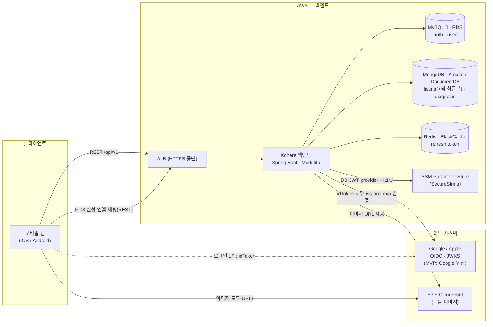
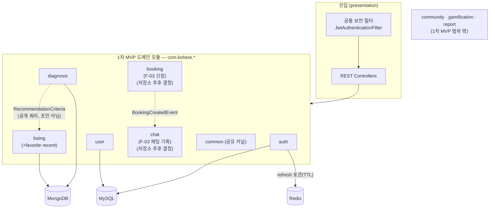
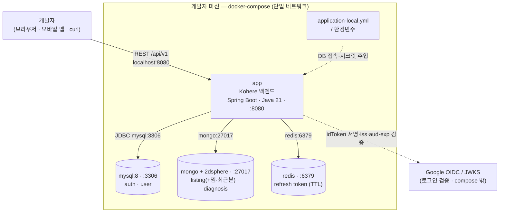
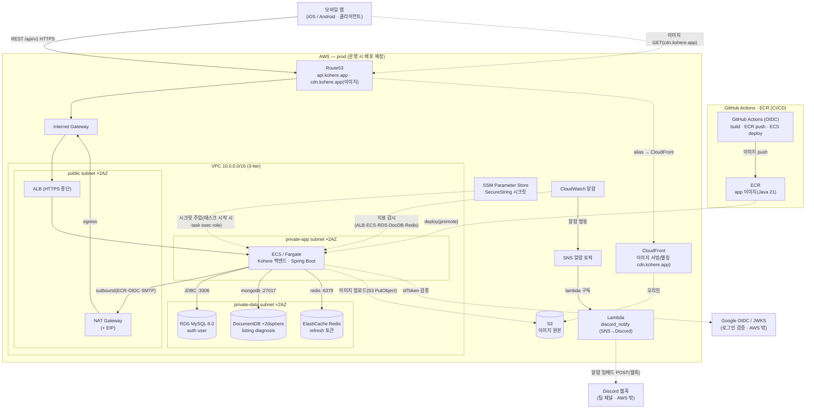
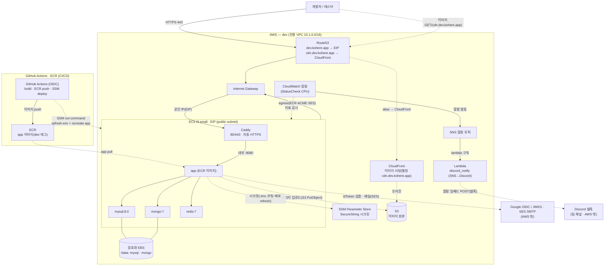

# System Overview

> Kohere 백엔드의 시스템 큰 그림(컨텍스트·컴포넌트·기술 스택·NFR 요약). **1차 MVP(2026-07-10)** 범위를 기준으로 작성한다. 영속 배치의 정본은 **[ADR-0005](../adr/0005-polyglot-persistence.md)**, 모듈 경계는 [ADR-0001](../adr/0001-bounded-context-module-decomposition.md), 통신은 [ADR-0002](../adr/0002-inter-module-communication-via-events.md), 마일스톤·트랙 분담은 [project-brief §7](../project/project-brief.md#7-마일스톤-milestones).
>
> **영속(ADR-0005, 데이터 특성 기준):** `listing`(+`favorite`·`recent-listing`)·`diagnosis` → **MongoDB**, `auth`·`user` → **MySQL**.
> **본 문서의 추가 결정(팀 확정):** ① **refresh 토큰 → Redis** — **[ADR-0006](../adr/0006-refresh-token-store-redis.md)** 으로 확정(ADR-0005 `RefreshToken` 배치 보완, ADR-0003 후속 닫힘). ② **임대인 연락 = F-03 신청하기 → 인앱 채팅방 기록**(booking→chat 이벤트). 실시간 WebSocket·푸시는 추후, booking·chat 저장소 추후 결정.
> **스택 상태:** 현재 배선된 의존성 정본은 [build.gradle](../../build.gradle)(`web`·`validation`·`data-jpa`·`data-redis`·`security`·`oauth2-jose`·`jjwt`·`spring-modulith-starter-core` + 테스트 `test`·`modulith-starter-test`·Testcontainers·REST Docs/restdocs-api-spec). `추후`=1차 MVP 이후.

## 목적

처음 합류한 백엔드 개발자가 **무엇이 어디서 돌아가고, 무엇으로 만들며, 어떤 제약을 지켜야 하는지**를 한 장에서 파악하도록 한다. 선택의 *근거*는 ADR, *상세 의존성*은 build.gradle, *기능 흐름*은 시퀀스 다이어그램으로 분리해 추적한다.

## 1차 MVP 범위 (2026-07-10)

| # | 영역                                                           | 모듈                                           | 저장소                          |
| - | -------------------------------------------------------------- | ---------------------------------------------- | ------------------------------- |
| 1 | 로그인·온보딩(소셜→JWT)                                      | `auth`·`user`                             | MySQL +**Redis**(refresh) |
| 2 | ★ F-01 큐레이션 챗봇(5단계 진단: 신분·위치·ARC·예산·기간) | `diagnosis`                                  | MongoDB                         |
| 3 | ★ F-02 맞춤 매물 추천(리스트+지도, 거리·예산 필터)           | `listing`(+`favorite`·`recent-listing`) | MongoDB                         |
| 4 | 매물 탐색·찜(지도 탭 검색·조건 필터·매물 상세, 찜·최근 본) | `listing`(+`favorite`·`recent-listing`) | MongoDB                         |
| 5 | F-03 임대인에게 신청하기→인앱 채팅 기록                       | `booking`·`chat`                          | (저장소 추후 결정)              |

★ = 보호 핵심. **1차 MVP 범위 밖(코드 골격만 존재, MVP 이후로 이연):** `community`(커뮤니티)·`gamification`(퀴즈·포인트)·`report`(신고). 저장소 미정(추후 ADR).

## 1. 시스템 컨텍스트 다이어그램

클라이언트(모바일 앱)·외부 시스템·AWS 백엔드와 **세 저장소(MySQL·MongoDB·Redis)** 관계다.

### 1-2. 내부 컴포넌트(모듈)와 저장소 매핑

진입(공통 보안 필터 + REST 컨트롤러) → 1차 MVP 도메인 모듈 + 공유 커널 `common` → 각 모듈의 인프라 어댑터 → **모듈별 저장소(ADR-0005)**. 모듈 간 협력은 직접 호출/조인이 아니라 **이벤트·공개 쿼리 API**로 한다([ADR-0002](../adr/0002-inter-module-communication-via-events.md)).

> 추천 흐름(ADR-0005 Decision 2): `diagnosis`가 진단 조건을 값 객체 `RecommendationCriteria`로 만들어 넘기면 `listing`이 `recommendByCriteria(...)`로 **자기 Mongo 컬렉션만** 질의한다. 둘 다 Mongo지만 **cross-collection 조인은 하지 않는다**(co-location은 부수적).

### 1-3. 아키텍처: 로컬 개발 ↔ 클라우드 배포

> **M0–M4는 전 구간 로컬(개발자 머신) 컨테이너(docker-compose)로 개발**(클라우드 비용 0)하고, **[M7](../project/project-brief.md#7-마일스톤-milestones)(7/8–7/10)에서 AWS로 이전·배포**한다. (커뮤니티는 **MVP 이후로 이연** — M4→M7 사이는 비워둔다.) 두 환경은 **동일 애플리케이션 Docker 이미지**를 쓰며 **인프라만 로컬↔매니지드로 교체**한다 — 클라우드 실배포는 1차 MVP 최종 목표에 그대로 포함되되 시점만 M7이다.

#### 1-3-1. 로컬 개발 아키텍처 (M0–M4, 클라우드 비용 0)

개발자 머신에서 **단일 `docker-compose`** 로 app + MySQL + MongoDB + Redis를 함께 기동한다(`./gradlew bootRun`은 같은 이미지의 앱을 단일 JVM으로 띄울 수도 있음). M0–M4 동안 AWS 인프라는 띄우지 않는다(러닝 비용 0). 아래 매핑은 두 환경이 동일하게 따르는 표준이며, **클라우드 대응 열의 매니지드 서비스는 M7에서 프로비저닝**한다.

| 요소         | 로컬 구성                                                             | 클라우드 대응(M7)                                       |
| ------------ | --------------------------------------------------------------------- | ------------------------------------------------------- |
| 앱 실행      | `./gradlew bootRun`(단일 JVM)                                       | ECS/Fargate + ALB(HTTPS)                                |
| 패키징       | `Dockerfile` + CI `docker build`(이미지 빌드 검증, 러닝 인프라 0) | 동일 이미지 ECR push 후 배포                            |
| MySQL        | `mysql:8` 컨테이너                                                  | RDS for MySQL 8.0 (auth·user)                          |
| MongoDB      | `mongo` 컨테이너 + `2dsphere`                                     | Amazon DocumentDB (listing[+찜·최근본]·diagnosis) |
| Redis        | `redis` 컨테이너                                                    | ElastiCache (refresh 토큰 TTL)                          |
| 매물 사진    | 백엔드 미보관(URL만 저장)                                             | S3 + CloudFront(Route53 별칭→클라이언트 로드)           |
| 시크릿·설정 | `application-local.yml` / 환경변수                                  | SSM Parameter Store(SecureString)                      |

> **booking·chat 저장소는 추후 결정**(추후 ADR) — 위 매핑에는 강제 반영하지 않는다.

로컬 `docker-compose` 구성도 — 한 도커 네트워크 안에서 app·MySQL·MongoDB·Redis가 **서비스명**으로 서로를 찾는다:

> 컨테이너는 서로를 **서비스명**(`mysql`·`mongo`·`redis`)으로 부르고, 개발자만 `localhost:8080`으로 app에 접속한다. 클라우드 이전(§1-3-2) 시 **app 이미지는 그대로**, 접속 대상만 서비스명 → 매니지드 엔드포인트(RDS·DocumentDB·ElastiCache·S3·Secrets Manager)로 교체된다. Google OIDC/JWKS는 로컬·클라우드 공통으로 외부 실호출이다. 매물 사진은 백엔드가 보관하지 않고 URL만 저장하며, 클라이언트가 S3/CloudFront(로컬은 동일 URL/시드 URL)에서 직접 로드한다.

#### 1-3-2. prod 클라우드 배포 아키텍처 (운영 시 배포 예정, AWS)

**prod은 실제 운영 시점에 배포 예정**이며 현재는 미배포(IaC만 준비). **M7(7/8–7/10) 첫 클라우드 배포는 dev**(§1-3-3)이고, prod은 로컬과 동일 이미지를 ECR에 push해 배포한다. 각 매니지드 서비스의 책임은 아래와 같다.

| 요소        | 구성                                    | 비고                                                                                                                         |
| ----------- | --------------------------------------- | ---------------------------------------------------------------------------------------------------------------------------- |
| 패키징      | Docker 이미지(Java 21 런타임)           | 로컬과 동일 이미지를 ECR push                                                                                                |
| 도메인·노출 | Route53 → ALB(HTTPS)                    | `api.kohere.app`, ACM 인증서로 443 종단                                                                                      |
| 실행        | ECS/Fargate                             | private-app 서브넷. access 무상태라 수평 확장 여지([ADR-0003](../adr/0003-jwt-auth-after-oauth-login.md))                       |
| 네트워크    | 3-tier 서브넷 + NAT                     | public(ALB·NAT) / private-app(ECS) / private-data(DB)                                                                        |
| MySQL       | RDS for MySQL 8.0                       | auth·user                                                                                                                   |
| MongoDB     | Amazon DocumentDB                       | listing(+찜·최근본)·diagnosis, `2dsphere` 인덱스                                                                         |
| Redis       | ElastiCache                             | refresh 토큰(TTL). **AOF·복제 권장**(§3-7)                                                                           |
| 매물 사진   | S3 + CloudFront (+ Route53 별칭)         | 백엔드는 S3 업로드 + URL 응답. **클라이언트는 `cdn.kohere.app`(Route53 alias→CloudFront)에서 로드**(커스텀 도메인 미설정 시 `*.cloudfront.net` 직접). 인증서는 us-east-1 ACM |
| 시크릿      | **SSM Parameter Store**(SecureString)   | DB·JWT·provider 시크릿. 태스크 시작 시 주입, **변경 반영은 배포(태스크 롤)**([ADR-0024](../adr/0024-secret-change-propagation.md)). **Secrets Manager 미사용**([ADR-0023](../adr/0023-secrets-in-ssm-parameter-store.md)) |
| 모니터링    | CloudWatch 알람 + SNS                   | ALB·ECS·RDS·DocDB·Redis 지표 → SNS → **Lambda → Discord**(+ 이메일 옵션, [ADR-0027](../adr/0027-dev-discord-alerting.md))                                                                                 |
| CI/CD       | GitHub Actions (OIDC)                   | build·ECR push·ECS deploy([ADR-0019](../adr/0019-infrastructure-as-code-terraform.md))                                       |

> **booking·chat 저장소는 추후 결정**(추후 ADR) — 위 표/토폴로지에는 강제 반영하지 않는다.
>
> **MongoDB 백엔드 = Amazon DocumentDB 확정**([ADR-0018](../adr/0018-documentdb-for-mongodb-on-aws.md), Atlas 대비). AWS 네이티브라 단일 provider·VPC 내부에서 운영하며, 위 토폴로지는 [`infra/terraform`](../../infra/terraform/README.md)로 IaC 구현돼 있다(ECS Fargate·RDS·DocumentDB·ElastiCache·S3+CloudFront·SSM Parameter Store·ECR·GitHub Actions OIDC). IaC 도구·구조·원격 상태 결정은 [ADR-0019](../adr/0019-infrastructure-as-code-terraform.md)·[ADR-0020](../adr/0020-terraform-remote-state-s3-dynamodb.md). 단, listing 지도검색의 **지오공간 쿼리(`2dsphere`·`$geoNear`/`$geoWithin`)** 가 DocumentDB에서 요구대로 동작하는지 검증해야 하며, 호환성 갭이 확인되면 Atlas로 전환한다. (Mongo 드라이버 배선 시 앱 이미지에 DocumentDB CA 번들 포함 — `infra/terraform/README.md` 참고.)

AWS 배포 토폴로지 — GitHub Actions가 빌드한 **동일 이미지**가 ECR→Fargate로 올라가고, 로컬 컨테이너(§1-3-1)가 매니지드 서비스로 교체된다:

> 로컬과 동일한 app 이미지를 GitHub Actions가 ECR에 push하고, **prod은 운영 시점에** Fargate로 deploy한다(현재 배포 예정) — 로컬 docker-compose(§1-3-1)와 같은 그림에서 접속 대상만 서비스명 → 매니지드 엔드포인트(RDS·DocumentDB·ElastiCache·S3+CloudFront·**SSM Parameter Store**)로 교체되고, 3-tier 서브넷이 app·DB를 감싼다. Google OIDC/JWKS는 로컬·클라우드 공통으로 AWS 밖 외부 실호출이다.

#### 1-3-3. dev 배포 아키텍처 (비용 최소화 — 단일 EC2 compose)

> **dev는 위 매니지드 토폴로지(§1-3-2)를 쓰지 않는다.** prod 매니지드 스택(ALB·ECS·RDS·DocumentDB·ElastiCache·NAT ~$370/mo)은 dev엔 **과투자**라, **단일 EC2**에 컨테이너로 올린 dev 전용 구성을 쓴다([ADR-0021](../adr/0021-cost-optimization-profile.md)). prod(매니지드) ↔ dev(단일 EC2)는 Terraform `environments/{prod,dev}` 루트로 분리하며, **앱 이미지·DB 엔진은 동일**(`mysql:8.0`·`mongo:7`·`redis:7`)하다.
>
> **M7(7/8–7/10) 첫 클라우드 배포는 dev**다(prod은 운영 시점에 배포 예정, §1-3-2). 배포는 GitHub Actions가 이미지를 ECR(`:dev`)에 push한 뒤 **SSM run-command로 dev EC2에서 `refresh-env.sh`(SSM→`.env` 재조회) → `docker compose pull` → `up --force-recreate app`** 하는 방식이다(ECS 없음). **시크릿 변경 반영도 이 배포 경로**이며, 코드 변경 없이 시크릿만 바꿨다면 배포 워크플로를 수동 트리거한다([ADR-0024](../adr/0024-secret-change-propagation.md)).

| 요소 | dev 구성 | 비고 |
| --- | --- | --- |
| 컴퓨트 | EC2 `t3.small` 1대(2vCPU/2GB, x86), `docker compose` 컨테이너들 | ALB·ECS 없음 |
| HTTPS | **Caddy**(자동 인증서·Let's Encrypt) | 80/443 종단 → app(내부 8080) 프록시. 갱신·reload 자체 처리([ADR-0022](../adr/0022-dev-https-caddy.md)) |
| DB | 자가호스팅 `mysql:8.0`·`mongo:7`·`redis:7`(같은 EC2) | local과 동일 엔진. 매니지드(RDS/DocDB/ElastiCache) 대체 |
| 메일 | 실 SMTP(예: Amazon SES) | **MailHog는 로컬 compose 전용이라 dev엔 없음** |
| 시크릿 | **SSM Parameter Store SecureString**(무료) | Secrets Manager 미사용. 부팅·배포 시 `refresh-env.sh`로 SSM→`.env` 재조회 후 app recreate(JWT/pepper 자동 생성). **변경 반영은 배포**([ADR-0024](../adr/0024-secret-change-propagation.md)) |
| 이미지 | **S3 + CloudFront**(+ Route53 별칭, prod 동일 모듈) | 앱은 S3 업로드 + URL 응답. **클라이언트는 `cdn.dev.kohere.app`(Route53 alias→CloudFront)에서 GET**(미설정 시 `*.cloudfront.net` 직접). 인증서는 us-east-1 ACM |
| 노출 | EIP → Route53 A 레코드(`dev.kohere.app`) | SG 80/443만. 관리자 접속은 SSM 전용(SSH 미개방) |
| 데이터 | 전용 암호화 EBS(`/data`) bind-mount | 인스턴스 교체에도 보존 |
| 모니터링 | CloudWatch StatusCheckFailed·CPU 알람 + SNS | 단일 박스 다운 → SNS → **Lambda → Discord** 통보([ADR-0027](../adr/0027-dev-discord-alerting.md)) |
| 비용 | EC2 ~$30/mo + EBS ~$2/mo + S3/CF(CF 무료티어) ≈ **~$32/mo+** | 매니지드 복제 대비 큰 절감 |

> dev는 클라우드 EC2 한 대에 각 서비스를 **컨테이너 박스**로 올린 구성이라 로컬↔dev 엔진이 일치한다(`SPRING_PROFILES_ACTIVE=dev`). MailHog는 로컬 전용이라 dev는 실 SMTP를 쓰고, HTTPS는 Caddy([ADR-0022](../adr/0022-dev-https-caddy.md))가, 시크릿은 SSM Parameter Store SecureString(무료·SM 미사용, [ADR-0023](../adr/0023-secrets-in-ssm-parameter-store.md))이 담당하며, **변경 반영은 배포(`refresh-env` + app recreate)** 경로로 한다([ADR-0024](../adr/0024-secret-change-propagation.md)). 단일 호스트 SPOF·인터넷 노출은 SG(80/443)·SSM 전용·IMDSv2·EBS 암호화로 통제하며 dev 단계에서 수용한다. 상태(state)는 prod·dev 공통 S3 + native lockfile([ADR-0020](../adr/0020-terraform-remote-state-s3-dynamodb.md)), `key`로 분리한다.

## 2. 주요 컴포넌트 표

| 컴포넌트            | 책임                                                                                                      | 저장소                          | 기술                                                   |
| ------------------- | --------------------------------------------------------------------------------------------------------- | ------------------------------- | ------------------------------------------------------ |
| 공통 보안 필터      | 보호 요청 JWT(서명·만료·클레임) 검증,`userId`·온보딩 스코프 주입                                     | —                              | Spring Security + 커스텀 `OncePerRequestFilter`      |
| presentation        | REST 엔드포인트, DTO, 형식 검증, 공통 래퍼 응답(ResponseBodyAdvice 자동 적용, [ADR-0013](../adr/0013-response-auto-wrapping.md)) | —                              | Spring MVC, Bean Validation                            |
| application         | 유스케이스 조율, 트랜잭션 경계, 이벤트 발행                                                               | —                              | `@Service`, `@Transactional`                       |
| domain              | Aggregate·VO·도메인 규칙,**Repository 인터페이스**                                                | —                              | POJO, enum                                             |
| infrastructure      | **Repository 구현**, 외부 어댑터(OIDC)                                                              | 모듈별 저장소                   | Spring Data JPA / Data MongoDB / Data Redis            |
| listing(매물)       | 카탈로그·탐색(학교·지역·지하철역 검색)·조건 필터·상세·찜·최근 본,**지도 bbox/반경 + 거리순** | **MongoDB**               | `2dsphere` + 서버 격자 집계                          |
| diagnosis(진단)     | 5단계 진단 도큐먼트[신분·위치·ARC·예산·기간], 결과 생성, 추천 criteria 발행                           | **MongoDB**               | 단일 도큐먼트 원자 쓰기                                |
| booking(신청)       | F-03 임대인에게 신청하기,`BookingCreatedEvent` 발행                                                     | (저장소 추후 결정)              | Modulith Application Events                            |
| chat(채팅)          | F-03 신청 후 인앱 채팅방 기록(이벤트 수신)                                                                | (저장소 추후 결정)              | 이벤트 리스너                                          |
| community(커뮤니티) | 게시글·댓글·좋아요, 키워드·해시태그 검색 (**MVP 이후로 이연**, 코드 골격만)                      | MySQL                           | FULLTEXT +**ngram**(한국어), 유니크·카운트 정합 |
| auth·user          | 소셜 로그인→JWT, 온보딩·프로필                                                                          | MySQL +**Redis**(refresh) | JPA + Nimbus(JWKS) + jjwt                              |
| 이벤트 버스         | 모듈 간 비동기 통신(**F-03: booking→chat(BookingCreatedEvent) MVP 편입**)                          | (도입 시)                       | Modulith Application Events                            |

## 3. 기술 스택

상태: **배선됨**=현재 build.gradle 존재 · **도입**=1차 MVP에 추가 · **추후**=이후.

### 3-1. 언어 · 프레임워크 · 빌드

| 영역        | 채택                                                                           | 상태   |
| ----------- | ------------------------------------------------------------------------------ | ------ |
| 언어/런타임 | Java 21 (Temurin), toolchain 21                                                | 배선됨 |
| 프레임워크  | Spring Boot 3.5, Spring MVC                                                    | 배선됨 |
| 모듈러리티  | Spring Modulith (BOM 2.1.0,`-starter-core`), `ApplicationModules.verify()` | 배선됨 |
| 빌드/포맷   | Gradle, Spotless + google-java-format(2-space), Lombok                         | 배선됨 |

### 3-2. 영속 — 폴리글랏 ([ADR-0005](../adr/0005-polyglot-persistence.md))

| 도메인/용도                                                   | 저장소                                                                                    | 상태               | 근거/비고                                                                                                                                                   |
| ------------------------------------------------------------- | ----------------------------------------------------------------------------------------- | ------------------ | ----------------------------------------------------------------------------------------------------------------------------------------------------------- |
| `listing`(+`favorite`·`recent-listing`), `diagnosis` | **MongoDB** + Spring Data MongoDB                                                   | 도입               | 지오·가변 스키마·대량 읽기 / 문서형 애그리거트·배열·단일 도큐먼트 원자 쓰기                                                                             |
| `auth`, `user`                                            | **MySQL 8**(RDS) + Spring Data JPA + `mysql-connector-j`                          | 도입               | 계정·토큰 트랜잭션 / 유니크 제약·카운트 정합. HikariCP(기본)                                                                                              |
| **refresh 토큰**                                        | **Redis**(ElastiCache)                                                              | 도입               | **[ADR-0006](../adr/0006-refresh-token-store-redis.md) 확정**(TTL·회전·재사용탐지). 해시 **SHA-256(+pepper)**. ADR-0005 보완·ADR-0003 후속 닫힘 |
| `booking`, `chat`(F-03)                                   | 추후 결정(추후 ADR)                                                                       | 도입               | 신청→인앱 채팅 기록. 저장소 임의 확정 금지                                                                                                                 |
| 리포지토리 스택 분리                                          | `@EnableMongoRepositories`(listing·diagnosis) / `@EnableJpaRepositories`(auth·user) | 도입               | 두 스택 스캔 분리(ADR-0005 Decision 1)                                                                                                                      |
| 지도 검색                                                     | MongoDB**2dsphere**($geoWithin/$near/$geoNear) + 서버 격자 클러스터               | 도입               | 비클러스터 결과 상한(`LISTING_AREA_TOO_LARGE`)                                                                                                            |
| 텍스트 검색(커뮤니티)                                         | MySQL**FULLTEXT + ngram parser**                                                    | **MVP 이후** | 한국어 토큰화. 규모 확장 시 Elasticsearch → 추후                                                                                                           |
| MySQL 마이그레이션                                            | **Flyway**(`flyway-core`,`flyway-mysql`)                                        | 도입               | **[ADR-0008](../adr/0008-mysql-migration-flyway.md)** 확정(+ JPA `ddl-auto=validate`). MongoDB=인덱스 부트스트랩+`schemaVersion`, Redis=키스페이스 버전(스키마 없음). 정본 [migration-policy](../database/migration-policy.md)                                       |
| 소프트삭제·PII 보존                                          | [ADR-0014](../adr/0014-withdrawal-pii-anonymization.md)/[ADR-0015](../adr/0015-sensitive-column-encryption.md) 확정 | 도입               | 탈퇴=status=WITHDRAWN 전이+withdrawn_at 기록+PII 즉시 익명화+social_accounts 매핑 삭제(행 보존). 민감 컬럼 암호화는 MVP 미도입, 마스킹+at-rest 암호화로 갈음 |
| 데이터 설계 정본                                              | [database-design](../database/database-design.md)(초안)                                      | 도입               | 모듈별 스키마 작성됨(MySQL ERD / Mongo 컬렉션 / Redis 키스페이스). 영속 도입 시 식별자·미모델링 갭 정합                                                    |

### 3-3. 인증 · 보안

| 영역            | 채택                                                                                    | 상태   | 비고                                                                    |
| --------------- | --------------------------------------------------------------------------------------- | ------ | ----------------------------------------------------------------------- |
| 인증 토큰       | JWT access(무상태) + 불투명 refresh(해시 저장)                                          | 결정됨 | [ADR-0003](../adr/0003-jwt-auth-after-oauth-login.md). 수명: access 1h·온보딩 임시 30m·refresh 14d [ADR-0011](../adr/0011-token-lifetime-and-secret-policy.md) 확정 |
| refresh 저장    | **Redis**(TTL), 해시 SHA-256(+pepper)                                             | 도입   | 내구성은 §3-7                                                          |
| 보안 프레임워크 | **Spring Security** + 커스텀 `JwtAuthenticationFilter`                          | 도입   | M0-A 산출물. [ADR-0010](../adr/0010-jwt-authentication-filter.md) 확정(ADR-0003 후속)                                    |
| 소셜 OIDC 검증  | provider별 Nimbus `JwtDecoder`(JWKS 캐시), **MVP는 Google 우선**(Apple 여유 시) | 도입   | Boot 4 스타터명 `spring-boot-starter-security-oauth2-*`               |
| 서버 JWT 서명   | jjwt(`io.jsonwebtoken`), **HS256**(대칭, HMAC-SHA256)           | 도입   | **[ADR-0009](../adr/0009-jwt-signing-algorithm-hs256.md)** 확정. MSA 분해·외부 검증자 도입 시 RS256/ES256+JWKS 전환(트리거)   |
| 시크릿/키 관리  | env vars + SSM Parameter Store(SecureString)                                                      | 도입   | 길이·주입 [ADR-0011](../adr/0011-token-lifetime-and-secret-policy.md) 확정(≥256bit env 주입), 무중단 회전 절차 운영 후속 |
| 레이트리밋      | **Bucket4j(인메모리)**                                                            | 도입   | auth·share 등 429 + Retry-After. 다중 인스턴스 시 Redis 백엔드 → 추후 |
| HTTP 헤더·CORS | Spring Security 헤더 + 명시적 CORS origin                                               | 도입   | HSTS·nosniff·X-Frame-Options                                          |

### 3-4. 통신 · 외부 연동

| 영역                         | 채택                                                                                | 상태   | 비고                                                                                                                            |
| ---------------------------- | ----------------------------------------------------------------------------------- | ------ | ------------------------------------------------------------------------------------------------------------------------------- |
| 모듈 간 통신                 | 도메인 이벤트 + 즉시결과는 동기 공개 쿼리                                           | 결정됨 | [ADR-0002](../adr/0002-inter-module-communication-via-events.md). 추천은 `RecommendationCriteria` 공개 쿼리                      |
| 임대인 연락                  | **F-03 신청하기 → 인앱 채팅방 기록**(booking→chat, `BookingCreatedEvent`) | 도입   | 실시간 WebSocket·푸시는 추후. booking·chat 저장소 추후 결정                                                                   |
| 오브젝트 스토리지            | **AWS S3 + CloudFront**                                                       | 도입   | 매물 사진 호스팅 — 클라이언트는 `cdn.kohere.app`(Route53 alias→CloudFront)에서 로드, 백엔드는 S3 업로드 후 URL만 저장(서빙 경로 비경유). 사용자 업로드 UI는 MVP 밖 |
| 푸시 알림(FCM/APNs)          | —                                                                                  | 추후   | 1차 MVP 비핵심(인앱 채팅은 REST 기록만, 실시간 푸시 없음)                                                                       |
| 채팅 실시간(WebSocket/STOMP) | —                                                                                  | 추후   | F-03은 REST 채팅 기록만. 실시간 전송은 추후                                                                                     |

### 3-5. 테스트 · 관측성 · 운영

| 영역            | 채택                                                                                     | 상태   | 비고                                                                                                                                                                                      |
| --------------- | ---------------------------------------------------------------------------------------- | ------ | ----------------------------------------------------------------------------------------------------------------------------------------------------------------------------------------- |
| 테스트          | JUnit 5 · AssertJ · Mockito · Modulith test                                           | 배선됨 | —                                                                                                                                                                                        |
| 통합 테스트     | **Testcontainers** — MySQL·Redis(`@ServiceConnection`)                              | ✅ 배선 | auth-onboarding 통합/문서 테스트가 실제 MySQL·Redis로 검증(Docker 필요; TC **1.21.4**로 신버전 Docker 호환, [ADR-0016](../adr/0016-downgrade-to-spring-boot-3.md)). MongoDB는 listing·diagnosis 도입 시 추가 |
| 로깅            | Logback(평문→JSON), traceId/X-Request-Id, PII 마스킹                                    | 도입   | [error-response-guide §6](../api/error-response-guide.md). 4xx WARN/5xx ERROR                                                                                                               |
| 메트릭/트레이싱 | Actuator(health)                                                                         | 도입   | Micrometer/Prometheus → 추후                                                                                                                                                             |
| API 문서        | **REST Docs**(HTML) + **OpenAPI3(restdocs-api-spec)→Swagger UI**                   | ✅ 배선   | [ADR-0007](../adr/0007-api-docs-spring-rest-docs.md)·[ADR-0017](../adr/0017-openapi-swagger-ui-from-restdocs.md). 같은 테스트로 `/docs/index.html`(HTML)·`/swagger-ui/index.html`(try-it-out) 생성. 어노테이션 미사용(드리프트 0). [api/specs](../api/specs/README.md) Markdown은 설계 정본 |
| DTO 매핑        | 수동 정적 팩토리(`of(...)`)                                                            | 도입   | MapStruct → 추후                                                                                                                                                                         |
| 시간            | UTC 강제(`jackson.time-zone`, `hibernate.jdbc.time_zone`); Mongo 문서도 UTC ISO-8601 | 도입   | [api-design-guide §6](../api/api-design-guide.md)                                                                                                                                           |
| i18n            | 클라이언트 code→text 매핑                                                               | 결정됨 | 서버 MessageSource → 추후                                                                                                                                                                |

### 3-6. 결정 필요 항목(ADR/문서 갱신)

- **신규/갱신 ADR(미결)**: 추천 랭킹 알고리즘, **booking·chat 저장소(F-03)**.
- **brief §7 결정(7/10 사수)**: 커뮤니티 사진 업로드 in/out.

### 3-7. 폴리글랏 영속 — 주의 / 위험

ADR-0005가 **cross-store 조인·트랜잭션을 금지**하므로 단일 엔진이 주던 무결성이 깨지는 지점을 관리한다. (찜·최근본을 listing과 같은 Mongo에 둬 1차 MVP의 교차 참조는 최소화됨.)

| 위험                      | 내용                                                                | 완화                                                                                              |
| ------------------------- | ------------------------------------------------------------------- | ------------------------------------------------------------------------------------------------- |
| 교차 스토어 조회          | `diagnosis`(Mongo)↔`listing`(Mongo)는 같은 store지만 조인 금지 | `RecommendationCriteria` 공개 쿼리로 분리, N+1·배치 조회 주의(ADR-0005 D2·D5)                 |
| 교차 스토어 트랜잭션 불가 | XA 미사용                                                           | 쓰기 경로를**단일 store**로 한정, store 넘는 정합은 이벤트 최종 일관성(ADR-0005 D6)         |
| Redis refresh 내구성      | 페일오버/재시작 시 폐기·로그아웃 토큰 부활 → 재생공격             | **AOF + 복제**, TTL=refresh 만료로 타이트, 강한 폐기 필요 시 MySQL로 이전/access 블랙리스트 |
| 두 스택 동시 설정         | JPA·Mongo 리포지토리 패키지·트랜잭션 매니저 구분                  | `@EnableJpaRepositories`/`@EnableMongoRepositories` 패키지 한정 + 컨텍스트 기동 테스트        |
| 경계검증의 사각           | `ModularityTest`는 코드 경계만 강제, 교차 스토어 쿼리는 못 막음   | 모듈은 자기 store만 Repository로 노출, 타 모듈 데이터는 공개 쿼리/이벤트로만                      |

## 4. 비기능 요구사항(NFR) 요약

> 정본은 [non-functional-requirements](../requirements/non-functional-requirements.md)(템플릿). 아래는 아키텍처 전제 기준이며, 정량 목표는 NFR 확정 시 채운다. 폴리글랏이라 **스토어별 SLA**(Mongo 지오/검색 지연, MySQL MTTR/RPO, Redis 내구성↔속도)를 정의해야 검증 가능하다.

| 속성   | 아키텍처 기준                                                           | 근거                                                                                                        |
| ------ | ----------------------------------------------------------------------- | ----------------------------------------------------------------------------------------------------------- |
| 성능   | 목록은 커서 페이지네이션, 지도는 `2dsphere` + 클러스터 + 결과 상한    | [03-listings](../api/specs/03-listings-favorites.md), [ADR-0005](../adr/0005-polyglot-persistence.md)             |
| 확장성 | access 토큰 무상태 → 수평 확장(세션 공유 불필요)                       | [ADR-0003](../adr/0003-jwt-auth-after-oauth-login.md)                                                          |
| 가용성 | RDS·Mongo·Redis 백업/복제, 무중단 배포는 expand-contract 마이그레이션 | [migration-policy](../database/migration-policy.md)                                                    |
| 보안   | 전 구간 HTTPS, JWT·refresh 회전·재사용탐지, PII 비로깅·마스킹        | [ADR-0003](../adr/0003-jwt-auth-after-oauth-login.md), [error-response-guide §6](../api/error-response-guide.md) |
| 관측성 | 요청 traceId 로깅, 4xx WARN/5xx ERROR 분리                              | [error-response-guide §6](../api/error-response-guide.md)                                                     |
| 신뢰성 | 단일 store 쓰기 원자성, 카운터·중복제출 멱등, 교차 store는 최종 일관성 | [ADR-0005](../adr/0005-polyglot-persistence.md), [ADR-0002](../adr/0002-inter-module-communication-via-events.md) |

## 관련 문서

- [ADR 인덱스](../adr/README.md) — 0001 모듈분해 · 0002 이벤트 · 0003 인증 · 0004 응답래퍼 · **0005 폴리글랏 영속**
- [project-brief §7](../project/project-brief.md#7-마일스톤-milestones) — 1차 MVP 마일스톤·트랙 분담·크리티컬 패스
- [code-style](../convention/code-style.md) · [database-design](../database/database-design.md)(초안) · [migration-policy](../database/migration-policy.md)
- [api-design-guide](../api/api-design-guide.md) · [error-response-guide](../api/error-response-guide.md) · [non-functional-requirements](../requirements/non-functional-requirements.md)(템플릿)
- [domain-model](domain-model.md) — 모듈별 애그리거트 카탈로그(루트·식별자·불변식·저장소 매핑) · [sequence-diagrams](sequence-diagrams/README.md)

> **배선 완료(auth-onboarding 구현, 스택 Boot 3.5 — [ADR-0016](../adr/0016-downgrade-to-spring-boot-3.md)):** `web`·`data-jpa`+`mysql-connector-j`·`data-redis`(refresh Redis 어댑터, ADR-0006)·`spring-security`·`oauth2-jose`·`jjwt` + API 문서(`restdocs-mockmvc`·`asciidoctor`·`restdocs-api-spec`·`swagger-ui` webjar, ADR-0017) + 통합 테스트 Testcontainers 1.21.4(MySQL·Redis). **남은 갱신:** `data-mongodb`(listing·diagnosis).

## 체크리스트

- [ ] 다이어그램이 ADR-0005 저장소 배치(Mongo: listing+찜+최근·diagnosis / MySQL: auth·user·community / Redis: refresh / booking·chat 추후 결정)와 일치한다
- [ ] 1차 MVP 범위 밖 모듈(community·gamification·report)이 'MVP 이후로 이연'으로 명확히 구분됐다
- [ ] refresh→Redis 결정이 ADR-0005/0003에 반영(갱신)됐다
- [ ] §3-7 폴리글랏 위험 완화(공개 쿼리·단일 store 쓰기·Redis AOF·스택 분리)가 구현에 반영됐다
- [ ] 스택 표의 상태(배선됨/도입/추후)가 build.gradle 현황과 동기화됐다
- [ ] 임대인 연락이 F-03(신청→인앱 채팅 기록, booking→chat)으로 구현되고 실시간 WebSocket·푸시는 추후로 구분됐다
